# Newsletter de versiones ENBLAU

Bienvenido al boletín de actualizaciones de **ENBLAU**.  
Aquí encontrarás las últimas versiones, mejoras y correcciones de errores.

---

## Próxima versión
**Fecha de publicación:** No disponible

Novedades

Correcciones

- **ENBLAU - Stock - Retales de paneles:** Resuelto problema al visualizar la ventana de introducir retal de paneles en materiales tipo panel.
- **ENBLAU - Ventas - Ubicaciones de stock:** Resuelto problema en el que no se visualizaban ubicaciones de materiales en stock cuando no disponen de proyecto asignado.
- **ENBLAU - Instalaciones - Configuración de estados:** Ahora es posible configurar los estados para pedidos de instlación de montadores internos.
- **ENBLAU - Stock - Producto terminado:** Modificadas las columnas **Proyecto** y **Artículo** para pdoer agrupar por ellas en el panel de agrupaje.

	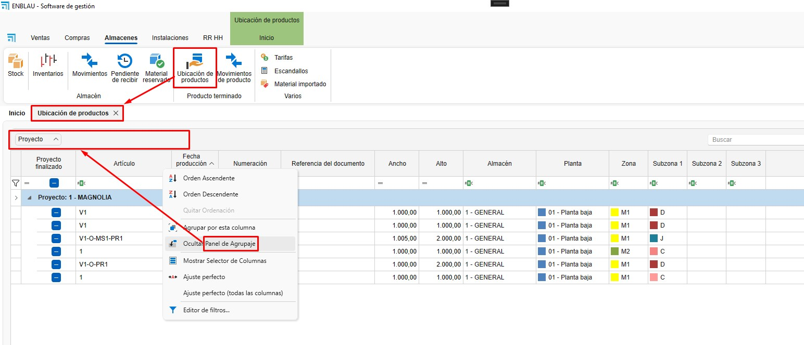

- **enCONTROL - Puesto de control - Estados de planificación:** Modificado para que se ordene el listado mostrado en orden alfabético.
- **enCONTROL - Puesto de control - Clasicaciones de planificación:** Modificado para que se ordene el listado mostrado en orden alfabético.
---

## Versión 25.12.0030
**Fecha de publicación:** 07/01/2026

Novedades

- **ENBLAU - SETUP:** Nuevo instalador automatizado para facilitar la instalación y actualización de ENBLAU y sus módulos asociados.

	

- **ENBLAU - Tarifas:** Ahora es posible otorgar un importe fijo a escandallos desde tarifa. 
El importe desglosado de materiales continuará calculándose, pero el importe del escandallo no se tendrá el porque corresponder con la suma total de los materiales estimada para ventas.

- **ENBLAU - Escandallos - Transformación de producto:** Ahora se pueden convertir escandallos en materiales como producto terminado desde el puesto de transformación. En este caso los escandallos no se podrán ubicar como producto terminado distinto de material.

	
	
	

- **ENBLAU - Almacenes - Retales de paneles:** Ahora es posible añadir retales de paneles desde stock detallado seleccionando el panel para el cual vamos a añadir el retal.

	
	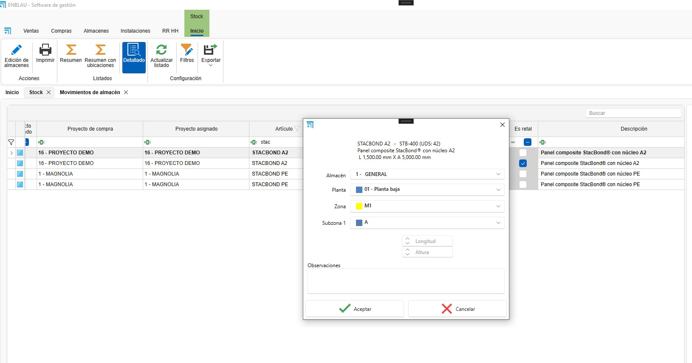
	

Correcciones

- **ENBLAU - Almacenes - Movimientos:** Modificado el filtro de fecha final para que se tengan en cuenta todos los movimientos hasta las 23:59:59.9999...
- **ENBLAU - Instalaciones - Nuevos informes:** Corregido problema de visualización al crear o eliminar un nuevo informe personalizado
- **ENBLAU - Ventas - Informes - Factura:** Corregida impresión de segunda página en blanco
- **ENBLAU - Ventas - Informes - Factura:** Corregido problema de visualización de descripción en facturas de tipo importe no agrupadas
- **ENBLAU - Ventas - Informes:** Corregido problema de visualización en el que aleatoriamente la pantalla de vista previa del informe quedaba detrás de la pantalla actual.
- **ENBLAU - Almacenes - Movimientos:** Resuelto problema al filtrar por la columna tipo de cálculo
- **ENBLAU - Almacenes - Stock:** Resuelto problema al filtrar por la columna tipo de cálculo

---

## Versión 25.12.0004
**Fecha de publicación:** 05/12/2025

Novedades

- **ENBLAU - Almacenes - Stock:** Añadida columna de tipo de cálculo.
- **ENBLAU - Almacenes - Movimientos:** Añadida columna de tipo de cálculo.
- **ENBLAU - Almacenes - Movimientos:** Posibilidad de filtrado adicional en consulta de movimientos para optimización de rendimiento.

	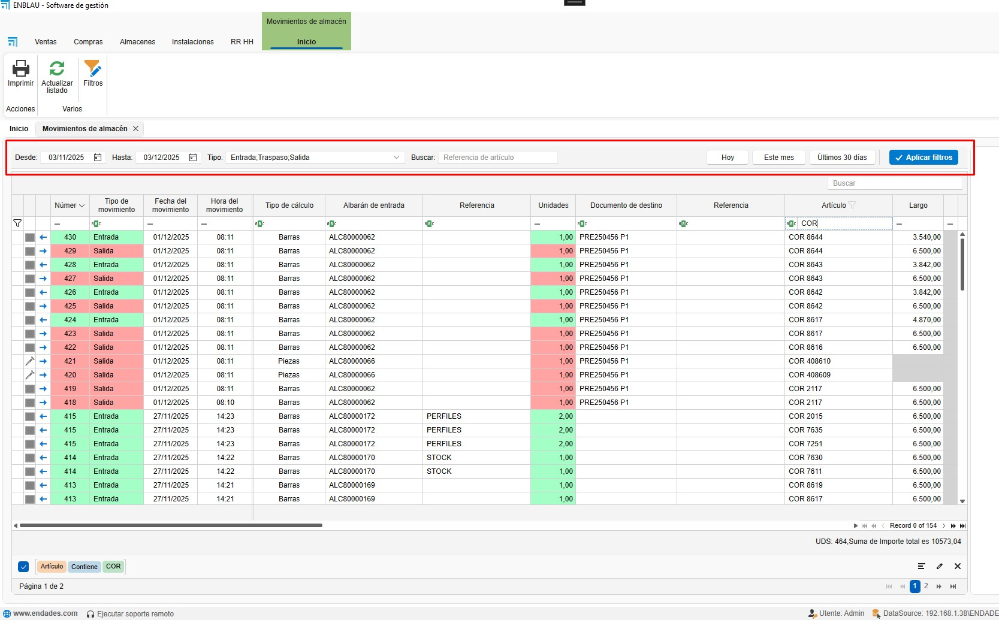

Correcciones

- **ENBLAU - Ventas - Pedido de cliente:** Resuelto el problema al clicar sobre el botón de vaciar fecha.
- **ENBLAU - Fases de producción - Modo Logikal duplicando posiciones:** Resuelto problema al cambiar nombre y unidades.

---

## Versión 25.11.0014
**Fecha de publicación:** 24/11/2025

Novedades

- **ENBLAU - Ventas - Informe presupuestos aceptados:** Modificado el acumulado para visualizar el acumulado anual hasta la fecha de fin indicada al presentar el informe.

	
	

- **ENBLAU - Ventas - Verifactu:** Implementada validación de factura previo al envío de la misma.

- **ENBLAU - Montajes - Comentarios:** Ahora es posible añadir comentarios de montaje visibles desde ENBLAU WEB para montadores. 

	
	
	

- **ENBLAU - Montajes - Comentarios:** Ahora es posible añadir comentarios de montaje visibles desde ENBLAU para montadores. 

	

- **ENBLAU - Montajes - Listado:** Incluida visualización y edición de comentarios de montaje.

	

- **ENBLAU - Montajes - Listado: Incluida visualización y edición de instalaciones planificadas. 

	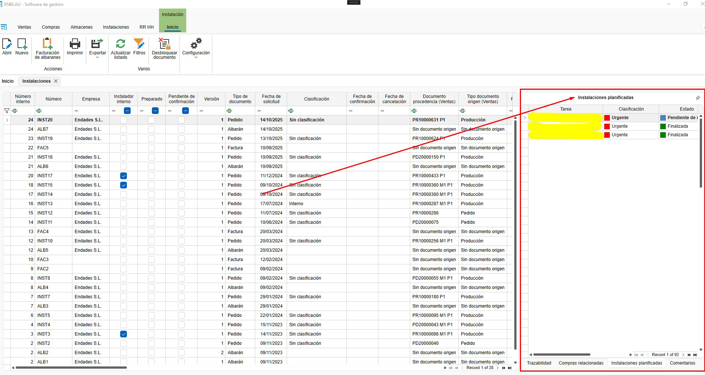

- **ENBLAU - Montajes - Comentarios:** Ahora es posible añadir comentarios de montaje visibles desde el planificador de instalaciones. 

	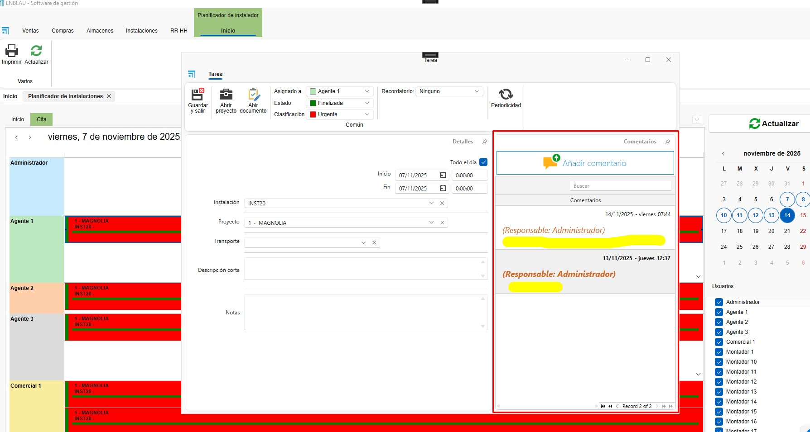

- **ENBLAU - Logikal - Modos de trabajo:** Ahora es posible trabajar de 3 modos diferentes durante el proceso de edición de proyectos y posiciones de Logikal. 

	

Correcciones

- **ENBLAU - Ventas - Nueva fase de medición:** Mejorado proceso de creación.
- **ENBLAU - Ventas - Nueva fase de producción:** Mejorado proceso de creación.
- **ENBLAU - Ventas - Nuevo albarán:** Mejorado proceso de creación.
- **ENBLAU - Ventas - Nueva factura:** Mejorado proceso de creación.

---

## Versión 25.11.0011
**Fecha de publicación:** 11/11/2025

Novedades

- **ENBLAU - Ventas - Factura proforma:** Nuevo tipo de documento añadido. Ahora es posible la creación de facturas proforma. 
    Las facturas proforma pueden ser convertidas a facturas legales, pasando a obtener la fecha actual de la conversión y una numeración válida.

	
	
	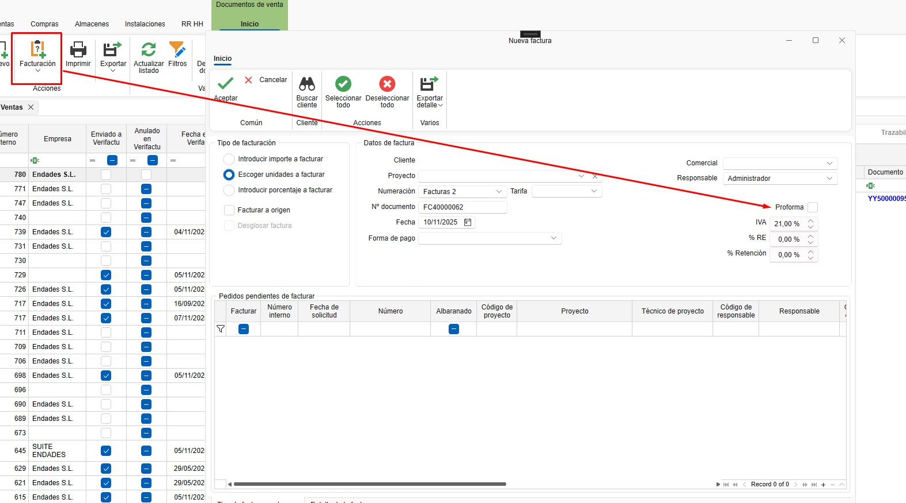
	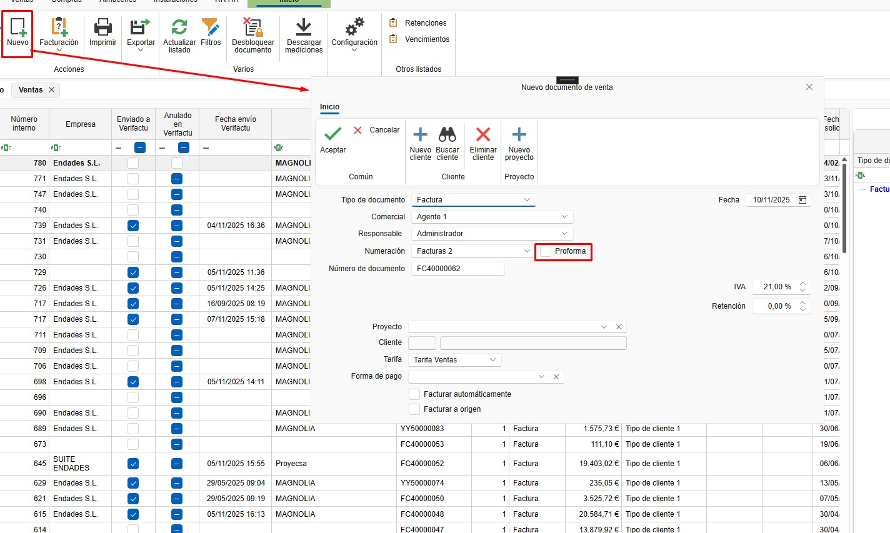
	

- **ENBLAU - Ventas - Listado de ventas:** Nuevas columnas añadidas. Factura enviada, fecha factura enviada, factura anulada y proforma.

Correcciones

---

## Versión 25.11.0007
**Fecha de publicación:** 07/11/2025

Novedades

Correcciones

- **ENBLAU - Almacenes - Exportar retales:** Resuelto problema de exportación a Excel en referencias antiguas almacenadas.
- **ENBLAU - Instalaciones - Creación de previsiones:** Resuelto problema de duplicidad en solicitud de información.
- **ENBLAU - Instalaciones - Cierres inesperados ENBLAU:** Resuelto cierre inesperado desde el calendario de instalaciones.
- **ENBLAU - Almacenes - Inventarios:** Resuelto problema al descontar juntas desde inventarios.

---

## Versión 25.10.0030
**Fecha de publicación:** 03/11/2025

Novedades

- **ENBLAU - Ventas - Logikal:** Implementados 3 modos de trabajar con Logikal. Por proyectos, por fases y por fases duplicando posiciones.
- **ENBLAU - Ventas - Listado de ventas:** Añadida nueva columna de 'Fecha de confirmado'.

Correcciones

- **ENBLAU - Instalaciones - Listado de instalaciones:** Resuelto problema con columna 'Planificado'. Estaba apuntando a tablas antiguas.
- **ENBLAU - Instalaciones - Planificador de instalaciones:** Resuelto problema en duplicidad de claves con múltiples usuarios.
- **ENBLAU - Ventas - Stock necesario:** Modificado nombre erróneo de columna.
- **ENBLAU - Ventas - Facturación de pedidos:** Resuelto problema en facturas por porcentaje, conteniendo posiciones en pedidos con importe negativo y unidades 0.

---

## Versión 25.10.0017
**Fecha de publicación:** 20/10/2025

Novedades

- **ENBLAU - Ventas - Informes:** Nuevo informe añadido. Resumen de documentos.

	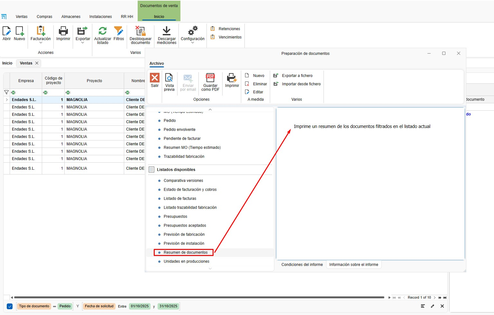

	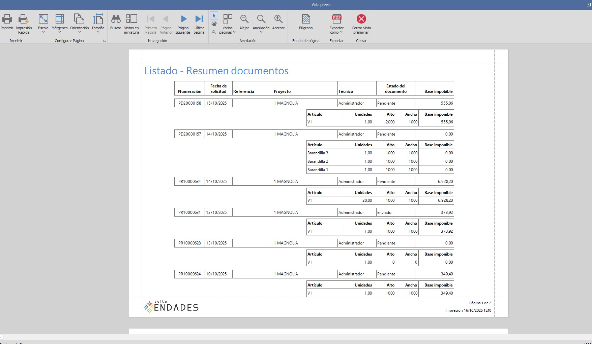

	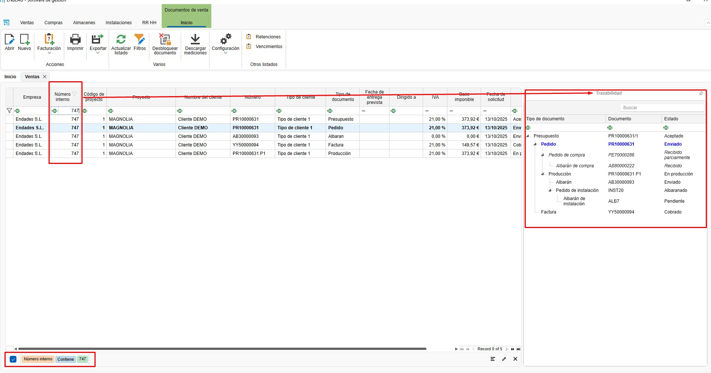

 	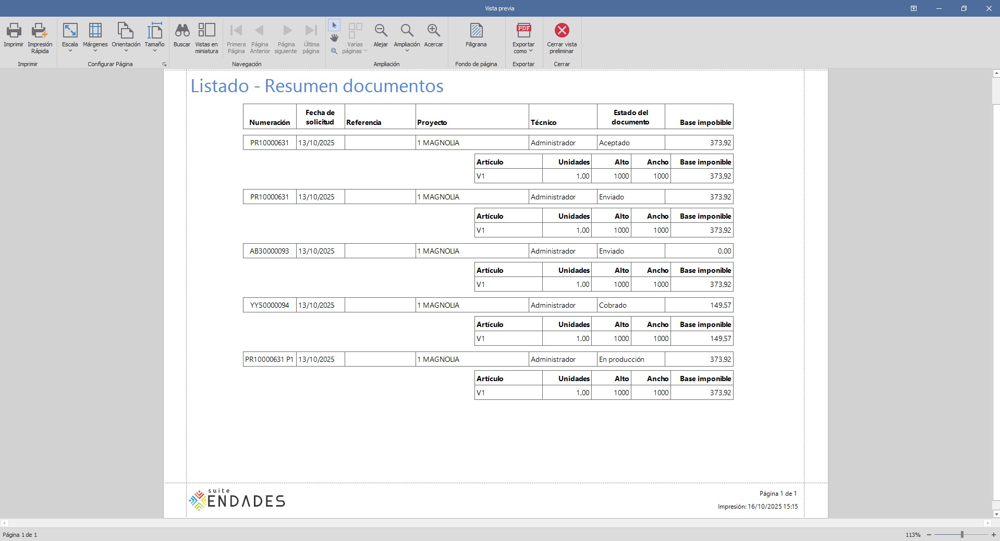
 
- **ENBLAU - Ventas - Fecha de entrega prevista:** Añadido nuevo campo de tipo fecha en presupuestos y pedidos de cliente.

	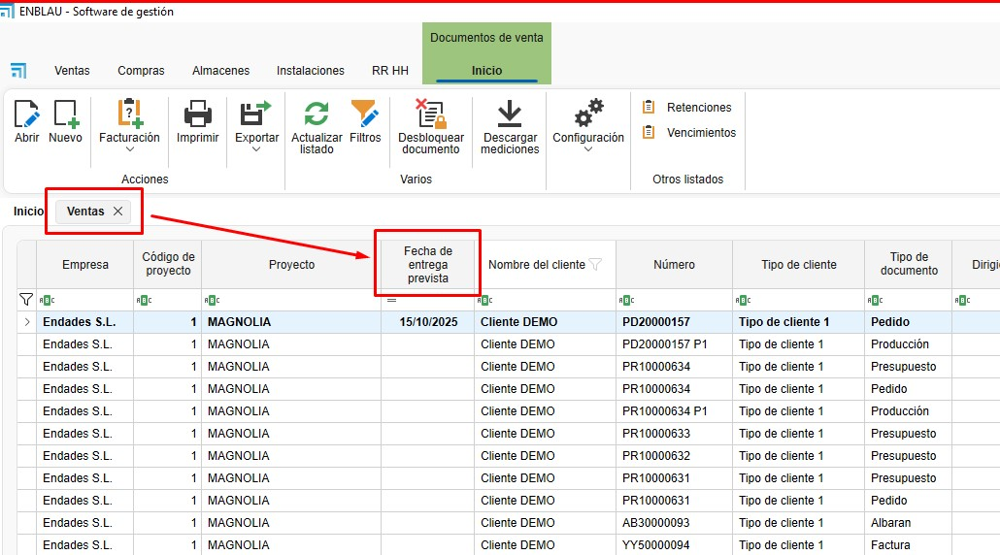

	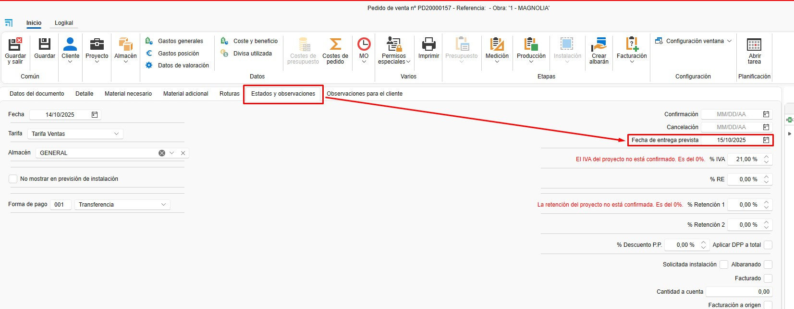

Correcciones

- **ENBLAU - Ventas - Gastos generales:** Resuelto problema en el que al aplicar un reparto por importe no estaba obteniendo un reparto correcto.
- **ENBLAU - Ventas - Producción - Desglosar:** Resuelto problema junto a nueva incorporación de API en Logikal.
- **ENBLAU - Ventas - Roturas:** Resuelto problema al comprar materiales desde roturas. Ahora aparece el nombre del color en la descripción del material.
- **enCLAD - Traducciones:** Resuelto problema con traducciones en italiano.
- **enCLAD - Clientes - Desbloquear:** Resuelto problema al desbloquear clientes.

---

## Versión 25.10.0013
**Fecha de publicación:** 14/10/2025

Novedades

- **enSITE - Mis fichajes:** Desaparece
- **enSITE - Fichajes:** Pasa a llamarse tiempos

Correcciones

- **ENBLAU - Exportación a Cortizo Center:** Resuelto problema en exportación de ciertas referencias

---

## Versión 25.10.0003
**Fecha de publicación:** 03/10/2025

Novedades

- **ENBLAU - Usuarios:** Nuevos campos añadidos. Sexo, fecha de nacimiento y seguridad social
- **ENBLAU - Almacenes - Inventarios:** Nueva implementación. Ahora es posible realizar inventarios de stock sobre un proyecto
- **ENBLAU - Almacenes - Almacén para stock:** Ahora es posible indicar cual es nuestro proyecto para stock en el apartado de configuración
- **ENBLAU - Compras - Importar bajo mínimo y bajo habitual:** Ahora se contrasta contra el proyecto definido para stock
- **ENBLAU - Configuración - Proyectos:** Nuevo campo añadido en configuración general para definición de observaciones por defecto de proyectos

Correcciones

- **ENBLAU - Compras:** Resuelto conflicto al eliminar un albarán de compras y actualizar unidades recibidas en el pedido de compras
- **ENBLAU - Ventas - Vencimientos:** Resuelto problema de actualización de descripción de vencimiento desde el listado de vencimientos
- **ENBLAU - Ventas - Retenciones:** Resuelto problema de actualización de descripción de retención desde el listado de retenciones
- **ENBLAU - Compras - Exportación Cortizo Center:** Resuelto problema de exportación en accesorios donde el acabado era distinto del negro

---

## Versión 25.09.0022
**Fecha de publicación:** 22/09/2025

Novedades

- **ENBLAU - Configuración:** Ahora se comprueban los estados delos documentos de instalaciones, ventas y compras en cada actualización, sin interferir en los estados propios introducidos
- **ENBLAU - Ventas - Informe de factura:** Añadido campo de factura rectificada en facturas rectificativas
- **ENBLAU - Ventas - Informe de factura:** Añadidos checks para poder ocultar la imagen y la descripción y reducir el tamaño de la factura
- **ENBLAU - Compras - Exportación Cortizo Center:** Modificación realizada para valoración de perfiles de PVC utilizados de Logikal
- **ENBLAU - Compras - Reclamaciones:** En el informe de reclamaciones, ahora se puede visualizar únicamente las líneas que contengan unidades pendientes de recibir. También se puede mostrar sin valoración

Correcciones

- **enCONTROL - Monitor de persiana:** Resuelto problema de duplicidad en materiales de tipo pieza como cajones de persiana

---

## Versión 25.09.0010
**Fecha de publicación:** 10/09/2025

Novedades

- **ENBLAU - Ventas - Material necesario:** Ahora se relacionan los cajones de persiana con su su posición pertinente
- **ENBLAU - Compras:** Ahora se relacionan los cajones de persiana con su su posición pertinente
- **ENBLAU - Proyectos - Exportación de costes:** Nueva columna añadida de material descontado de proyecto
- **ENBLAU - Proyectos - Exportación de costes:** Traducido a inglés, portugués e italiano

Correcciones

- **enCONTROL - Monitor de preparación de material:** Corregido problema de detección de vidrio en el proyecto
- **enCONTROL - Monitor de ajunquillado:** Corregido descuento automático de vidrios
- **enCONTROL - Monitor de persiana:** Corregido descuento automático de cajones, definidos como tipo pieza, provenientes de Logikal
- **enCONTROL - Monitor de corte:** Corregido problema de obtención de cortes con múltiples mecanizados

---

## Versión 25.09.0002
**Fecha de publicación:** 02/09/2025

Novedades

- **ENBLAU - Traducciones - Reposición de stock:** Italiano disponible
- **enCONTROL - Traducciones - Reposición de stock:** Italiano disponible
- **enSITE - Traducciones - Reposición de stock:** Italiano disponible
- **ENBLAU WEB - Traducciones - Reposición de stock:** Italiano disponible
- **enUPDATE - Traducciones - Reposición de stock:** Italiano disponible
- **enCONNECT - Traducciones - Reposición de stock:** Italiano disponible
- **ENBLAU - Compras:** Nueva implementación de realización de búsquedas entre el detalle del documento

Correcciones

- **ENBLAU - Ventas - Logikal:** Resuelto problema de sincronización con posicviones de Logikal. El valor de la columna Custom4 de Ventas_Detalle ha sido incrementado al máximo
- **ENBLAU - Compras - Reposición de stock:** Resuelto problema de filtro en bajo mínimo y bajo habitual
- **enCLAD - Exportación a PDF:** Resuelto problema en exportación. Leía imagen como recurso y no física
- **enCLAD - Alzados:** Resuelto problema en creación de alzados. Leía imagen como recurso y no física

---

## Versión 25.08.0025
**Fecha de publicación:** 25/08/2025

Novedades

_Sin novedades destacadas._

Correcciones

_Sin correcciones destacadas._

---

## Versión 25.07.0014
**Fecha de publicación:** 14/07/2025

Novedades

- **ENBLAU - Almacenes - Ubicar albarán de compras:** Nuevo check en configuración (Compras y stock --> Ubicar albarán). Al marcar esta casilla, al crear un nuevo albaán de compras se abrirá automáticamente la ventana de ubicar albarán.
- **ENBLAU - Clientes:** Nuevo tipo de contacto 'Ventas' para selección de email automáticamente
- **ENBLAU - Compras - Exportación a Cortizo Center:** Cambiado el requerido en juntas al total de unidades multiplicado por el total de unidades de empaquetamiento 
- **ENBLAU - Contactos:** Nuevo tipo de contacto 'Ventas' para selección de email automáticamente
- **enCONTROL - Monitor de control:** Añadido resumen estado 'Corte y plegado'
- **enCONTROL - Monitor de control:** Añadido resumen estado 'Pintura'
- **enCONTROL - Monitor de control:** Añadido resumen estado 'Picking'
- **enCONTROL - Monitor de control:** Añadido resumen estado 'Transformación'
- **enCONTROL - Monitor de control:** Añadido resumen estado 'Soldado'
- **enCONTROL - Monitor de control:** Añadido resumen estado 'Limpieza'

Correcciones

- **ENBLAU - Divisas:** Resuelto problema con nueva implementación de histórico de divisas con duplicidad de divisa seleccionada

---

## Versión 25.07.0003
**Fecha de publicación:** 03/07/2025

Novedades

- **enCONTROL - Campos en BD:** Añadidos campos ProfileClass, ArticleType y PieceListType a PR_Barras_Cortes
- **enCONTROL - Campos en BD:** Añadidos campos ArticleType y PieceListType a Ventas_Detalle_EPI_Cuadros_Articulos
- **enCONTROL - Monitor de corte de perfiles principales:** Nuevo puesto de corte de perfiles principales
- **enCONTROL - Monitor de corte de junquillos:** Nuevo puesto de corte de junquillos

Correcciones

- **enCONTROL - Monitor de corte:** Resuelto problema de referencia de Logikal en PVC en bicolores

---

## Versión 25.07.0001
**Fecha de publicación:** 01/07/2025

Novedades

- **ENBLAU - Ventas - Material necesario:** Ahora es posible añadir materiales importados de Logikal en documentos de venta
- **ENBLAU - Ventas - Material necesario:** Añadida funcionalidad para poder descontar de stock desde la ventana de material necesario
- **ENBLAU - RRHH - Calendario de ausencias:** Mejorada vista de solicitudes

Correcciones

- **ENBLAU - Ventas - Divisa utilizada:** Corregido problema de selección de fecha actual la primera vez que se presenta un documento
- **ENBLAU - RRHH - Calendario de ausencias:** Resuelto problema de cálculo de días pendientes de disfrutar al añadir días manualmente

---

## Versión 25.06.0030
**Fecha de publicación:** 30/06/2025

Novedades

- **enCONTROL - Licenciamiento:** Nuevo modo de licenciamiento. Se podrá trabajar con cualquier puesto. En cuanto a licencias, únicamente se tendrá en cuenta el total de puestos concurrentes, independientemente de cuales sean
- **ENBLAU - Instalaciones - Calendario:** Nuevo permiso sobre calendario. Será necesario otorgar este permiso para que los usuarios puedan modificar las citas del calendario
- **ENBLAU - Ventas - Divisa utilizada:** Ahora es posible escoger la divisa de la fecha del documento

Correcciones

_Sin correcciones destacadas._

---

## Versión 25.06.0019
**Fecha de publicación:** 19/06/2025

Novedades

- **enCONTROL - Monitor de Soldado:** Nuevo puesto de soldado
- **enCONTROL - Monitor de Limpieza:** Nuevo puesto de limpieza
- **enCONTROL - Monitor de Transformación:** Nuevo puesto de transformación
- **ENBLAU - Clientes:** Se ha incrementado el campo dirección de 50 a 200 caracteres
- **ENBLAU - Proveedores:** Se ha incrementado el campo dirección de 50 a 200 caracteres
- **ENBLAU - Usuarios:** Se ha incrementado el campo dirección de 50 a 200 caracteres
- **ENBLAU - Instaladores:** Se ha incrementado el campo dirección de 50 a 200 caracteres
- **ENBLAU - Contactos:** Se ha incrementado el campo dirección de 50 a 200 caracteres
- **ENBLAU - Configuración general:** Se ha incrementado el campo dirección de 50 a 200 caracteres
- **ENBLAU - Empresas:** Se ha incrementado el campo dirección de 50 a 200 caracteres
- **ENBLAU - Proyectos:** Se ha incrementado el campo dirección de 50 a 200 caracteres
- **enCONTROL - Monitor de corte - Retales:** Ahora solicitamos la ubicación del retal. Anteriormente se ubicaba automáticamente en la ubicación de la que se obtenía la barra
- **ENBLAU - Ventas - Albaranes:** Se han añadido los campos 'Firmado', 'FechaFirmado', 'NombreFirmante' y 'DNIFirmante' para albaranes en documentos de ventas
- **ENBLAU - Ventas - Facturación:** Se ha implementado una nueva funcionalidad para que marque el check de facturado cuando facturamos desde un albarán de ventas
- **enCONTROL - Monitor de corte y transformación:** Nuevo puesto de corte, en el que se cortan cantidades de barras para almacenar en medidas oportunas para stock
- **ENBLAU - Ventas - Documento de venta:** Al cambiar el nombre de la posición, si Logikal lo permite y nos encontramos conectados a Logikal, el nombre también se cambiará en Logikal.

Correcciones

- **enCONTROL - Monitor de Ajunquillado:** Resuelto problema en perfiles de montado en destino
- **enCONTROL - Monitor de Montaje:** Resuelto problema en perfiles de montado en destino

---

## Versión 25.06.0011
**Fecha de publicación:** 11/06/2025

Novedades

- **ENBLAU - Materiales importados:** Nuevo campo añadido 'Montado en destino'
- **ENBLAU - Ventas - Clasificaciones:** Añadido nuevo puesto de picking
- **ENBLAU - Configuración - Layout de poducción:** Añadido nuevo puesto de picking
- **enMATERIALS - Artículos:** Nuevo campo añadido 'Montado en destino'
- **enCONTROL - Pizarra:** Mejorada velocidad en el puesto de pizarra
- **enCONTROL - Picking:** Nuevo puesto de picking
- **enCONTROL - Montaje:** Nuevo check de montado en destino. Al clicarlo ese material aparecerá en el puesto de picking
- **enCONTROL - Ajunquillado:** Nuevo check de montado en destino. Al clicarlo ese material aparecerá en el puesto de picking
- **enCONTROL - Herraje:** Nuevo check de montado en destino. Al clicarlo ese material aparecerá en el puesto de picking
- **ENBLAU - Ventas - Facturación de albaranes:** Se han añadido las columnas código de proyecto, nombre del proyecto y técnico de proyecto
- **ENBLAU - Compras - Reclamaciones:** Ahora se almacena el texto del email de la reclamación, en el modo nuevo de envío de emails

Correcciones

- **ENBLAU - Almacenes - Asignación:** Resuelto probelma en el que se permitía asignar unidades de mas
- **ENBLAU - Ventas - Nuevo documento de ventas:** Corregido problema en el que se permitía añadir documento sin numeración
- **ENBLAU - Instalaciones - Nuevo documento de instalación:** Corregido problema en el que se permitía añadir documento sin numeración
- **ENBLAU - Ventas - Nuevo albarán:** Resuelto problema en el que un albarán sin XML de precios no podía ser facturado
- **ENBLAU - Ventas - Nuevo documento:** Resuelto problema de selección automática de check de facturación automática al escoger un proyecto

---

## Versión 25.06.0003
**Fecha de publicación:** 03/06/2025

Novedades

- **ENBLAU - Instalaciones - Planificador:** Nuevo modo de vista de línea de tiempo. Ahora es posible interactuar con la hora de inicio y de fin
- **ENBLAU - Proyectos - Planificador:** Ahora siempre se mantiene la primera hora de inicio visible, de tal modo que aunque se vayan posponiendo las tareas podremos visualizar la fecha inicial de asignación

Correcciones

- **ENBLAU - Instalaciones - Planificador:** Resuelto problema al eliminar citas en la planificación

---

## Versión 29.05.0025
**Fecha de publicación:** 29/05/2025

Novedades

- **ENBLAU - Exportación a contabilidad:** Nuevos campos añadidos

Correcciones

_Sin correcciones destacadas._

---

## Versión 25.05.0026
**Fecha de publicación:** 26/05/2025

Novedades

- **enCONTROL - Monitor de corte:** Añadida información acerca de si tiene mecanizados o no el corte seleccionado
- **ENBLAU - Ventas - Material necesario:** Añadida nueva columna que indica si hay stock en el proyecto o no, para poder filtrar
- **ENBLAU - Compras - Pedido de reposición:** Añadidas columnas de color interior y color exterior
- **ENBLAU - Compras - Pedido de reposición:** Ahora se visualizan las referencias aunque tengas stock en el almacén
- **ENBLAU - Proyectos - Árbol de materiales importados:** Añadido árbol a proyectos
- **ENBLAU - Proyectos - Material adicional:** Ahora es posible añadir material de Logikal
- **ENBLAU - Proyectos - Roturas:** Ahora es posible añadir material de Logikal
- **ENBLAU - Ventas - Árbol de materiales importados:** Añadido árbol a ventas
- **ENBLAU - Ventas - Material adicional:** Ahora es posible añadir material de Logikal
- **ENBLAU - Ventas - Roturas:** Ahora es posible añadir material de Logikal

Correcciones

_Sin correcciones destacadas._

---

## Versión 25.05.0019
**Fecha de publicación:** 19/05/2025

Novedades

- **ENBLAU - Usuarios - Permisos de usuario:** Ahora es posible modificar permisos de usuario masivamente
- **ENBLAU - Usuarios - Permisos:** Ahora es posible modificar permisos de usuario masivamente

Correcciones

- **ENBLAU - Ventas - Logikal:** Resuelto problema al copiar posiciones
- **ENBLAU - Ventas - Logikal:** Resuelto problema de asignación de nombre

---

## Versión 25.05.0015
**Fecha de publicación:** 15/05/2025

Novedades

- **ENBLAU - Ventas - Pedido:** Nuevo informe disponible. Certificado de suministro
- **ENBLAU:** Corregidas cadenas en inglés al seleccionar filtros
- **enCLAD:** Corregidas cadenas en inglés al seleccionar filtros
- **enCONTROL:** Corregidas cadenas en inglés al seleccionar filtros
- **ENBLAU - Almacenes - Movimientos de almacén:** Ahora es posible abrir el documento de compras relacionado desde movimientos
- **ENBLAU - Almacenes - Movimientos de almacén:** Ahora es posible abrir el documento la producción relacionada desde movimientos
- **ENBLAU:** Cambio de modo de apertura en ventanas de documentos. ahora dependen de la ventana principal de ENBLAU
- **ENBLAU - Ventas:** Ahora se puede quitar el sujeto pasivo en facturas
- **enCONTROL - Monitor de comprobación final:** Añadida etiqueta de producto terminado

Correcciones

_Sin correcciones destacadas._

---

## Versión 25.05.0012
**Fecha de publicación:** 12/05/2025

Novedades

- **ENBLAU - Ventas - Documento de material necesario:** Habilitado en mediciones y en producciones
- **ENBLAU - Usuarios - Impresión de tarjetas:** Se ha habilitado la edición de las tarjetas directamente desde la aplicación

Correcciones

- **ENBLAU - Compras - Pedidos agrupados:** Resuelto problema en creación de documentos

---

## Versión 25.05.0007
**Fecha de publicación:** 07/05/2025

Novedades

_Sin novedades destacadas._

Correcciones

- **enCONTROL - Monitor de control:** Resuelto problema de puesto de control. En ocasiones no liberaba el puesto en uso

---

## Versión 25.05.0005
**Fecha de publicación:** 05/05/2025

Novedades

- **ENBLAU - Ventas - Posiciones:** Añadidos tres campos nuevos en base de datos con información de sistema, color y tipo de producto para posiciones de Logikal
- **ENBLAU - Almacenes - Producto terminado:** Nuevo apartado de gestión de producto terminado
- **enCONTROL - Monitor de comprobación:** Nuevo botón de ubicación de producto

Correcciones

_Sin correcciones destacadas._

---

## Versión 25.04.0028
**Fecha de publicación:** 29/04/2025

Novedades

- **ENBLAU - Instalaciones - Planificador:** Ahora es posible copiar y pegar citas en el planificador
- **ENBLAU - Instalaciones - Instalaciones planificadas:** Añadida columna estado
- **ENBLAU - Instalaciones - Instalaciones planificadas:** Añadida columna Clasificación
- **ENBLAU - Instalaciones - Instalaciones planificadas:** Modificadas columnas de fecha para que muestre la hora
- **ENBLAU - Almacenes:** Nuevo listado - Resumen con ubicaciones
- **enCONTROL - Monitor de control - Pasar a producción:** Ahora se respetan los cambios iniciales al arrastrar una nueva producción a fabricación, y cambiar ciertos valores
- **ENBLAU - Gestión de ventanas emergentes:** Ahora se modifican de manera independiente

Correcciones

- **ENBLAU - Campos de texto - Texto enriquecido:** Resuelto problema al copiar texto en todos los campos de observaciones
- **ENBLAU - Ventas:** Resuelto problemas con subestructuras obtenidas desde Logikal

---

## Versión 25.04.0016
**Fecha de publicación:** 22/04/2025

Novedades

- **ENBLAU - Proyectos - Stock:** Al finalizar un proyecto ahora podemos reasignar masivamente todos los materiales de almacén a un nuevo proyecto
- **ENBLAU - Ventas - Stock:** Ahora se pueden reasignar materiales de almacén desde material necesario
- **enCONTROL - Stock:** Creado log de problemas de stock en ruta de instalación de ENBLAU

Correcciones

- **ENBLAU - Compras:** Resuelto problema en facturación de albaranes
- **ENBLAU - Compras:** Resuelto problema de duplicidad en la descripción de materiales al arrastrarse desde el árbol de materiales. Solo en superficies.
- **enCONTROL - Stock:** Resueltos múltiples problemas al descontar stock automáticamente

---

## Versión 25.04.0011
**Fecha de publicación:** 11/04/2025

Novedades

- **ENBLAU - Compras - Reposición de stock:** Nueva aplicación para importar materiales a stock bajo mínimo o bajo habitual
- **ENBLAU - Almacenes:** Ahora es posible configurar el modo de descontar de stock para cuando se realizan movimientos de salida desde una producción en ENBLAU

Correcciones

- **ENBLAU - Almacenes:** Corregido el modo en el que se muestran los colores en material necesario para saber si disponemos de materiales en stock

---

## Versión 25.04.0007
**Fecha de publicación:** 07/04/2025

Novedades

- **ENBLAU - Compras - Escanear:** Modificado para poder escanear múltiples hojas de documentos en un único PDF
- **enUPDATE - Descargas:** Ahora cada vez que se cierre y se vuelva a entrar en enUPDATE, te permitirá volver a descargar la versión si no se encuentra instalada
- **ENBLAU - Almacenes:** Nuevo tipo de movimiento. Movimiento de asignación desde almacen detallado, a través del cual podemos asginar el proyecto en el queremos utilizar el material
- **ENBLAU - Ventas - Stock necesario:** Ahora se puede visualizar las unidades disponibles, reservadas y pendientes del material para cada almacén desde esta ventana
- **ENBLAU - Almacenes - Detallado:** Ahora se puede abrir el documento de entrada desde el listado de almacén
- **ENBLAU - Almacenes - Material pendiente:** Ahora se puede abrir el documento de entrada desde el listado de material pendiente
- **ENBLAU - Almacenes - Reservado:** Ahora se puede abrir el material reservado del proyecto e interactuar

Correcciones

_Sin correcciones destacadas._

---

## Versión 25.04.0003
**Fecha de publicación:** 03/04/2025

Novedades

_Sin novedades destacadas._

Correcciones

- **enCONTROL - Touch:** Resuelto problema con interfaz táctil en ciertas pantallas.

---

## Versión 25.04.0001
**Fecha de publicación:** 01/04/2025

Novedades

- **ENBLAU - Almacenes - Movimientos:** Añadida columna de hora en movimientos
- **ENBLAU - Almacenes - Movimientos:** Ahora se puede devolver una salida de material
- **ENBLAU - Almacenes - Movimientos:** Ahora se puede eliminar un movimiento por un administrador
- **ENBLAU - Almacenes - Movimientos - Informes:** Nuevo informe de movimientos 'Movimientos'
- **ENBLAU - Almacenes - Movimientos - Informes:** Nuevo informe de movimientos 'Movimientos I'
- **ENBLAU - Almacenes - Almacenes - Informes:** Nuevo informe de inventario en fecha concreta
- **ENBLAU - Almacenes - Almacenes - Informes:** Nuevo informe de inventario según filtro aplicado
- **ENBLAU - Almacenes - Almacenes - Resumen:** Mejorada vista de resumen de almacén
- **ENBLAU - Material necesario - Vidrios:** Modificadas las descripciones extendidas de los vidrios provenientes de Logikal

Correcciones

- **ENBLAU - Material Reservado:** Resuelto problema de visualización en sock en almacenes
- **enCHECK - Traducciones:** Resuelto problema con traducción

---

## Versión 25.03.0025
**Fecha de publicación:** 25/03/2025

Novedades

- **enCONTROL - Pizarra:** Mejorada interfaz.
- **enCONTROL - Monitores:** Mejorada interfaz.
- **ENBLAU - Ventas - Facturación:** Integrada exportación para facturación electrónica según gobierno de España

Correcciones

- **ENBLAU - Compras:** Resuelto problema de precios en persianas en materiales prvenientes de Logikal
- **ENBLAU - Compras:** Resuelto problema de precios en vidrios en materiales prvenientes de Logikal
- **ENBLAU - Compras - Ubicación de albaranes:** Resuelto problema de duplicación de unidades en stock

---

## Versión 25.03.0006
**Fecha de publicación:** 06/03/2025

Novedades

- **ENBLAU - Almacenes:** Añadido sumatorio de unidades totales en stock, pendientes de recibir y reservadas.
- **ENBLAU - Proyectos - Material reservado:** Añadido sumatorio de unidades totales en stock, pendientes de recibir y reservadas.
- **ENBLAU - Ventas - Material necesario - Roturas:** Añadido sumatorio de unidades totales en stock, pendientes de recibir y reservadas.
- **ENBLAU - Ventas - Roturas:** Añadido sumatorio de unidades totales en stock, pendientes de recibir y reservadas.
- **ENBLAU - Ventas - Material adicional:** Añadido sumatorio de unidades totales en stock, pendientes de recibir y reservadas.

Correcciones

_Sin correcciones destacadas._

---

## Versión 25.02.0018
**Fecha de publicación:** 18/02/2025

Novedades

- **ENBLAU - Informes - Pedido de compras sin valorar:** Ahora se tiene en cuentra las unidades de venta indicadas en el proveedor
- **ENBLAU - Compras - Escanear:** Ahora se almacena siempre en PDF la imagen escaneada. Tamben incrementa el nombre del documento a almacenar
- **enCONTROL - Monitor de control:** Al hacer click sobre una producción en cola de producción, veremos la documentación asociada al mismo en el árbol de producción
- **ENBLAU:** Mejora de rendimiento
- **ENBLAU:** Actualización de entorno
- **enCONTROL:** Actualización de entorno
- **enMATERIALS:** Actualización de entorno
- **enCHECK:** Actualización de entorno
- **enCAD:** Actualización de entorno
- **enCLAD:** Actualización de entorno
- **ENBLAU - Ventas - Configuración estados:** Ahora es posible configurar estados existentes o añadir estados nuevos
- **ENBLAU - Compras - Configuración estados:** Ahora es posible configurar estados existentes o añadir estados nuevos
- **ENBLAU - Instalaciones - Configuración estados:** Ahora es posible configurar estados existentes o añadir estados nuevos
- **ENBLAU - Ventas - Filtros:** Mejorado rendimiento y usabilidad
- **ENBLAU - Compras - Filtros:** Mejorado rendimiento y usabilidad
- **ENBLAU - Instalaciones - Filtros:** Mejorado rendimiento y usabilidad
- **ENBLAU - Ventas - Materiales necesarios - STOCK:** Mejorada consulta de obtención de unidades en stock, contando con el material de proyectos finalizados
- **ENBLAU - Almacenes:** Mejorada consulta de con el valor 'EsRetal' agrupado
- **ENBLAU - Contabilidad:** Añadido nuevo tipo de exportación contable previsto para '.xlsx'
- **ENBLAU - Planificador de instalaciones:** Mejorando usabilidad y visualización del planificador de instalaciones

Correcciones

_Sin correcciones destacadas._

---

## Versión 25.02.0004
**Fecha de publicación:** 04/02/2025

Novedades

_Sin novedades destacadas._

Correcciones

- **enCONTROL:** Resueltos problemas visuales relacionados con traducciones

---

## Versión 25.02.0001
**Fecha de publicación:** 31/01/2025

Novedades

_Sin novedades destacadas._

Correcciones

- **ENBLAU - Ubicación albaranes:** Resuelto problema visualización planta
- **ENBLAU - Proyectos:** Resuelto problema eliminación almacén automáticamente, en modo de stock 2

---

## Versión 25.01.0022
**Fecha de publicación:** 22/01/2025

Novedades

- **enCONTROL - Monitor de pizarra:** Añadido el texto del último comentario de producción
- **ENBLAU - Planificador de proyectos:** Ahora se almacena la última vista utilizada en el planificador por usuario
- **ENBLAU - Almacenes - Stock:** Nueva visualización de stock a través de la cual podemos ver a que proyecto van destinados esos materiales
- **ENBLAU - Ventas - Material necesario:** Ahora se visualiza desde ventas el proyecto al que va destinado el stock
- **ENBLAU - Ventas - Material necesario:** La columna artículo y la columna unidades a comprar se visualizan en color rojo o verde según si se encuentra material idsponible para realizar el proyecto o no. Consideramos material disponible la diferencia entre las unidades necesarias y las que hay en stock destinadas al proyecto, o en proyectos finalizados, menos las reservadas.
- **ENBLAU - Proyectos:** Nuevo check de predeterminado junto a responsable de compras y responsable. Al marcarlo, asumimos que el responsable indicado es el que queremos que arrastre a cada documento de compras o documento de ventas respectivamente que vayamos a crear a nuevo, y que se encuentre relacionado con el proyecto en cuestión.
- **ENBLAU - Compras - Informes:** Ahora se puede ocultar en los documentos de pedido a proveedor el documento de origen
- **ENBLAU - Idioma:** Disponible en portugués
- **enCONTROL - Idioma:** Disponible en portugués
- **enCLAD - Idioma:** Disponible en portugués
- **enSite - Idioma:** Disponible en portugués
- **ENBLAU - Idioma:** Disponible en Inglés
- **enCONTROL - Idioma:** Disponible en Inglés
- **enCLAD - Idioma:** Disponible en Inglés
- **enSite - Idioma:** Disponible en Inglés
- **enSite - Documentación:** Añadido nuevo apartado de documentación
- **ENBLAU - Informes - Editor:** Añadidas dlls necesarias para edición de informes personalizados

Correcciones

- **ENBLAU - Emails - Guardado en local:** Resuelto problema de almacenamiento local

---

## Versión 25.01.0002
**Fecha de publicación:** 02/01/2025

Novedades

- **enCONTROL - Monitor de preparación de material:** Se han añadido dos columnas nuevas. Stock en proyecto y reservado en proyecto
- **ENBLAU - Instalaciones:** Modificaco el modo de lectura de iconos en documentación. Ahora no sé dejará de visualizar la documentación después de una instalación aunque otro usuario tuviese abierta la aplicación durante el proceso de instalación
- **ENBLAU - Listado de ventas - Informe de facturas:** Ahora admite el filtro aplicado en el listado
- **ENBLAU - Listado de compras - Informe de facturas:** Ahora admite el filtro aplicado en el listado
- **ENBLAU - Stock:** Añadida columna Es retal a almacenes y almacenes en ventas
- **ENBLAU - Stock - Material reservado:** Añadida la visualización de material en almacenes en la ventana de reservado
- **ENBLAU - Compras - Logikal - Matereiales importados:** Nuevo árbol de materiales de artículos de Logikal con los que hemos trabajado previamente. Ahora es posible añadir materiales de Logikal a un pedido de compras sin necesidad de estar conectado
- **ENBLAU - Logikal - Matereiales importados:** Ahora se pueden definir los materiales de Logikal para que se controle el stock al listar material o se marque como para comprar según necesidades
- **ENBLAU - Compras - Informes:** Nuevo informe de M2 por proveedor
- **ENBLAU - Compras - Stock:** Nueva función desde pedidos de compra para pedir a proveedor todos los materiales bajo mínimo o bajo habitual en almacén

Correcciones

- **ENBLAU - Usuarios:** Corregido problema de duplicidad de permisos
- **ENBLAU - Notificaciones de procesos:** Corregido problema en notificaciones de ciertos usuarios

---

## Versión 24.12.0020
**Fecha de publicación:** 20/12/2024

Novedades

- **ENBLAU - Medidas de persiana:** Ahora se importa el alto del cajón de persiana
- **ENBLAU - Compras - Documento de compras:** Añadida columna de trazabilidad de superficies
- **ENBLAU - Compras - Nuevo albarán:** Añadida columna de trazabilidad de superficies
- **ENBLAU - Compras - Nueva factura:** Añadida columna de trazabilidad de superficies

Correcciones

- **ENBLAU - Stock:** Resuelto problema de movimiento y descuento de juntas cuando la longitud coincidía con la longitud a descontar
- **enSITE - Stock:** Resuelto problema de movimiento y descuento de juntas cuando la longitud coincidía con la longitud a descontar

---

## Versión 24.12.0012
**Fecha de publicación:** 12/12/2024

Novedades

- **enCONTROL - Puesto de comprobación final:** Añadido campo referencia de producción

Correcciones

_Sin correcciones destacadas._

---

## Versión 24.12.0010
**Fecha de publicación:** 10/12/2024

Novedades

- **ENBLAU - Compras - escánner:** Ahora es posible llamar al escánner desde un documento de compras
- **ENBLAU - Stock - Material reservado:** Ahora si una reserva está cancelada, no suma cantidades nuevas añadidas sobre ella

Correcciones

- **ENBLAU - Compras - Importe en superficies:** Resuelto problema de valoración en materiales de tipo superficie

---

## Versión 24.12.0009
**Fecha de publicación:** 09/12/2024

Novedades

- **ENBLAU - Compras - Ubicación en stock:** Ahora se puede ubicar un albarán de compras en almacén desde ENBLAU
- **ENBLAU - Compras - Facturación:** Actualización de check de pagado en facturas de compra auotmáticamente
- **ENBLAU - Compras:** Ahora se permite modificar la referencia de proveedor de materiales de Logikal y ENBLAU desde un documento de compras
- **enCONTROL - Puesto de corte:** Añadida longitud de retal en la información de la barra
- **enCONTROL - Puesto de corte:** Modificado el orden de los cortes para que se muestre como en el informe de optimización de corte de Logikal

Correcciones

_Sin correcciones destacadas._

---

## Versión 24.11.0027
**Fecha de publicación:** 27/11/2024

Novedades

- **enCONTROL:** Añadido enUPDATE a la instalación independiente de enCONTROL
- **enCONTROL:** Añadido nuevo puesto de pintura
- **enCONTROL:** Añadido nuevo puesto de corte y plegado de chapas
- **ENBLAU - Stock:** Añadida exportación Excel de barra en stock según protocolo de importación de retales de Logikal
- **ENBLAU - Facturación electrónica:** Añadida facturación electrónica según Facturae
- **ENBLAU - Facturación electrónica:** Modificada plantilla de factura con QR de factura electrónica
- **ENBLAU - Ventas - Vencimientos:** Actualización de estado automático en facturas al indicar que los vencimientos se encuentran cobrados

Correcciones

_Sin correcciones destacadas._

---

## Versión 24.11.0015
**Fecha de publicación:** 15/11/2024

Novedades

- **enCONTROL:** Nueva etiqueta añadida. Etiqueta 06.

Correcciones

- **ENBLAU - Producción:** Corregido problema de duplicidad de IDs en stock necesario
- **enCONTROL:** Resuelto problema de interpretación de fechas en algunos entornos de red

---

## Versión 24.10.0031
**Fecha de publicación:** 11/11/2024

Novedades

- **enCONTROL - Configuración:** Incluida nueva ruta de documentación genérica
- **enCONTROL - Configuración:** Nuevo sistema de control de stock. Descontar del proyecto, en su defecto de cualquier lugar
- **ENBLAU - Producción:** Ahora es posible controlar el stock necesario masivamente desde ENBLAU

Correcciones

_Sin correcciones destacadas._

---

## Versión 24.10.0028
**Fecha de publicación:** 28/10/2024

Novedades

- **ENBLAU - Compras - Informes:** Incluida imagen de material en pedido de compras sin valorar
- **ENBLAU - Compras - Informes:** Incluida imagen de material en material a recibir
- **ENBLAU - Compras - Informes:** Incluida imagen de material en reclamaciones
- **enCLAD - Selección perfiles:** Ahora se muestra la longitud del perfil
- **enCLAD - Longitud perfiles:** Ahora se generan de la longitud exacta en lugar de 10 mm de diferencia

Correcciones

- **enCLAD - Paneles desplegados:** Resuelto problema en muros con inclinación

---

## Versión 24.10.0015
**Fecha de publicación:** 15/10/2024

Novedades

- **ENBLAU - Compras - Vencimientos:** Añadido nuevo check a configuración, donde poder indicar si queremos que los vencimientos en facturas de compra se creen por defecto como pagados
- **ENBLAU - Compras - Listado de vencimientos:** Ahora se calcula la fecha del vencimiento desde la fecha del documento
- **ENBLAU - Compras - Listado de vencimientos:** Se han añadido las columans referencia y referencia de proveedor
- **ENBLAU - Compras - Informes - Pedido sin valorar:** Ahora se visualizan las observaciones para el proveedor
- **ENBLAU - Ventas:** Ahora es posible visualizar el stock desde material necesario en el nuevo método de control de stock
- **ENBLAU - Notificaciones:** Ahora es posible indicar un usuario concreto a notificar

Correcciones

- **ENBLAU - Ventas:** Resuelto problema al añadir material a roturas
- **ENBLAU - Compras - Listado de vencimientos:** Resuelto problema con filtro de pagado

---

## Versión 24.10.0004
**Fecha de publicación:** 04/10/2024

Novedades

- **ENBLAU:** Mejoras de rendimiento interno
- **ENBLAU - Ventas:** Incluidas medidas de persiana en materiales de tipo pieza provenientes de Logikal

Correcciones

_Sin correcciones destacadas._

---

## Versión 24.09.0011
**Fecha de publicación:** 11/09/2024

Novedades

- **ENBLAU - Listado de material:** Modificado el redondeo en vidrios para controlar que se corresponda con milímetros
- **ENBLAU - Ventana de reservado:** Añadido mostrar colores en materiales para arrastrar
- **ENBLAU - Materiales necesarios:** Ahora se muestra la medida de la persiana en la descripción del artículo
- **ENBLAU - Compras - Informes:** Añadida nueva plantilla de pedido de compras sin valorar
- **ENBLAU - Ventas - Vencimientos:** Añadida columna de comercial
- **ENBLAU - Vencimientos:** Añadido campo de fecha de cobrado
- **ENBLAU - Informes:** Añadida columna de fecha de cobrado en el informe de vencimientos

Correcciones

- **enSITE - Adjuntos en recepciones:** Resuelto problema al adjuntar imágenes en una albarán de compra
- **ENBLAU - Ventana de reservado:** Resuelto problema de visualización de unidades en referencias de pedidos
- **ENBLAU - Stock:** Resuelto problema con obtención de código único en referencias similares con diferente color

---

## Versión 24.09.0003
**Fecha de publicación:** 03/09/2024

Novedades

- **ENBLAU - Informes:** Albarán valorado - Ahora es posible ocultar la columna de descuento
- **ENBLAU - Compras:** No se permite la modificación de la referencia en materiales de Logikal

Correcciones

- **enCONTROL - Monitor de persiana:** Resuelto problema de visualización de documentación
- **enSITE - Opciones:** Resuelto problema de visualización del texto en los valores de las opciones de tipo selección
- **ENBLAU - Compras - Exportación Cortizo Center:** Resuelto problema de exportación a plantilla de Cortizo center

---

## Versión 24.07.0024
**Fecha de publicación:** 29/07/2024

Novedades

- **ENBLAU - Listado de ventas:** Añadida columna de tipo de cliente
- **ENBLAU - Control de stock:** Nueva funcionalidad de reservas de material para proyecto
- **ENBLAU - Recursos humanos - Solicitudes:** Listado de días disponibles por empleado por año de convenio
- **ENBLAU - Recursos humanos - Appointment:** Listado de días disponibles por empleado por año de convenio
- **ENBLAU - Notificaciones:** Añadido botón para pdoer abrir el documento al que se hace referencia
- **ENBLAU - Documentación:** Añadida automatización de creación de directorios en las carpetas de documentación
- **enCONTROL - Etiquetas:** Nueva etiqueta añadida

Correcciones

_Sin correcciones destacadas._

---

## Versión 24.07.0008
**Fecha de publicación:** 08/07/2024

Novedades

- **ENBLAU - Clientes:** Añadido botón de cuentas contables en clientes
- **ENBLAU - Compras - Vencimientos:** Ahora es posible marcar como pagados múltiples vencimientos de compra
- **ENBLAU - Ventas:** Añadido nuevo campo en configuración, para personalizar la obtención de descripción de superficies de Logikal

Correcciones

- **ENBLAU - Compras:** Corregido problema de traducciones al aplicar descuentos masivamente en compras
- **ENBLAU - Proyectos:** Corregido problema en filtro nombre al seleccionar el cliente

---

## Versión 24.06.0020
**Fecha de publicación:** 20/06/2024

Novedades

- **ENBLAU - Material necesario:** Será posible agrupar vidrios provenientes de Logikal desde configuración general
- **ENBLAU - Retales:** Nuevo campo de retal mínimo en Logikal, en configuración general de ENBLAU
- **ENBLAU - Compras:** Ahora es posible aplicar distinto IVA a las distintas líneas del pedido, del albarán o la factura
- **ENBLAU - Compras:** Se han modificado las plantillas de pedido, albarán y factura para visualizar el IVA de la línea

Correcciones

_Sin correcciones destacadas._

---

## Versión 24.06.0017
**Fecha de publicación:** 17/06/2024

Novedades

- **ENBLAU - Informes:** Añadido sumatorio en informe de crédito
- **ENBLAU - Informes:** Nuevo informe de albarán valorado en ventas
- **ENBLAU - Informes:** Nuevo informe desde el listado de ventas. Posiciones realizadas en un persiodo de tiempo
- **ENBLAU - Control de stock:** Añadido nuevo modo de control de stock, a través de difinición de plano de planta
- **enSITE - Control de stock:** Ahora es posible ubicar albaranes recibidos, realizar traspasos o salidas
- **enCONTROL - Control de stock:** Nueva configuración para control de stock. Ahora se descontarán automáticamente los materiales utilizados en cada puesto

Correcciones

_Sin correcciones destacadas._

---

## Versión 24.05.0021
**Fecha de publicación:** 21/05/2024

Novedades

- **ENBLAU - Emails:** Ahora existen dos modos de envío de emails, disponibles para seleccionar desde configuración general --> Emails. Modo 1 y Modo 2. El nuevo modo de envío de emails almacenará una copia del email enviado en la bandeja de enviados del usuario que lo envía
- **enMATERIALS - Artículos:** Añadido check para creación de herramientas

Correcciones

_Sin correcciones destacadas._

---

## Versión 24.05.0017
**Fecha de publicación:** 17/05/2024

Novedades

- **ENBLAU - Numeraciones:** Nuevo desarrollo. Para cualquier tipo de documento que pertenezca a un proyecto, por defecto tomará las numeraciones pertinentes a la empresa a la que va dirigido
- **ENBLAU - Vencimientos - Informes:** Añadido el sumatorio total del importe al documento de vencimientos
- **ENBLAU - Proyectos - Exportación de costes:** Añadidas columans de horas reales de enCONTROL, coste de fabricación, horas reales de enSITE y coste de colocación
- **ENBLAU - Proyectos - Exportación de costes:** Implementadas mejoras de visualización

Correcciones

- **ENBLAU - Compras - Nuevo albarán:** Corregido problema de visualización de base imponible total
- **enSITE - Compras - Nuevo albarán:** Corregido problema de visualización de base imponible total
- **ENBLAU - Compras - Nueva factura:** Corregido problema de visualización de base imponible total

---

## Versión 24.05.0008
**Fecha de publicación:** 08/05/2024

Novedades

- **ENBLAU - Fase de producción:** Ahora es posible seleccionar la fecha prevista de entrada en producción, y un motivo
- **ENBLAU - Nueva fase de producción:** Ahora es posible seleccionar la fecha prevista de entrada en producción, y un motivo para pdoer enviar a producción inmediatamente
- **enCONTROL - Monitor de control:** Se visualiza en las producciones en cola el motivo indicado por el técnico
- **enSITE - Recepciones:** Mejorado el proceso en el que se guardan los adjuntos en base de datos. Al comprobar el servidor HTTP en ocasiones no llegaba a guardarse por falta de tiempo
- **enSITE - Mediciones:** Ahora es posible descargar y publicar mediciones en modo 'SIN CONEXIÓN'
- **enSITE - Tomas de datos:** Ahora es posible descargar y publicar tomas de datos en modo 'SIN CONEXIÓN'

Correcciones

_Sin correcciones destacadas._

---

## Versión 24.04.0030
**Fecha de publicación:** 30/04/2024

Novedades

- **ENBLAU - Instalaciones - Plantilla de pedido:** Cambio en visualización de observaciones
- **ENBLAU - Compras:** Añadido botón para poder abrir la el proyecto desde el documento de compras
- **ENBLAU - Instalaciones:** Añadido botón para poder abrir la el proyecto desde el documento de instalación
- **ENBLAU - Ventas - Logikal:** Desde mostrar ruta, ahora es visile mayor información sobre el proyecto relacionado
- **ENBLAU - Ventas - Logikal:** Añadido check en informes para producción para diferenciar el informe de exportación de producción del informe de exportación de gestión
- **ENBLAU - Almacenes:** Nueva implementación. Realización de movimientos masivos desde el propio almacén. Entrada, salida y traspaso
- **ENBLAU - Proyectos:** Añadido botón para abrir documentación de los documentos pertenecientes a la obra, sin necesidad de abrir el documento en cuestión

Correcciones

_Sin correcciones destacadas._

---

## Versión 24.04.0018
**Fecha de publicación:** 19/04/2024

Novedades

- **enMATERIALS - Exportar artículos:** Modificado el proceso de exportar artículos y datos de compra por proveedor
- **enMATERIALS - Importar artículos:** Ahora se pueden importar ciertos campos de los artículos a través de un excel
- **enMATERIALS - Importar datos de compra:** Se pueden importar los datos de compra de los artículos modificados
- **ENBLAU - Logikal:** Creada tabla de almacenamiento de materiales importados.
- **enCONTROL - Puesto de persiana:** Nuevo puesto para control de montaje de persiana
- **ENBLAU - Ventas - Lista de almacenes:** Se permite filtrar
- **ENBLAU - Compras - Lista de almacenes:** Se permite filtrar
- **ENBLAU - Ventas - Material necesario:** Se visualiza una imagen del material seleccionado
- **ENBLAU - Ventas - Material adicional:** Se visualiza una imagen del material seleccionado
- **ENBLAU - Compras:** Se visualiza una imagen del material seleccionado

Correcciones

- **ENBLAU - Licencias:** Arreglado problema con acentos en licencias

---

## Versión 24.04.0005
**Fecha de publicación:** 05/04/2024

Novedades

- **enCLAD - Inicio:** Almacenamiento de idioma escogido por el usuario en el registro
- **ENBLAU - Inicio:** Almacenamiento de idioma escogido por el usuario en el registro
- **enCONTROL - Inicio:** Almacenamiento de idioma escogido por el usuario en el registro
- **enMATERIALS - Inicio:** Almacenamiento de idioma escogido por el usuario en el registro
- **ENBLAU - Retales:** Modificación de añadido de retales de materiales de Logikal
- **ENBLAU - Compras:** Al copiar y pegar una línea en un pedido de compras, ahora mantiene la relación con material necesario o roturas, de tal modo que podemos controlar el stock adecuadamente en materiales de Logikal
- **enCLAD - Sistema remachado:** Modificación de cálcul ode remaches en aristas horizontales y recercados
- **enCLAD - Cálculo de paneles:** Implementada mejora para control de paneles en cuadros pertenecientes a huecos

Correcciones

_Sin correcciones destacadas._

---

## Versión 24.03.0027
**Fecha de publicación:** 27/03/2024

Novedades

- **enCONTROL - Fecha propuesta:** La fecha de la producción en ENBLAU será la propuesta al responsable de rpoducción al pasar la producción de cola a fabricación.
- **enCONTROL - Observaciones:** Serán visibles las observaciones del técnico al arrastrar la producción de cola a fabricación
- **ENBLAU - Traducciones:** Mejorada traducción en informes, producción, configuración y cadenas internas
- **ENBLAU - Inicio:** Mejorada la velocidad de inicio en carga de materiales, colores y escandallos
- **enMATERIALS - Inicio:** Mejorada la velocidad de inicio en carga de materiales y colores
- **enCAD - Inicio:** Mejorada la velocidad de inicio en carga de materiales y colores
- **enCLAD - Inicio:** Mejorada la velocidad de inicio en carga de materiales y colores

Correcciones

- **ENBLAU - Notificaciones:** Resuelto problema de comprobación de valores nulos
- **enCONTROL - Envío a producción:** Resuelto problema de comprobación de campos y ficheros necesarios

---

## Versión 24.03.0020
**Fecha de publicación:** 15/03/2024

Novedades

- **enSITE - Ubicación mediciones:** Se añade botón para visualizar la imagen con trazos y poder hacer zoom.
- **enSITE - Ubicación toma de datos:** Se añade botón para visualizar la imagen con trazos y poder hacer zoom.
- **ENBLAU - Ventas - Enviar a producción:** Ahora no es necesario establecer los datos del calendario de fabricación al enviar una producción a fabricación.
- **ENBLAU - RRHH - Calendario:** Se cambia diseño de ventanas de nuevas citas y se añaden funcionalidades adicionales.
- **enCONTROL - Monitor de control:** Actualizaremos el calendario de producción al arrastrar la producción de cola de producción a fabricación.
- **ENBLAU - Ventas:** Ahora se transmiten las observaciones internas al añadir versión o al aceptar el presupuesto.
- **ENBLAU - Ventas - Facturación:** Modificado campo para que en total pedido de facturas se tenga en cuenta el descuento de pronto pago.
- **ENBLAU - Ventas - Informes - Comparativa entre versiones:** Ahora se tiene en cuenta el descuento de pronto pago.
- **enCONTROL - Planificación (Nuevo):** Añadido diagrama de Gantt para previsión de producción en base a la carga de tiempos.

Correcciones

- **enCONTROL - Monitor de control:** Corregido problema de visualización de desplazamiento de producciones al actualizar listado de producciones o arrastrar producicones entre listados de producciones en cola, producciones archivadas o producciones en fabricación.

---

## Versión 24.02.0022
**Fecha de publicación:** 22/02/2024

Novedades

- **ENBLAU - Vencimientos:** Añadida columna empresa.
- **ENBLAU - Retenciones:** Añadida columna empresa.
- **ENBLAU - Proyectos:** Se ha dividido la información de tareas y documentos relacionados en distintas pestañas.
- **ENBLAU - Traducciones:** Añadidas nuevas traducciones sobre preguntas y avisos de ENBLAU.
- **ENBLAU - Traducciones:** Mejorado filtrado y manejo de traducciones.

Correcciones

- **ENBLAU - Proyectos:** Resuelto problema de visualización de documentos relacionados en proyectos puntuales.

---

## Versión 24.02.0016
**Fecha de publicación:** 16/02/2024

Novedades

- **enSITE - Toma de datos:** Se elimina cabecera de información de paginas.
- **enSITE - Producción:** Ahora despues de realizar una acción en un proyecto se puede deshacer volviendo a pulsar sobre el botón de montar/colocar.
- **ENBLAU - Logikal:** Cambio de modo de trabajo de ENBLAU a través de Logikal. Ahora no se crean nuevos proyectos, en todo momento se trabaja sobre el mismo proyecto de Logikal al crear versiones, aceptar presupuesto, crear mediciones o crear producciones. Para diferenciar las posiciones seirán moviendo a través de fases de Logikal.

Correcciones

_Sin correcciones destacadas._

---

## Versión 24.02.0008
**Fecha de publicación:** 08/02/2024

Novedades

- **ENBLAU-enSITE - Toma datos-Mediciones:** Se revisa y mejora funcionamiento para el traspaso de información entre los dos apartados.
- **ENBLAU - Toma datos-Mediciones:** Ahora se añaden los valores de luces de la toma de datos a la medición.
- **enSITE - Listado de producciones:** Correción para que se muestre numeración de la producción seleccionada en la parte inferior del listado.
- **enSITE - Listado de producciones:** Correción para que al estar la app en funcionamiento actualize las producciones recien añadidas.
- **enSITE - Ubicación mediciones:** Ahora los trazos se guardan automaticamente, se elimina el botón de guardar.
- **enSITE - Ubicación toma de datos:** Ahora los trazos se guardan automaticamente, se elimina el botón de guardar.
- **enSITE - Opciones mediciones:** Ahora en tablet se desplazan conjuntamentente los apartados de propuesta actual y propuesta anterior.
- **ENBLAU - Ventas - Material necesario:** Muestra de control de stock por colores en material necesario.
- **ENBLAU - Ventas - Roturas:** Ahora es posible visualizar el material de Logikal en el almacén a través de roturas.
- **ENBLAU - Logikal:** Mejorado el trabajo con información de Logikal.
- **enCONTROL - Preparación de material:** Es visible si hay material en stock en el almacén del proyecto.

Correcciones

_Sin correcciones destacadas._

---

## Versión 24.02.0006
**Fecha de publicación:** 06/02/2024

Novedades

- **ENBLAU-enSITE - Revision mediciones:** Correción para que se muestren las imagenes tomadas en ubicación aunque no tengan trazos dibujados.
- **ENBLAU-enSITE - Revision toma de datos:** Correción para que se muestren las imagenes tomadas en ubicación aunque no tengan trazos dibujados.
- **ENBLAU - Notificaciones por procesos:** Añadido nuevo método de notificaciones por procesos, configurable por el cliente.
- **ENBLAU - Notificaciones:** Modificado el sistema de notificaciones para que no se envíen notificaciones diarias hasta se leídas.
- **ENBLAU - Ventas - Aprobación de procesos:** Ahora es posible definir una configuración para que una persona responsable pueda decidir cuando se puede comprar material para una pedido de cliente, cuando se puede pasar a producción o cuando se puede ir a instalar.

Correcciones

_Sin correcciones destacadas._

---

## Versión 24.02.0002
**Fecha de publicación:** 02/02/2024

Novedades

- **ENBLAU - Inicio:** Unificado calendario de tareas y notificaciones.

Correcciones

_Sin correcciones destacadas._

---

## Versión 24.02.0001
**Fecha de publicación:** 01/02/2024

Novedades

- **enSITE - Mis tareas:** Correción en rango de fechas que muestran los listados
- **enSITE - Mis fichajes:** Correción en rango de fechas que muestran los listados
- **enSITE - Listado de toma de datos:** Correciónes en fechas de ultimos movimientos de toma de datos
- **enSITE - Listado de mediciones:** Correciónes en fechas de ultimos movimientos de medición
- **enSITE - Subir documentos (Documentación):** Se añade posibilidad de añadir PDF's en versión IOS
- **enSITE - Adjuntos (Toma de datos):** Se añade posibilidad de añadir PDF's en versión IOS
- **enSITE - Adjuntos (Mediciones):** Se añade posibilidad de añadir PDF's en versión IOS
- **ENBLAU - Ventas - Informe comparativa:** Invertido el orden de cálculo de porcentaje.
- **ENBLAU - Ventas:** Nuevo atajo para abrir un proyecto desde un documento de ventas. Botón en cinta de botones superior.
- **ENBLAU - Instalaciones:** Nuevo calendario de instalaciones.
- **ENBLAU - Ventas - Listado de vencimientos:** Se añade un sumatorio del total de los vencimientos filtrados.
- **ENBLAU - Ventas - Listado de retenciones:** Se añade un sumatorio del total de los vencimientos filtrados.
- **ENBLAU - Compras - Listado de vencimientos:** Se añade un sumatorio del total de los vencimientos filtrados.
- **ENBLAU - Ventas - Producciones:** Mejora realizada para añadir los retales al almacén desde una producción enviada a producción, y poder descontarlos del almacen desde el listado de material necesario.
- **ENBLAU - Ventas - Material necesario - Stock:** la columna de referencia se mostrará en azul cuando sea un retal. Las columnas de reservado y descontado se mostrarán en ver cuando dispongamos de stock y en rojo cuando no dispongamos de stock

Correcciones

_Sin correcciones destacadas._

---

## Versión 24.01.0026
**Fecha de publicación:** 26/01/2024

Novedades

- **ENBLAU - Proyectos (Planificación):** Añadido botón de edición de proyectos desde la propia tarea.
- **ENBLAU - Proyectos (Planificación):** Añadido botón de edición de documento desde la propia tarea.
- **ENBLAU - Proyectos (Planificación):** Se envía un aviso a la persona a la que se le añade la tarea cuando la tarea se crea nueva, cambia o se elimina.
- **ENBLAU - Numeraciones:** Las numeraciones de ventas, compras y montajes pueden ser asociadas a una empresa. Al crear un nuevo documento con un proyecto asociado el cual pertenezca a una empresa, únicamente nos mostrará las numeraciones relacionadas con la empresa en cuestión
- **ENBLAU - Proyectos:** Añadido campo comercial y responsable a proyectos.
- **ENBLAU - Proyectos:** Añadido campo comercial de proyecto y responsable de proyecto a listado de proyectos.
- **ENBLAU - Proyectos:** Mejor accesos a editar, añadir y eliminar contactos.
- **ENBLAU - Clientes:** Mejor accesos a editar, añadir y eliminar contactos.
- **ENBLAU - Montadores:** Mejor accesos a editar, añadir y eliminar contactos.
- **ENBLAU - Proveedores:** Mejor accesos a editar, añadir y eliminar contactos.
- **ENBLAU - Compras:** Al enviar un pedido de compras por email, ahora el estado cambia automáticamente a enviado.

Correcciones

- **ENBLAU - Ventas:** Corregido problema con la generación de vídrios desde Logikal, en materiales necesarios de un documento de ventas.
- **ENBLAU - Compras:** Estado parcialmente recibido - Resuelto probelma al añadir nueva línea. Cambiaba el estado a parcialmente recibido sin estarlo.

---

## Versión 24.01.0016
**Fecha de publicación:** 16/01/2024

Novedades

- **ENBLAU - Notificaciones:** Nuevo aviso añadido para nuevas facturas pendientes de cobro.
- **ENBLAU - Notificaciones:** Nuevo aviso añadido para nuevos vencimientos cobrados.
- **ENBLAU - Traducciones:** Mejora en filtrado de traducciones para poder filtrar comparando entre campos de idioma.
- **ENBLAU - Informes:** Nuevo informe de listado de presupuestos organizado por responsable.
- **ENBLAU - Informes:** Nuevo informe de listado de presupuestos aceptados organizado por responsable y mostrando el acumulado anual por empresa.

Correcciones

_Sin correcciones destacadas._

---

## Versión 24.01.0011
**Fecha de publicación:** 11/01/2024

Novedades

- **ENBLAU - Compras:** Añadida exportación de facturación para vinculación con programas contables.
- **ENBLAU - Proyectos (Planificación):** Añadido calendario de navegación.
- **ENBLAU - Configuración:** Añadido campo de nuemración para cuentas contables de clientes (CC y CC de retención) y proveedores (CC). Al crear un cliente o un proveedor nuevo tomará automáticamente para la información de cuentas el campo de esta nuemración, siempre y cuendo el campo sea distinto de 0.
- **ENBLAU - enCHECK:** Nueva aplicación creada para fichaje de usuarios a través de una tarjeta con un código de barras.

Correcciones

_Sin correcciones destacadas._

---

## Versión 24.01.0008
**Fecha de publicación:** 08/01/2024

Novedades

- **ENBLAU - Usuarios:** Se ha añadido un nuevo rol de tipo comercial. Para que un usuario aparezca en el desplegable de comerciales, será necesario que tenga marcado este rol
- **ENBLAU - Usuarios:** Añadido nuevo campo en usuarios para que esté disponible como recurso en el planificador de proyectos.
- **ENBLAU - Planificador de proyectos:** Al refrescar el calendario, ahora se refrescan recursos, estados y clasificaciones, además de tareas. Ya no es necesario salir y volver a entrar en ENBLAU
- **ENBLAU - Ventas:** Añadido nuevo botón desplegable para acciones sobre presupuesto, dentro del apartado de etapas
- **ENBLAU - Configuración general:** Nuevo campo añadido para ventas. Ahora podemos configurar para exigir que el cliente disponga de NIF al aceptar un presupuesto
- **ENBLAU - Facturación:** Es necesario que el pedido a facturar disponga de cliente y el cliente disponga de NIF

Correcciones

_Sin correcciones destacadas._

---

## Versión 24.01.0002
**Fecha de publicación:** 02/01/2024

Novedades

- **ENBLAU - Informes:** Se han modificado todos los informes de clientes, proveedores e instaladores para incluir los datos de la empresa a la que pertenece el proyecto en lugar de los datos anteriores.
- **enSITE - Tareas:** Se añade POPUP para poder modificar las tareas asignadas.
- **enSITE - Tareas:** Se añade nuevo apartado en inicio para visualizar las tareas pendientes añadidas a cada usuario.
- **enSITE - Documentos:** Mejoras de uso y visuales en el apartado de documentacion de usuario.
- **enSITE - Calendario laboral:** Cambios de diseño en las pestañas 'festivos' y 'vacaciones y ausencias'.

Correcciones

_Sin correcciones destacadas._

---

## Versión 23.12.0022
**Fecha de publicación:** 22/12/2023

Novedades

- **ENBLAU - Proyectos:** Modificada interfaz de proyectos para añadir un control de tareas.
- **ENBLAU - Proyectos:** Disponible planificación por proyectos.
- **ENBLAU - Mis tareas:** Ahora se muestran mis tareas asignadas al iniciar ENBLAU.
- **ENBLAU - Listado de proyectos:** Se encuentra diponible el calendario de tareas administrativas en el listado de proyectos.
- **ENBLAU - Listado de proyectos:** Añadida configuración de opciones de medición desde listado de proyectos.
- **ENBLAU - Listado de proyectos:** Añadida configuración de estados de proyectos desde listado de proyectos.
- **ENBLAU - Listado de proyectos:** Añadida configuración de estados de tareas desde listado de proyectos.
- **ENBLAU - Listado de proyectos:** Añadida configuración de clasificación de tareas desde listado de proyectos.
- **ENBLAU - Proyectos:** Ahora es posible configurar los estados de los proyectos.
- **ENBLAU - Informes:** Modificado informe de comparación entre versiones. Ahora aparece el logotipo
- **enSITE - Mediciones:** Al seleccionar una opción de tipo numérico se selecciona automaticamente todo el texto.
- **enSITE - Toma de datos:** Nuevo apartado añadido de toma de datos en proyectos.
- **ENBLAU - Toma de datos:** Añadido edición, publicación y descarga de toma de datos.
- **ENBLAU - Configuración:** Añadido control de crédito en clientes.
- **ENBLAU - Clientes:** Ahora se puede definir el crédito en clientes.
- **ENBLAU - Proveedores:** Nuevo rol de asegurador añadido.
- **ENBLAU - Usuarios:** Nuevo rol de responsable de crédito añadido.
- **ENBLAU - Listado de clientes:** Nuevo informe añadido - Crédito y caución.

Correcciones

_Sin correcciones destacadas._

---

## Versión 23.12.0015
**Fecha de publicación:** 15/12/2023

Novedades

- **ENBLAU - Mediciones:** Se visualizan u ocultan opciones recursivamente a cualquier nivel de opciones.
- **ENBLAU - Opciones de medición:** Mejorado manejo de configuración de opciones.
- **ENBLAU - Ventas:** Controlado problema de Logikal al asignar un número de presupuesto a un proyecto de Logikal.
- **ENBLAU - Ventas:** Controlado problema de Logikal al asignar un número de proyecto a un proyecto de Logikal.
- **enSITE - Mediciones:** Las opciones de medición ahora se muestran según el orden configurado.
- **ENBLAU - Mediciones:** Las opciones de medición ahora se muestran según el orden configurado.
- **enSITE - Mediciones:** Se visualizan u ocultan opciones recursivamente a cualquier nivel de opciones.
- **enSITE - Mediciones:** En opciones de medición, ahora se mantiene siempre visible la cabecera de la posición.
- **enSITE - Mediciones:** En opciones de medición, las opciones de selección se adaptan a la configuración de la pantalla.

Correcciones

_Sin correcciones destacadas._

---

## Versión 23.12.0014
**Fecha de publicación:** 14/12/2023

Novedades

- **ENBLAU - Mediciones:** Modificado 'Opciones de grupo', ahora se visualiza el campo orden.
- **ENBLAU - Ventas:** Añadido nuevo tipo de posición. Listado de paneles.
- **ENBLAU - Ventas:** Ahora es posible realizar el nesting de paneles desde ENBLAU, sin necesidad de acceder a enCLAD.
- **enCLAD - Nesting:** Mejorado cálculo en función de puntos 3D obtenidos de vértices de datos.
- **ENBLAU - Ventas:** Modificado el tamaño de las imágenes obtenidas de Logikal. Pasa de 250x250 a 350x350.

Correcciones

- **enMATERIALS - Sistemas:** Arreglado problema de visulización en campo ubicación del herraje.

---

## Versión 23.12.0007
**Fecha de publicación:** 07/12/2023

Novedades

- **enCLAD - Cálculo de montanes extremos:** Ahora se aplica desde el muro de obra.
- **enCLAD - Obtención de separadores:** Modificado para tener en cuenta la separación del perfil escogido y del sistema.
- **enCLAD - Cuadros a no revestir:** Ahora todos los cuadros se colocan a revestir por defecto.
- **ENBLAU - Informes:** Nuevo informe añadido de comparación entre versiones.
- **ENBLAU - Informes:** Añadida descripción de informes.
- **ENBLAU - Ventas:** Optimizado rendimiento al obtener formas de pago y responsables.
- **ENBLAU - Ventas:** Modificados los responsables seleccionables. Ahora únicamente son usuarios de ENBLAU.
- **ENBLAU - Ventas:** Modificados los comerciales seleccionables. Ahora únicamente son usuarios de ENBLAU.
- **enSITE - Mediciones:** Ahora es posible visualizar u ocultar múltiples opciones.
- **ENBLAU - Mediciones:** Ahora es posible visualizar u ocultar múltiples opciones.

Correcciones

- **ENBLAU - Mediciones:** Resuelto problema de visualización en imágenes tomadas con dispositivos iOS al revisar documentos adjuntos de medición desde ENBLAU.
- **enSITE - Mediciones:** Resuelto problema de cámara y selección de adjuntos en dispositivos iOS.

---

## Versión 23.11.0030
**Fecha de publicación:** 30/11/2023

Novedades

- **ENBLAU - RRHH:** Las ventanas del apartado de recursos humanos ahora se abren como pestañas de la ventana principal. 
- **ENBLAU - Logikal:** Cambiado el modo de copia de proyectos.
- **ENBLAU - Presupuestos:** Mejoras de rendimiento implementadas.
- **enCLAD - Galería de paneles:** Nueva galería predefinida de paneles.

Correcciones

- **ENBLAU - Presupuestos:** Corregido problema con el descuento de pronto pago en plantilla de presupuestos.
- **enMATERIALS - Sistemas:** Resuelto problema de visualización del árbol de herraje.

---

## Versión 23.11.0017
**Fecha de publicación:** 17/11/2023

Novedades

- **ENBLAU - Mediciones:** Ahora es posible elegir el técnico al que se le va a publicar la medición. 
- **enSITE - Mediciones:** Se añade botón para poder volver atrás de apartados de medición a la ventana medición en dispositivos IOS. 
- **enSITE - Mediciones:** En apartado luces de una medición al pulsar sobre un valor para modificar, se selecciona todo el texto para facilitar la introducción de valores. 
- **enSITE - Común:** Se añade barra inferior roja cuando estamos en modo desconectado. 

Correcciones

- **ENBLAU - Mediciones:** Corregido problema al copiar y pegar líneas en un documento. No se estaban copiando datos de la medición.
- **ENBLAU - Mediciones:** Corregido al publicar mediciones.

---

## Versión 23.11.0010
**Fecha de publicación:** 10/11/2023

Novedades

- **ENBLAU - Documentos de venta:** Ahora es posible eliminar múltiples posiciones seleccionadas.
- **ENBLAU - Nueva medición:** Modificado para que se arrastre la referencia desde el pedido a la medición.
- **ENBLAU - Informes:** Modificados márgenes de informe de producción y de listado 'Parte de tiempos (Anotación tiempos)'. 
- **ENBLAU - Informes:** Ahora es posible asignar la referencia de una producción durante la creación de la misma, desde el asistente. 
- **ENBLAU - Principal:** Se muestra aviso de nueva versión en la barra inferior de la pagina principal. 
- **Logikal - Descripción de posición:** Mostramos todas las descripciones del diseño. Si las descripciones han sido divididas, se acumularán todas las decripciones. 
- **ENBLAU - Documento de venta:** Se muestra la referencia en el título de la ventana. 

Correcciones

_Sin correcciones destacadas._

---

## Versión 23.11.0007
**Fecha de publicación:** 07/11/2023

Novedades

- **enCLAD - Sistema remachado:** Distinción entre L, Omega y T para mecanizar. Ahora en paneles remachados, se generan los mecanizados correspondientes según tipo de montante.
- **enCLAD - Creación de paneles:** Mejorado el modo en el que se comprobaba la longitud de las aristas vistas del panel, para su creación o no según el mínimo de panel del proyecto.
- **Logikal - Descripción de posiciones:** Ahora se obtienen todas las descripciones cuando las descripciones de un aposición se encuentran divididas.
- **ENBLAU - Proyectos:** Mejora para posibilitar la acción de asignar tareas desde una proyecto.
- **ENBLAU - Proyectos:** Modificada la interfaz. El resumen del documento se mueve al exterior del listado de documentos de un proyecto.
- **ENBLAU - Proyectos:** Se añade edición de campos del planificador de tareas en listado de trazabilidad de un proyecto.
- **ENBLAU - Proyectos:** Se añade columna responsable del planificador de tareas en listado de trazabilidad de un proyecto.
- **ENBLAU - Ventas:** Se añade columna responsable del planificador de tareas en listado de ventas.
- **ENBLAU - Documentos de venta:** Ahora es posible eliminar múltiples posiciones seleccionadas.

Correcciones

- **enCONTROL - Registro de licencia:** Corregido problema registro inicial de 'Todos los puestos en uso'.
- **Logikal - Editar posición:** Resuelto problema con la obtención del importe y la descripción al editar una posición.

---

## Versión 23.11.0002
**Fecha de publicación:** 02/11/2023

Novedades

- **ENBLAU - Asignación de tareas:** Disponible la asignación de tareas por usuario desde el proyecto, o desde el propio documento de ventas. Ahora los usuarios podrán filtrar el listado de ventas por sus tareas asignadas, y será visible el estado de las mismas deswde el propio proyecto.
- **Logikal - Cálculo de lista de piezas:** Ahora es posible calcular la lista de piezas desde ENBLAU.
- **Logikal - Velocidad:** Mejorada la velocidad al aceptar un presupuesto, crear una medición o crear una producción.
- **enCLAD - Parámetro distancia interior huecos:** Ahora se puede introducir la distancia que la superficie de revestimiento debe introducirse dentro de los huecos del diseño, desde el asistente de diseño y cálculo.
- **ENBLAU - Plantilla presupuesto envolvente:** Modificado para obtener el total de la superficie de revestimiento, no únicamente la del primer muro.
- **enCLAD - Refresco vista remache de conformado:** Ahora, al cambiar el color desde el árbol de propiedades del remache de conformado se refresca la vista al instante
- **ENBLAU - Multiempresa:** Ahora podemos trabajar con múltiples empresas
- **ENBLAU - Proyectos:** Se añaden columnas del planificador de tareas en listado de trazabilidad de un proyecto.
- **ENBLAU - Ventas:** Se añaden columnas del planificador de tareas en listado de ventas.
- **ENBLAU - RRHH:** Se añade botón para acceder a ventana listado de tiempos realizados en ENBLAU.
- **ENBLAU - RRHH:** Se añade botón para acceder a ventana listado de acciones realizadas en ENBLAU.

Correcciones

- **Logikal - obtención de proyectos:** Resuelto problema con la obtención de proyectos vinculados que se encuentran en sub-directorio.

---
