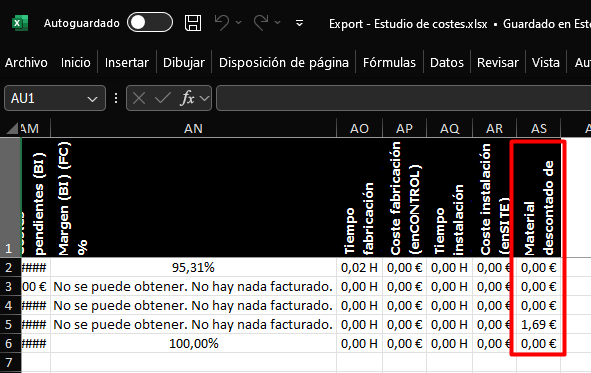

# Newsletter de versiones MSI

Bienvenido al boletín de actualizaciones de **MSI**.  
Aquí encontrarás las últimas versiones, mejoras y correcciones de errores.

---

## Versión 25.09.0010
**Fecha de publicación:** 10/09/2025

Novedades

- **ENBLAU - Ventas - Material necesario:** Ahora se relaciona los cajones de persiana con posición pertinente.
- **ENBLAU - Compras - Material necesario:** Ahora se relaciona los cajones de persiana con posición pertinente. 
- **ENBLAU - Proyectos - Expotación de costes:** Nueva columna añadida de material descontado de proyecto.

    

- **ENBLAU - Proyectos - Exportación de costes:** traducido a inglés, portugués e italiano.

Correcciones

- **enCONTROL - Monitor preparación de material:** Corregido problema de detección de vidrio en el proyecto.
- **enCONTROL - Monitor de ajunquillado:** Corregido descuento automático de vidrios.
- **enCONTROL - Monitor de persiana:** Corregido descuento automático de cajones, definidos como tipo pieza, provenientes de Logikal.
- **enCONTROL - Monitor de corte:** Corregido problema de obtención de cortes con múltiples mecanizados.

---

## Versión 25.09.0002
**Fecha de publicación:** 02/09/2025

Novedades

Correcciones

---

## Versión 25.08.0025
**Fecha de publicación:** 25/08/2025

Novedades

Correcciones

---

