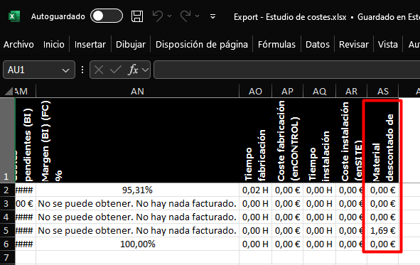

# MSI Version Newsletter

Welcome to the **MSI** update bulletin.  
Here you will find the latest versions, improvements, and bug fixes.

---

## Version 25.09.0010
**Release date:** 09/10/2025

What's New

- **ENBLAU - Sales - Required material:** Roller shutter boxes are now linked with the corresponding position.
- **ENBLAU - Purchasing - Required material:** Roller shutter boxes are now linked with the corresponding position. 
- **ENBLAU - Projects - Cost export:** New column added for material deducted from the project.

    

- **ENBLAU - Projects - Cost export:** translated into English, Portuguese, and Italian.

Fixes

- **enCONTROL - Material preparation monitor:** Fixed issue with glass detection in the project.
- **enCONTROL - Beading monitor:** Fixed automatic deduction of glass panes.
- **enCONTROL - Shutter monitor:** Fixed automatic deduction of boxes, defined as part type, coming from Logikal.
- **enCONTROL - Cutting monitor:** Fixed issue with retrieving cuts with multiple machining operations.

---

## Version 25.09.0002
**Release date:** 09/02/2025

What's New

Fixes

---

## Version 25.08.0025
**Release date:** 08/25/2025

What's New

Fixes

---
