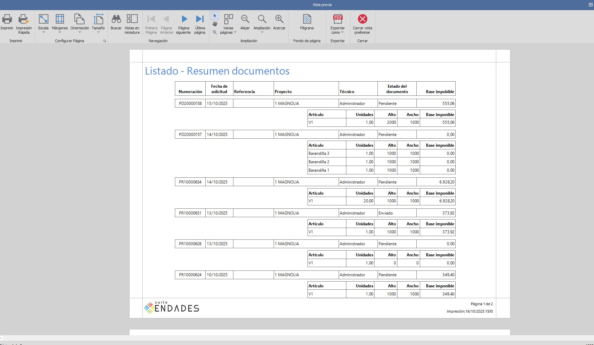

# ENBLAU Version Newsletter

Welcome to the **ENBLAU** update newsletter.  
Here you will find the latest versions, improvements, and bug fixes.

---

## Next Version
**Release Date:** Not available

New Features

Fixes

- **ENBLAU - Installations - Installation List:** Fixed issue with 'Planned' column. It was pointing to old tables.
- **ENBLAU - Installations - Installation Scheduler:** Fixed issue with key duplication with multiple users.
- **ENBLAU - Sales - Required Stock:** Fixed incorrect column name.

---

## Version 25.10.0017
**Release Date:** 20/10/2025

New Features

- **ENBLAU - Sales - Reports:** New report added. Document summary.

	

	

	

 	
 
- **ENBLAU - Sales - Expected Delivery Date:** Added new date field in quotes and customer orders.

	

	

Fixes

- **ENBLAU - Sales - Overhead Costs:** Fixed issue where applying a distribution by amount was not calculating correctly.
- **ENBLAU - Sales - Production - Breakdown:** Fixed issue along with new API integration in Logikal.
- **ENBLAU - Sales - Breakages:** Fixed issue when purchasing materials from breakages. The color name now appears in the material description.
- **enCLAD - Translations:** Fixed issue with Italian translations.
- **enCLAD - Customers - Unlock:** Fixed issue when unlocking customers.

---

## Version 25.10.0013
**Release Date:** 14/10/2025

New Features

- **enSITE - My Time Clocks:** Removed
- **enSITE - Time Clocks:** Renamed to Times

Fixes

- **ENBLAU - Export to Cortizo Center:** Fixed issue with export of certain references

---

## Version 25.10.0003
**Release Date:** 03/10/2025

New Features

- **ENBLAU - Users:** New fields added. Gender, date of birth and social security
- **ENBLAU - Warehouses - Inventories:** New implementation. It is now possible to perform stock inventories on a project
- **ENBLAU - Warehouses - Stock Warehouse:** It is now possible to indicate which is our stock project in the configuration section
- **ENBLAU - Purchases - Import Under Minimum and Under Usual:** Now contrasted against the defined stock project
- **ENBLAU - Configuration - Projects:** New field added in general configuration for definition of default project observations

Fixes

- **ENBLAU - Purchases:** Fixed conflict when deleting a purchase delivery note and updating received units in the purchase order
- **ENBLAU - Sales - Due Dates:** Fixed issue updating due date description from the due dates list
- **ENBLAU - Sales - Withholdings:** Fixed issue updating withholding description from the withholdings list
- **ENBLAU - Purchases - Cortizo Center Export:** Fixed export issue in accessories where finish was different from black

---

## Version 25.09.0022
**Release Date:** 22/09/2025

New Features

- **ENBLAU - Configuration:** Installation, sales and purchase document statuses are now checked on each update, without interfering with manually entered statuses
- **ENBLAU - Sales - Invoice Report:** Added corrected invoice field in corrective invoices
- **ENBLAU - Sales - Invoice Report:** Added checkboxes to hide image and description and reduce invoice size
- **ENBLAU - Purchases - Cortizo Center Export:** Modification made for valuation of PVC profiles used from Logikal
- **ENBLAU - Purchases - Claims:** In the claims report, it is now possible to view only lines containing pending units to be received. It can also be shown without valuation

Fixes

- **enCONTROL - Blind Monitor:** Fixed duplication issue in piece-type materials like blind boxes

---

## Version 25.09.0010
**Release Date:** 10/09/2025

New Features

- **ENBLAU - Sales - Required Material:** Blind boxes are now related to their relevant position
- **ENBLAU - Purchases:** Blind boxes are now related to their relevant position
- **ENBLAU - Projects - Cost Export:** New column added for project discounted material
- **ENBLAU - Projects - Cost Export:** Translated to English, Portuguese and Italian

Fixes

- **enCONTROL - Material Preparation Monitor:** Fixed glass detection issue in project
- **enCONTROL - Glazing Bar Monitor:** Fixed automatic glass discount
- **enCONTROL - Blind Monitor:** Fixed automatic discount of boxes, defined as piece type, from Logikal
- **enCONTROL - Cutting Monitor:** Fixed issue obtaining cuts with multiple machinings

---

## Version 25.09.0002
**Release Date:** 02/09/2025

New Features

- **ENBLAU - Translations - Stock Replenishment:** Italian available
- **enCONTROL - Translations - Stock Replenishment:** Italian available
- **enSITE - Translations - Stock Replenishment:** Italian available
- **ENBLAU WEB - Translations - Stock Replenishment:** Italian available
- **enUPDATE - Translations - Stock Replenishment:** Italian available
- **enCONNECT - Translations - Stock Replenishment:** Italian available
- **ENBLAU - Purchases:** New implementation of search within document detail

Fixes

- **ENBLAU - Sales - Logikal:** Fixed synchronization issue with Logikal positions. The value of the Custom4 column in Sales_Detail has been increased to maximum
- **ENBLAU - Purchases - Stock Replenishment:** Fixed filter issue in under minimum and under usual
- **enCLAD - PDF Export:** Fixed export issue. Was reading image as resource and not physical
- **enCLAD - Elevations:** Fixed issue creating elevations. Was reading image as resource and not physical

---

## Version 25.08.0025
**Release Date:** 25/08/2025

New Features

_No notable new features._

Fixes

_No notable fixes._

---

## Version 25.07.0014
**Release Date:** 14/07/2025

New Features

- **ENBLAU - Warehouses - Locate Purchase Delivery Note:** New checkbox in configuration (Purchases and stock --> Locate delivery note). When checked, when creating a new purchase delivery note, the locate delivery note window will automatically open.
- **ENBLAU - Customers:** New 'Sales' contact type for automatic email selection
- **ENBLAU - Purchases - Cortizo Center Export:** Changed requirement in joints to total units multiplied by total packaging units
- **ENBLAU - Contacts:** New 'Sales' contact type for automatic email selection
- **enCONTROL - Control Monitor:** Added 'Cutting and Folding' status summary
- **enCONTROL - Control Monitor:** Added 'Painting' status summary
- **enCONTROL - Control Monitor:** Added 'Picking' status summary
- **enCONTROL - Control Monitor:** Added 'Transformation' status summary
- **enCONTROL - Control Monitor:** Added 'Welding' status summary
- **enCONTROL - Control Monitor:** Added 'Cleaning' status summary

Fixes

- **ENBLAU - Currencies:** Fixed issue with new currency history implementation with selected currency duplication

---

## Version 25.07.0003
**Release Date:** 03/07/2025

New Features

- **enCONTROL - Database Fields:** Added ProfileClass, ArticleType and PieceListType fields to PR_Barras_Cortes
- **enCONTROL - Database Fields:** Added ArticleType and PieceListType fields to Ventas_Detalle_EPI_Cuadros_Articulos
- **enCONTROL - Main Profiles Cutting Monitor:** New main profiles cutting station
- **enCONTROL - Glazing Bars Cutting Monitor:** New glazing bars cutting station

Fixes

- **enCONTROL - Cutting Monitor:** Fixed Logikal reference issue in PVC bicolors

---

## Version 25.07.0001
**Release Date:** 01/07/2025

New Features

- **ENBLAU - Sales - Required Material:** It is now possible to add materials imported from Logikal in sales documents
- **ENBLAU - Sales - Required Material:** Added functionality to deduct from stock from the required material window
- **ENBLAU - HR - Absence Calendar:** Improved request view

Fixes

- **ENBLAU - Sales - Currency Used:** Fixed issue with current date selection the first time a document is presented
- **ENBLAU - HR - Absence Calendar:** Fixed issue calculating pending days to enjoy when adding days manually

---

## Version 25.06.0030
**Release Date:** 30/06/2025

New Features

- **enCONTROL - Licensing:** New licensing mode. It will be possible to work with any station. Regarding licenses, only the total of concurrent stations will be taken into account, regardless of which ones they are
- **ENBLAU - Installations - Calendar:** New calendar permission. This permission will need to be granted for users to modify calendar appointments
- **ENBLAU - Sales - Currency Used:** It is now possible to choose the currency of the document date

Fixes

_No notable fixes._

---

## Version 25.06.0019
**Release Date:** 19/06/2025

New Features

- **enCONTROL - Welding Monitor:** New welding station
- **enCONTROL - Cleaning Monitor:** New cleaning station
- **enCONTROL - Transformation Monitor:** New transformation station
- **ENBLAU - Customers:** Address field increased from 50 to 200 characters
- **ENBLAU - Suppliers:** Address field increased from 50 to 200 characters
- **ENBLAU - Users:** Address field increased from 50 to 200 characters
- **ENBLAU - Installers:** Address field increased from 50 to 200 characters
- **ENBLAU - Contacts:** Address field increased from 50 to 200 characters
- **ENBLAU - General Configuration:** Address field increased from 50 to 200 characters
- **ENBLAU - Companies:** Address field increased from 50 to 200 characters
- **ENBLAU - Projects:** Address field increased from 50 to 200 characters
- **enCONTROL - Cutting Monitor - Remnants:** We now request the remnant location. Previously it was automatically located in the location from which the bar was obtained
- **ENBLAU - Sales - Delivery Notes:** Added fields 'Signed', 'SignDate', 'SignerName' and 'SignerID' for delivery notes in sales documents
- **ENBLAU - Sales - Invoicing:** New functionality implemented to mark the invoiced checkbox when invoicing from a sales delivery note
- **enCONTROL - Cutting and Transformation Monitor:** New cutting station, where bar quantities are cut to store in appropriate measurements for stock
- **ENBLAU - Sales - Sales Document:** When changing the position name, if Logikal allows it and we are connected to Logikal, the name will also be changed in Logikal

Fixes

- **enCONTROL - Glazing Bar Monitor:** Fixed issue in destination assembled profiles
- **enCONTROL - Assembly Monitor:** Fixed issue in destination assembled profiles

---

## Version 25.06.0011
**Release Date:** 11/06/2025

New Features

- **ENBLAU - Imported Materials:** New field added 'Assembled at Destination'
- **ENBLAU - Sales - Classifications:** New picking station added
- **ENBLAU - Configuration - Production Layout:** New picking station added
- **enMATERIALS - Articles:** New field added 'Assembled at Destination'
- **enCONTROL - Whiteboard:** Improved speed in the whiteboard station
- **enCONTROL - Picking:** New picking station
- **enCONTROL - Assembly:** New 'Assembled at Destination' checkbox. When clicked, that material will appear in the picking station
- **enCONTROL - Glazing Bar:** New 'Assembled at Destination' checkbox. When clicked, that material will appear in the picking station
- **enCONTROL - Hardware:** New 'Assembled at Destination' checkbox. When clicked, that material will appear in the picking station
- **ENBLAU - Sales - Delivery Note Invoicing:** Added columns for project code, project name and project technician
- **ENBLAU - Purchases - Claims:** Claim email text is now stored in the new email sending mode

Fixes

- **ENBLAU - Warehouses - Assignment:** Fixed issue where it was allowed to assign excess units
- **ENBLAU - Sales - New Sales Document:** Fixed issue where it was allowed to add document without numbering
- **ENBLAU - Installations - New Installation Document:** Fixed issue where it was allowed to add document without numbering
- **ENBLAU - Sales - New Delivery Note:** Fixed issue where a delivery note without price XML could not be invoiced
- **ENBLAU - Sales - New Document:** Fixed issue with automatic selection of automatic invoicing checkbox when choosing a project

---

## Version 25.06.0003
**Release Date:** 03/06/2025

New Features

- **ENBLAU - Installations - Scheduler:** New timeline view mode. It is now possible to interact with the start and end time
- **ENBLAU - Projects - Scheduler:** The first start time is now always kept visible, so that even if tasks are postponed we can visualize the initial assignment date

Fixes

- **ENBLAU - Installations - Scheduler:** Fixed issue when deleting appointments in the planning

---

## Version 29.05.0025
**Release Date:** 29/05/2025

New Features

- **ENBLAU - Export to Accounting:** New fields added

Fixes

_No notable fixes._

---

## Version 25.05.0026
**Release Date:** 26/05/2025

New Features

- **enCONTROL - Cutting Monitor:** Added information about whether the selected cut has machinings or not
- **ENBLAU - Sales - Required Material:** Added new column indicating whether there is stock in the project or not, for filtering purposes
- **ENBLAU - Purchases - Replenishment Order:** Added interior color and exterior color columns
- **ENBLAU - Purchases - Replenishment Order:** References are now displayed even if you have stock in the warehouse
- **ENBLAU - Projects - Imported Materials Tree:** Added tree to projects
- **ENBLAU - Projects - Additional Material:** It is now possible to add material from Logikal
- **ENBLAU - Projects - Breakages:** It is now possible to add material from Logikal
- **ENBLAU - Sales - Imported Materials Tree:** Added tree to sales
- **ENBLAU - Sales - Additional Material:** It is now possible to add material from Logikal
- **ENBLAU - Sales - Breakages:** It is now possible to add material from Logikal

Fixes

_No notable fixes._

---

## Version 25.05.0019
**Release Date:** 19/05/2025

New Features

- **ENBLAU - Users - User Permissions:** It is now possible to modify user permissions in bulk
- **ENBLAU - Users - Permissions:** It is now possible to modify user permissions in bulk

Fixes

- **ENBLAU - Sales - Logikal:** Fixed issue when copying positions
- **ENBLAU - Sales - Logikal:** Fixed name assignment issue

---

## Version 25.05.0015
**Release Date:** 15/05/2025

New Features

- **ENBLAU - Sales - Order:** New report available. Supply certificate
- **ENBLAU:** Fixed English strings when selecting filters
- **enCLAD:** Fixed English strings when selecting filters
- **enCONTROL:** Fixed English strings when selecting filters
- **ENBLAU - Warehouses - Warehouse Movements:** It is now possible to open the related purchase document from movements
- **ENBLAU - Warehouses - Warehouse Movements:** It is now possible to open the related production document from movements
- **ENBLAU:** Changed document window opening mode. Now they depend on the main ENBLAU window
- **ENBLAU - Sales:** It is now possible to remove the passive subject in invoices
- **enCONTROL - Final Check Monitor:** Added finished product label

Fixes

_No notable fixes._

---

## Version 25.05.0012
**Release Date:** 12/05/2025

New Features

- **ENBLAU - Sales - Required Material Document:** Enabled in measurements and productions
- **ENBLAU - Users - Card Printing:** Card editing has been enabled directly from the application

Fixes

- **ENBLAU - Purchases - Grouped Orders:** Fixed issue in document creation

---

## Version 25.05.0007
**Release Date:** 07/05/2025

New Features

_No notable new features._

Fixes

- **enCONTROL - Control Monitor:** Fixed control station issue. Sometimes it didn't release the station in use

---

## Version 25.05.0005
**Release Date:** 05/05/2025

New Features

- **ENBLAU - Sales - Positions:** Added three new database fields with system, color and product type information for Logikal positions
- **ENBLAU - Warehouses - Finished Product:** New finished product management section
- **enCONTROL - Check Monitor:** New product location button

Fixes

_No notable fixes._

---

## Version 25.04.0028
**Release Date:** 29/04/2025

New Features

- **ENBLAU - Installations - Scheduler:** It is now possible to copy and paste appointments in the scheduler
- **ENBLAU - Installations - Planned Installations:** Added status column
- **ENBLAU - Installations - Planned Installations:** Added Classification column
- **ENBLAU - Installations - Planned Installations:** Modified date columns to show time
- **ENBLAU - Warehouses:** New listing - Summary with locations
- **enCONTROL - Control Monitor - Move to Production:** Initial changes are now respected when dragging a new production to manufacturing and changing certain values
- **ENBLAU - Pop-up Window Management:** Now modified independently

Fixes

- **ENBLAU - Text Fields - Rich Text:** Fixed issue when copying text in all observation fields
- **ENBLAU - Sales:** Fixed issues with substructures obtained from Logikal

---

## Version 25.04.0016
**Release Date:** 22/04/2025

New Features

- **ENBLAU - Projects - Stock:** When finishing a project, we can now massively reassign all warehouse materials to a new project
- **ENBLAU - Sales - Stock:** Warehouse materials can now be reassigned from required material
- **ENBLAU - Stock:** Created stock problem log in ENBLAU installation route

Fixes

- **ENBLAU - Purchases:** Fixed issue in delivery note invoicing
- **ENBLAU - Purchases:** Fixed duplication issue in material description when dragging from materials tree. Only in surfaces.
- **enCONTROL - Stock:** Fixed multiple issues when automatically deducting stock

---

## Version 25.04.0011
**Release Date:** 11/04/2025

New Features

- **ENBLAU - Purchases - Stock Replenishment:** New application to import materials to stock under minimum or under usual
- **ENBLAU - Warehouses:** It is now possible to configure the stock deduction mode for when output movements are made from a production in ENBLAU

Fixes

- **ENBLAU - Warehouses:** Fixed the way colors are displayed in required material to know if we have materials in stock

---

## Version 25.04.0007
**Release Date:** 07/04/2025

New Features

- **ENBLAU - Purchases - Scan:** Modified to scan multiple document sheets into a single PDF
- **enUPDATE - Downloads:** Now every time you close and re-enter enUPDATE, it will allow you to download the version again if it is not installed
- **ENBLAU - Warehouses:** New movement type. Assignment movement from detailed warehouse, through which we can assign the project where we want to use the material
- **ENBLAU - Sales - Required Stock:** Available, reserved and pending units of the material for each warehouse can now be viewed from this window
- **ENBLAU - Warehouses - Detailed:** The entry document can now be opened from the warehouse listing
- **ENBLAU - Warehouses - Pending Material:** The entry document can now be opened from the pending material listing
- **ENBLAU - Warehouses - Reserved:** The project's reserved material can now be opened and interacted with

Fixes

_No notable fixes._

---

## Version 25.04.0003
**Release Date:** 03/04/2025

New Features

_No notable new features._

Fixes

- **enCONTROL - Touch:** Fixed touch interface issue on certain screens.

---

## Version 25.04.0001
**Release Date:** 01/04/2025

New Features

- **ENBLAU - Warehouses - Movements:** Added time column in movements
- **ENBLAU - Warehouses - Movements:** Material output can now be returned
- **ENBLAU - Warehouses - Movements:** A movement can now be deleted by an administrator
- **ENBLAU - Warehouses - Movements - Reports:** New movements report 'Movements'
- **ENBLAU - Warehouses - Movements - Reports:** New movements report 'Movements I'
- **ENBLAU - Warehouses - Warehouses - Reports:** New inventory report on specific date
- **ENBLAU - Warehouses - Warehouses - Reports:** New inventory report according to applied filter
- **ENBLAU - Warehouses - Warehouses - Summary:** Improved warehouse summary view
- **ENBLAU - Required Material - Glass:** Modified extended descriptions of glass from Logikal

Fixes

- **ENBLAU - Reserved Material:** Fixed display issue in warehouse stock
- **enCHECK - Translations:** Fixed translation issue

---

## Version 25.03.0025
**Release Date:** 25/03/2025

New Features

- **enCONTROL - Whiteboard:** Improved interface.
- **enCONTROL - Monitors:** Improved interface.
- **ENBLAU - Sales - Invoicing:** Integrated export for electronic invoicing according to Spanish government

Fixes

- **ENBLAU - Purchases:** Fixed price issue in blinds in materials from Logikal
- **ENBLAU - Purchases:** Fixed price issue in glass in materials from Logikal
- **ENBLAU - Purchases - Delivery Note Location:** Fixed stock unit duplication issue

---

## Version 25.03.0006
**Release Date:** 06/03/2025

New Features

- **ENBLAU - Warehouses:** Added summation of total units in stock, pending receipt and reserved.
- **ENBLAU - Projects - Reserved Material:** Added summation of total units in stock, pending receipt and reserved.
- **ENBLAU - Sales - Required Material - Breakages:** Added summation of total units in stock, pending receipt and reserved.
- **ENBLAU - Sales - Breakages:** Added summation of total units in stock, pending receipt and reserved.
- **ENBLAU - Sales - Additional Material:** Added summation of total units in stock, pending receipt and reserved.

Fixes

_No notable fixes._

---

## Version 25.02.0018
**Release Date:** 18/02/2025

New Features

- **ENBLAU - Reports - Unvalued Purchase Order:** Now takes into account the sales units indicated in the supplier
- **ENBLAU - Purchases - Scan:** Scanned image is now always stored in PDF. Also increments the document name to be stored
- **enCONTROL - Control Monitor:** When clicking on a production in production queue, we see the associated documentation in the production tree
- **ENBLAU:** Performance improvement
- **ENBLAU:** Environment update
- **enCONTROL:** Environment update
- **enMATERIALS:** Environment update
- **enCHECK:** Environment update
- **enCAD:** Environment update
- **enCLAD:** Environment update
- **ENBLAU - Sales - Status Configuration:** It is now possible to configure existing statuses or add new statuses
- **ENBLAU - Purchases - Status Configuration:** It is now possible to configure existing statuses or add new statuses
- **ENBLAU - Installations - Status Configuration:** It is now possible to configure existing statuses or add new statuses
- **ENBLAU - Sales - Filters:** Improved performance and usability
- **ENBLAU - Purchases - Filters:** Improved performance and usability
- **ENBLAU - Installations - Filters:** Improved performance and usability
- **ENBLAU - Sales - Required Materials - STOCK:** Improved query for obtaining units in stock, including material from finished projects
- **ENBLAU - Warehouses:** Improved query with grouped 'IsRemnant' value
- **ENBLAU - Accounting:** Added new accounting export type planned for '.xlsx'
- **ENBLAU - Installation Scheduler:** Improving usability and visualization of installation scheduler

Fixes

_No notable fixes._

---

## Version 25.02.0004
**Release Date:** 04/02/2025

New Features

_No notable new features._

Fixes

- **enCONTROL:** Fixed visual issues related to translations

---

## Version 25.02.0001
**Release Date:** 31/01/2025

New Features

_No notable new features._

Fixes

- **ENBLAU - Delivery Note Location:** Fixed floor visualization issue
- **ENBLAU - Projects:** Fixed automatic warehouse deletion issue, in stock mode 2

---

## Version 25.01.0022
**Release Date:** 22/01/2025

New Features

- **enCONTROL - Whiteboard Monitor:** Added text of the last production comment
- **ENBLAU - Project Scheduler:** The last view used in the scheduler is now stored per user
- **ENBLAU - Warehouses - Stock:** New stock visualization through which we can see which project the materials are destined for
- **ENBLAU - Sales - Required Material:** The project for which the stock is destined is now visible from sales
- **ENBLAU - Sales - Required Material:** The article column and units to purchase column are displayed in red or green depending on whether material is available to complete the project or not. We consider material available as the difference between required units and those in stock destined for the project, or in finished projects, minus reserved ones.
- **ENBLAU - Projects:** New default checkbox next to purchasing manager and manager. When checked, we assume that the indicated manager is the one we want to carry over to each new purchase or sales document respectively, and that it is related to the project in question.
- **ENBLAU - Purchases - Reports:** The source document can now be hidden in supplier order documents
- **ENBLAU - Language:** Available in Portuguese
- **enCONTROL - Language:** Available in Portuguese
- **enCLAD - Language:** Available in Portuguese
- **enSite - Language:** Available in Portuguese
- **ENBLAU - Language:** Available in English
- **enCONTROL - Language:** Available in English
- **enCLAD - Language:** Available in English
- **enSite - Language:** Available in English
- **enSite - Documentation:** Added new documentation section
- **ENBLAU - Reports - Editor:** Added necessary DLLs for custom report editing

Fixes

- **ENBLAU - Emails - Local Storage:** Fixed local storage issue

---

## Version 25.01.0002
**Release Date:** 02/01/2025

New Features

- **enCONTROL - Material Preparation Monitor:** Two new columns added. Stock in project and reserved in project
- **ENBLAU - Installations:** Modified the way icons are read in documentation. Documentation will no longer stop being displayed after an installation even if another user had the application open during the installation process
- **ENBLAU - Sales List - Invoice Report:** Now accepts the filter applied in the list
- **ENBLAU - Purchases List - Invoice Report:** Now accepts the filter applied in the list
- **ENBLAU - Stock:** Added 'Is remnant' column to warehouses and warehouses in sales
- **ENBLAU - Stock - Reserved Material:** Added visualization of material in warehouses in the reserved window
- **ENBLAU - Purchases - Logikal - Imported Materials:** New tree of Logikal article materials that we have previously worked with. It is now possible to add Logikal materials to a purchase order without being connected
- **ENBLAU - Logikal - Imported Materials:** Logikal materials can now be defined to control stock when listing material or mark as for purchase according to needs
- **ENBLAU - Purchases - Reports:** New M2 report by supplier
- **ENBLAU - Purchases - Stock:** New function from purchase orders to request from supplier all materials under minimum or under usual in warehouse

Fixes

- **ENBLAU - Users:** Fixed permission duplication issue
- **ENBLAU - Process Notifications:** Fixed issue in notifications for certain users

---

## Version 24.12.0020
**Release Date:** 20/12/2024

New Features

- **ENBLAU - Blind Measurements:** Blind box height is now imported
- **ENBLAU - Purchases - Purchase Document:** Added surface traceability column
- **ENBLAU - Purchases - New Delivery Note:** Added surface traceability column
- **ENBLAU - Purchases - New Invoice:** Added surface traceability column

Fixes

- **ENBLAU - Stock:** Fixed movement and discount issue in joints when length matched the length to be discounted
- **enSITE - Stock:** Fixed movement and discount issue in joints when length matched the length to be discounted

---

## Version 24.12.0012
**Release Date:** 12/12/2024

New Features

- **enCONTROL - Final Check Station:** Added production reference field

Fixes

_No notable fixes._

---

## Version 24.12.0010
**Release Date:** 10/12/2024

New Features

- **ENBLAU - Purchases - Scanner:** It is now possible to call the scanner from a purchase document
- **ENBLAU - Stock - Reserved Material:** Now if a reservation is cancelled, it doesn't add new quantities added to it

Fixes

- **ENBLAU - Purchases - Amount in Surfaces:** Fixed valuation issue in surface-type materials

---

## Version 24.12.0009
**Release Date:** 09/12/2024

New Features

- **ENBLAU - Purchases - Stock Location:** Purchase delivery notes can now be located in warehouse from ENBLAU
- **ENBLAU - Purchases - Invoicing:** Automatic update of paid checkbox in purchase invoices
- **ENBLAU - Purchases:** It is now allowed to modify supplier reference of Logikal and ENBLAU materials from a purchase document
- **enCONTROL - Cutting Station:** Added remnant length in bar information
- **enCONTROL - Cutting Station:** Modified cut order to display as in Logikal cutting optimization report

Fixes

_No notable fixes._

---

## Version 24.11.0027
**Release Date:** 27/11/2024

New Features

- **enCONTROL:** Added enUPDATE to independent enCONTROL installation
- **enCONTROL:** Added new painting station
- **enCONTROL:** Added new sheet cutting and folding station
- **ENBLAU - Stock:** Added Excel export of bar in stock according to Logikal remnant import protocol
- **ENBLAU - Electronic Invoicing:** Added electronic invoicing according to Facturae
- **ENBLAU - Electronic Invoicing:** Modified invoice template with electronic invoice QR
- **ENBLAU - Sales - Due Dates:** Automatic status update in invoices when indicating that due dates are collected

Fixes

_No notable fixes._

---

## Version 24.11.0015
**Release Date:** 15/11/2024

New Features

- **enCONTROL:** New label added. Label 06.

Fixes

- **ENBLAU - Production:** Fixed ID duplication issue in required stock
- **enCONTROL:** Fixed date interpretation issue in some network environments

---

## Version 24.10.0031
**Release Date:** 11/11/2024

New Features

- **enCONTROL - Configuration:** Included new generic documentation route
- **enCONTROL - Configuration:** New stock control system. Deduct from project, otherwise from anywhere
- **ENBLAU - Production:** It is now possible to control required stock massively from ENBLAU

Fixes

_No notable fixes._

---

## Version 24.10.0028
**Release Date:** 28/10/2024

New Features

- **ENBLAU - Purchases - Reports:** Included material image in unvalued purchase order
- **ENBLAU - Purchases - Reports:** Included material image in material to receive
- **ENBLAU - Purchases - Reports:** Included material image in claims
- **enCLAD - Profile Selection:** Profile length is now displayed
- **enCLAD - Profile Length:** Now generated with exact length instead of 10 mm difference

Fixes

- **enCLAD - Deployed Panels:** Fixed issue in sloped walls

---

## Version 24.10.0015
**Release Date:** 15/10/2024

New Features

- **ENBLAU - Purchases - Due Dates:** Added new checkbox to configuration, where we can indicate if we want due dates in purchase invoices to be created as paid by default
- **ENBLAU - Purchases - Due Dates List:** Due date is now calculated from the document date
- **ENBLAU - Purchases - Due Dates List:** Reference and supplier reference columns have been added
- **ENBLAU - Purchases - Reports - Unvalued Order:** Observations for the supplier are now displayed
- **ENBLAU - Sales:** It is now possible to view stock from required material in the new stock control method
- **ENBLAU - Notifications:** It is now possible to indicate a specific user to notify

Fixes

- **ENBLAU - Sales:** Fixed issue when adding material to breakages
- **ENBLAU - Purchases - Due Dates List:** Fixed issue with paid filter

---

## Version 24.10.0004
**Release Date:** 04/10/2024

New Features

- **ENBLAU:** Internal performance improvements
- **ENBLAU - Sales:** Included blind measurements in piece-type materials from Logikal

Fixes

_No notable fixes._

---

## Version 24.09.0011
**Release Date:** 11/09/2024

New Features

- **ENBLAU - Material List:** Modified rounding in glass to ensure it corresponds to millimeters
- **ENBLAU - Reserved Window:** Added color display in materials for dragging
- **ENBLAU - Required Materials:** Blind measurement is now displayed in the article description
- **ENBLAU - Purchases - Reports:** Added new template for unvalued purchase order
- **ENBLAU - Sales - Due Dates:** Added commercial column
- **ENBLAU - Due Dates:** Added collection date field
- **ENBLAU - Reports:** Added collection date column in due dates report

Fixes

- **enSITE - Attachments in Receipts:** Fixed issue when attaching images in a purchase delivery note
- **ENBLAU - Reserved Window:** Fixed unit display issue in order references
- **ENBLAU - Stock:** Fixed unique code retrieval issue in similar references with different colors

---

## Version 24.09.0003
**Release Date:** 03/09/2024

New Features

- **ENBLAU - Reports:** Valued delivery note - It is now possible to hide the discount column
- **ENBLAU - Purchases:** Modification of reference in Logikal materials is not allowed

Fixes

- **enCONTROL - Blind Monitor:** Fixed documentation display issue
- **enSITE - Options:** Fixed text display issue in selection-type option values
- **ENBLAU - Purchases - Cortizo Center Export:** Fixed export issue to Cortizo center template

---

## Version 24.07.0024
**Release Date:** 29/07/2024

New Features

- **ENBLAU - Sales List:** Added customer type column
- **ENBLAU - Stock Control:** New material reservation functionality for projects
- **ENBLAU - Human Resources - Requests:** List of available days per employee per agreement year
- **ENBLAU - Human Resources - Appointment:** List of available days per employee per agreement year
- **ENBLAU - Notifications:** Added button to open the referenced document
- **ENBLAU - Documentation:** Added automation for directory creation in documentation folders
- **enCONTROL - Labels:** New label added

Fixes

_No notable fixes._

---

## Version 24.07.0008
**Release Date:** 08/07/2024

New Features

- **ENBLAU - Customers:** Added accounting accounts button in customers
- **ENBLAU - Purchases - Due Dates:** It is now possible to mark multiple purchase due dates as paid
- **ENBLAU - Sales:** Added new field in configuration to customize the retrieval of Logikal surface descriptions

Fixes

- **ENBLAU - Purchases:** Fixed translation issue when applying discounts massively in purchases
- **ENBLAU - Projects:** Fixed name filter issue when selecting the customer

---

## Version 24.06.0020
**Release Date:** 20/06/2024

New Features

- **ENBLAU - Required Material:** It will be possible to group glass from Logikal from general configuration
- **ENBLAU - Remnants:** New minimum remnant field in Logikal, in ENBLAU general configuration
- **ENBLAU - Purchases:** It is now possible to apply different VAT to different lines of the order, delivery note or invoice
- **ENBLAU - Purchases:** Order, delivery note and invoice templates have been modified to display line VAT

Fixes

_No notable fixes._

---

## Version 24.06.0017
**Release Date:** 17/06/2024

New Features

- **ENBLAU - Reports:** Added summation in credit report
- **ENBLAU - Reports:** New valued delivery note report in sales
- **ENBLAU - Reports:** New report from sales list. Positions completed in a time period
- **ENBLAU - Stock Control:** Added new stock control mode through floor plan definition
- **enSITE - Stock Control:** It is now possible to locate received delivery notes, perform transfers or outputs
- **enCONTROL - Stock Control:** New configuration for stock control. Materials used in each station will now be automatically deducted

Fixes

_No notable fixes._

---

## Version 24.05.0021
**Release Date:** 21/05/2024

New Features

- **ENBLAU - Emails:** There are now two email sending modes available to select from general configuration --> Emails. Mode 1 and Mode 2. The new email sending mode will store a copy of the sent email in the sender's sent folder
- **enMATERIALS - Articles:** Added checkbox for tool creation

Fixes

_No notable fixes._

---

## Version 24.05.0017
**Release Date:** 17/05/2024

New Features

- **ENBLAU - Numbering:** New development. For any type of document belonging to a project, it will by default take the numbering relevant to the company it is addressed to
- **ENBLAU - Due Dates - Reports:** Added total amount summation to the due dates document
- **ENBLAU - Projects - Cost Export:** Added columns for actual enCONTROL hours, manufacturing cost, actual enSITE hours and installation cost
- **ENBLAU - Projects - Cost Export:** Implemented visualization improvements

Fixes

- **ENBLAU - Purchases - New Delivery Note:** Fixed total taxable base display issue
- **enSITE - Purchases - New Delivery Note:** Fixed total taxable base display issue
- **ENBLAU - Purchases - New Invoice:** Fixed total taxable base display issue

---

## Version 24.05.0008
**Release Date:** 08/05/2024

New Features

- **ENBLAU - Production Phase:** It is now possible to select the planned production entry date and a reason
- **ENBLAU - New Production Phase:** It is now possible to select the planned production entry date and a reason to be able to send to production immediately
- **enCONTROL - Control Monitor:** The reason indicated by the technician is displayed in queued productions
- **enSITE - Receipts:** Improved the process of saving attachments in the database. When checking the HTTP server, sometimes it didn't save due to lack of time
- **enSITE - Measurements:** It is now possible to download and publish measurements in 'OFFLINE' mode
- **enSITE - Data Collection:** It is now possible to download and publish data collection in 'OFFLINE' mode

Fixes

_No notable fixes._

---

## Version 24.04.0030
**Release Date:** 30/04/2024

New Features

- **ENBLAU - Installations - Order Template:** Change in observation display
- **ENBLAU - Purchases:** Added button to open the project from the purchase document
- **ENBLAU - Installations:** Added button to open the project from the installation document
- **ENBLAU - Sales - Logikal:** From showing route, more information about the related project is now visible
- **ENBLAU - Sales - Logikal:** Added checkbox in production reports to differentiate production export report from management export report
- **ENBLAU - Warehouses:** New implementation. Performing massive movements from the warehouse itself. Entry, exit and transfer
- **ENBLAU - Projects:** Added button to open documentation of documents belonging to the project, without needing to open the specific document

Fixes

_No notable fixes._

---

## Version 24.04.0018
**Release Date:** 19/04/2024

New Features

- **enMATERIALS - Export Articles:** Modified the process of exporting articles and purchase data by supplier
- **enMATERIALS - Import Articles:** Certain article fields can now be imported through Excel
- **enMATERIALS - Import Purchase Data:** Purchase data of modified articles can be imported
- **ENBLAU - Logikal:** Created imported materials storage table
- **enCONTROL - Blind Station:** New station for blind assembly control
- **ENBLAU - Sales - Warehouse List:** Filtering is allowed
- **ENBLAU - Purchases - Warehouse List:** Filtering is allowed
- **ENBLAU - Sales - Required Material:** An image of the selected material is displayed
- **ENBLAU - Sales - Additional Material:** An image of the selected material is displayed
- **ENBLAU - Purchases:** An image of the selected material is displayed

Fixes

- **ENBLAU - Licenses:** Fixed issue with accents in licenses

---

## Version 24.04.0005
**Release Date:** 05/04/2024

New Features

- **enCLAD - Startup:** Storage of user-selected language in the registry
- **ENBLAU - Startup:** Storage of user-selected language in the registry
- **enCONTROL - Startup:** Storage of user-selected language in the registry
- **enMATERIALS - Startup:** Storage of user-selected language in the registry
- **ENBLAU - Remnants:** Modification of remnant addition for Logikal materials
- **ENBLAU - Purchases:** When copying and pasting a line in a purchase order, it now maintains the relationship with required material or breakages, so we can properly control stock for Logikal materials
- **enCLAD - Riveted System:** Modification of rivet calculation in horizontal edges and trims
- **enCLAD - Panel Calculation:** Implemented improvement for panel control in frames belonging to openings

Fixes

_No notable fixes._

---

## Version 24.03.0027
**Release Date:** 27/03/2024

New Features

- **enCONTROL - Proposed Date:** The production date in ENBLAU will be the one proposed to the production manager when moving production from queue to manufacturing
- **enCONTROL - Observations:** Technician observations will be visible when dragging production from queue to manufacturing
- **ENBLAU - Translations:** Improved translation in reports, production, configuration and internal strings
- **ENBLAU - Startup:** Improved startup speed in loading materials, colors and breakdowns
- **enMATERIALS - Startup:** Improved startup speed in loading materials and colors
- **enCAD - Startup:** Improved startup speed in loading materials and colors
- **enCLAD - Startup:** Improved startup speed in loading materials and colors

Fixes

- **ENBLAU - Notifications:** Fixed null value checking issue
- **enCONTROL - Send to Production:** Fixed required fields and files checking issue

---

## Version 24.03.0020
**Release Date:** 15/03/2024

New Features

- **enSITE - Measurement Location:** Added button to view image with strokes and zoom
- **enSITE - Data Collection Location:** Added button to view image with strokes and zoom
- **ENBLAU - Sales - Send to Production:** It is no longer necessary to set manufacturing calendar data when sending a production to manufacturing
- **ENBLAU - HR - Calendar:** Changed design of new appointment windows and added additional functionalities
- **enCONTROL - Control Monitor:** Production calendar will be updated when dragging production from production queue to manufacturing
- **ENBLAU - Sales:** Internal observations are now transmitted when adding version or accepting budget
- **ENBLAU - Sales - Invoicing:** Modified field so that prompt payment discount is taken into account in total order of invoices
- **ENBLAU - Sales - Reports - Version Comparison:** Prompt payment discount is now taken into account
- **enCONTROL - Planning (New):** Added Gantt chart for production forecast based on time load

Fixes

- **enCONTROL - Control Monitor:** Fixed production displacement display issue when updating production list or dragging productions between queued productions, archived productions or productions in manufacturing lists

---

## Version 24.02.0022
**Release Date:** 22/02/2024

New Features

- **ENBLAU - Due Dates:** Added company column
- **ENBLAU - Withholdings:** Added company column
- **ENBLAU - Projects:** Task information and related documents have been divided into different tabs
- **ENBLAU - Translations:** Added new translations for ENBLAU questions and alerts
- **ENBLAU - Translations:** Improved filtering and handling of translations

Fixes

- **ENBLAU - Projects:** Fixed related documents display issue in specific projects

---

## Version 24.02.0016
**Release Date:** 16/02/2024

New Features

- **enSITE - Data Collection:** Page information header removed
- **enSITE - Production:** After performing an action in a project, it can now be undone by pressing the mount/place button again
- **ENBLAU - Logikal:** Changed ENBLAU working mode through Logikal. New projects are no longer created, we always work on the same Logikal project when creating versions, accepting budgets, creating measurements or creating productions. To differentiate positions, they will be moved through Logikal phases

Fixes

_No notable fixes._

---

## Version 24.02.0008
**Release Date:** 08/02/2024

New Features

- **ENBLAU-enSITE - Data Collection-Measurements:** Reviewed and improved operation for information transfer between the two sections
- **ENBLAU - Data Collection-Measurements:** Data collection light values are now added to the measurement
- **enSITE - Production List:** Correction to display numbering of selected production at the bottom of the list
- **enSITE - Production List:** Correction so that when the app is running, newly added productions are updated
- **enSITE - Measurement Location:** Strokes are now automatically saved, save button removed
- **enSITE - Data Collection Location:** Strokes are now automatically saved, save button removed
- **enSITE - Measurement Options:** On tablet, current proposal and previous proposal sections now scroll together
- **ENBLAU - Sales - Required Material:** Stock control display by colors in required material
- **ENBLAU - Sales - Breakages:** It is now possible to view Logikal material in the warehouse through breakages
- **ENBLAU - Logikal:** Improved work with Logikal information
- **enCONTROL - Material Preparation:** Visible if there is material in stock in the project warehouse

Fixes

_No notable fixes._

---

## Version 24.02.0006
**Release Date:** 06/02/2024

New Features

- **ENBLAU-enSITE - Measurement Review:** Correction to display images taken in location even if they don't have drawn strokes
- **ENBLAU-enSITE - Data Collection Review:** Correction to display images taken in location even if they don't have drawn strokes
- **ENBLAU - Process Notifications:** Added new process notification method, configurable by the client
- **ENBLAU - Notifications:** Modified notification system so daily notifications are not sent until read
- **ENBLAU - Sales - Process Approval:** It is now possible to define a configuration so a responsible person can decide when material can be purchased for a customer order, when it can go to production or when it can be installed

Fixes

_No notable fixes._

---

## Version 24.02.0002
**Release Date:** 02/02/2024

New Features

- **ENBLAU - Startup:** Unified task and notification calendar

Fixes

_No notable fixes._

---

## Version 24.02.0001
**Release Date:** 01/02/2024

New Features

- **enSITE - My Tasks:** Correction in date ranges displayed in lists
- **enSITE - My Time Clocks:** Correction in date ranges displayed in lists
- **enSITE - Data Collection List:** Corrections in dates of last data collection movements
- **enSITE - Measurement List:** Corrections in dates of last measurement movements
- **enSITE - Upload Documents (Documentation):** Added possibility to add PDFs in iOS version
- **enSITE - Attachments (Data Collection):** Added possibility to add PDFs in iOS version
- **enSITE - Attachments (Measurements):** Added possibility to add PDFs in iOS version
- **ENBLAU - Sales - Comparison Report:** Inverted percentage calculation order
- **ENBLAU - Sales:** New shortcut to open a project from a sales document. Button in top ribbon
- **ENBLAU - Installations:** New installation calendar
- **ENBLAU - Sales - Due Dates List:** Added summation of total filtered due dates
- **ENBLAU - Sales - Withholdings List:** Added summation of total filtered due dates
- **ENBLAU - Purchases - Due Dates List:** Added summation of total filtered due dates
- **ENBLAU - Sales - Productions:** Improvement made to add remnants to warehouse from a production sent to production, and deduct them from warehouse from required material list
- **ENBLAU - Sales - Required Material - Stock:** Reference column will be displayed in blue when it's a remnant. Reserved and deducted columns will be displayed in green when we have stock and in red when we don't have stock

Fixes

_No notable fixes._

---

## Version 24.01.0026
**Release Date:** 26/01/2024

New Features

- **ENBLAU - Projects (Planning):** Added project edit button from the task itself
- **ENBLAU - Projects (Planning):** Added document edit button from the task itself
- **ENBLAU - Projects (Planning):** An alert is sent to the person to whom the task is added when the task is created new, changed or deleted
- **ENBLAU - Numbering:** Sales, purchases and installation numberings can be associated with a company. When creating a new document with an associated project belonging to a company, only numberings related to that company will be shown
- **ENBLAU - Projects:** Added commercial and responsible fields to projects
- **ENBLAU - Projects:** Added project commercial and project responsible fields to project list
- **ENBLAU - Projects:** Better access to edit, add and delete contacts
- **ENBLAU - Customers:** Better access to edit, add and delete contacts
- **ENBLAU - Installers:** Better access to edit, add and delete contacts
- **ENBLAU - Suppliers:** Better access to edit, add and delete contacts
- **ENBLAU - Purchases:** When sending a purchase order by email, status now automatically changes to sent

Fixes

- **ENBLAU - Sales:** Fixed issue with glass generation from Logikal in required materials of a sales document
- **ENBLAU - Purchases:** Partially received status - Fixed issue when adding new line. Changed status to partially received without being so

---

## Version 24.01.0016
**Release Date:** 16/01/2024

New Features

- **ENBLAU - Notifications:** New alert added for new pending collection invoices
- **ENBLAU - Notifications:** New alert added for new collected due dates
- **ENBLAU - Translations:** Improved translation filtering to be able to filter by comparing between language fields
- **ENBLAU - Reports:** New budget list report organized by responsible
- **ENBLAU - Reports:** New accepted budget list report organized by responsible and showing annual accumulated by company

Fixes

_No notable fixes._

---

## Version 24.01.0011
**Release Date:** 11/01/2024

New Features

- **ENBLAU - Purchases:** Added invoicing export for linking with accounting programs
- **ENBLAU - Projects (Planning):** Added navigation calendar
- **ENBLAU - Configuration:** Added numbering field for customer accounting accounts (CC and withholding CC) and suppliers (CC). When creating a new customer or supplier, it will automatically take this numbering field for account information, provided the field is different from 0
- **ENBLAU - enCHECK:** New application created for user time tracking through a card with a barcode

Fixes

_No notable fixes._

---

## Version 24.01.0008
**Release Date:** 08/01/2024

New Features

- **ENBLAU - Users:** Added new commercial role type. For a user to appear in the commercial dropdown, they must have this role checked
- **ENBLAU - Users:** Added new field in users to be available as a resource in the project planner
- **ENBLAU - Project Planner:** When refreshing the calendar, resources, statuses and classifications are now refreshed in addition to tasks. It is no longer necessary to exit and re-enter ENBLAU
- **ENBLAU - Sales:** Added new dropdown button for budget actions within the stages section
- **ENBLAU - General Configuration:** New field added for sales. We can now configure to require that the customer has a Tax ID when accepting a budget
- **ENBLAU - Invoicing:** The order to be invoiced must have a customer and the customer must have a Tax ID

Fixes

_No notable fixes._

---

## Version 24.01.0002
**Release Date:** 02/01/2024

New Features

- **ENBLAU - Reports:** All customer, supplier and installer reports have been modified to include the data of the company to which the project belongs instead of the previous data
- **enSITE - Tasks:** Added POPUP to modify assigned tasks
- **enSITE - Tasks:** Added new section in home to view pending tasks added to each user
- **enSITE - Documents:** Usage and visual improvements in the user documentation section
- **enSITE - Work Calendar:** Design changes in the 'holidays' and 'vacations and absences' tabs

Fixes

_No notable fixes._

---

## Version 23.12.0022
**Release Date:** 22/12/2023

New Features

- **ENBLAU - Projects:** Modified project interface to add task control
- **ENBLAU - Projects:** Project planning available
- **ENBLAU - My Tasks:** My assigned tasks are now displayed when starting ENBLAU
- **ENBLAU - Project List:** Administrative task calendar is available in the project list
- **ENBLAU - Project List:** Added measurement options configuration from project list
- **ENBLAU - Project List:** Added project status configuration from project list
- **ENBLAU - Project List:** Added task status configuration from project list
- **ENBLAU - Project List:** Added task classification configuration from project list
- **ENBLAU - Projects:** It is now possible to configure project statuses
- **ENBLAU - Reports:** Modified version comparison report. Logo now appears
- **enSITE - Measurements:** When selecting a numeric option, all text is automatically selected
- **enSITE - Data Collection:** New data collection section added in projects
- **ENBLAU - Data Collection:** Added editing, publishing and downloading of data collection
- **ENBLAU - Configuration:** Added credit control in customers
- **ENBLAU - Customers:** Credit can now be defined in customers
- **ENBLAU - Suppliers:** New insurer role added
- **ENBLAU - Users:** New credit manager role added
- **ENBLAU - Customer List:** New report added - Credit and guarantee

Fixes

_No notable fixes._

---

## Version 23.12.0015
**Release Date:** 15/12/2023

New Features

- **ENBLAU - Measurements:** Options are displayed or hidden recursively at any option level
- **ENBLAU - Measurement Options:** Improved handling of option configuration
- **ENBLAU - Sales:** Controlled Logikal issue when assigning a budget number to a Logikal project
- **ENBLAU - Sales:** Controlled Logikal issue when assigning a project number to a Logikal project
- **enSITE - Measurements:** Measurement options are now displayed according to the configured order
- **ENBLAU - Measurements:** Measurement options are now displayed according to the configured order
- **enSITE - Measurements:** Options are displayed or hidden recursively at any option level
- **enSITE - Measurements:** In measurement options, the position header now always remains visible
- **enSITE - Measurements:** In measurement options, selection options adapt to the screen configuration

Fixes

_No notable fixes._

---

## Version 23.12.0014
**Release Date:** 14/12/2023

New Features

- **ENBLAU - Measurements:** Modified 'Group Options', order field is now displayed
- **ENBLAU - Sales:** Added new position type. Panel list
- **ENBLAU - Sales:** It is now possible to perform panel nesting from ENBLAU, without needing to access enCLAD
- **enCLAD - Nesting:** Improved calculation based on 3D points obtained from data vertices
- **ENBLAU - Sales:** Modified size of images obtained from Logikal. Changed from 250x250 to 350x350

Fixes

- **enMATERIALS - Systems:** Fixed display issue in hardware location field

---

## Version 23.12.0007
**Release Date:** 07/12/2023

New Features

- **enCLAD - Extreme Mount Calculation:** Now applied from the construction wall
- **enCLAD - Separator Retrieval:** Modified to take into account the separation of the chosen profile and the system
- **enCLAD - Frames Not to be Clad:** All frames are now set to be clad by default
- **ENBLAU - Reports:** New version comparison report added
- **ENBLAU - Reports:** Added report description
- **ENBLAU - Sales:** Optimized performance when retrieving payment methods and responsible persons
- **ENBLAU - Sales:** Modified selectable responsible persons. Now only ENBLAU users
- **ENBLAU - Sales:** Modified selectable commercial staff. Now only ENBLAU users
- **enSITE - Measurements:** It is now possible to display or hide multiple options
- **ENBLAU - Measurements:** It is now possible to display or hide multiple options

Fixes

- **ENBLAU - Measurements:** Fixed display issue in images taken with iOS devices when reviewing measurement attachments from ENBLAU
- **enSITE - Measurements:** Fixed camera and attachment selection issue on iOS devices

---

## Version 23.11.0030
**Release Date:** 30/11/2023

New Features

- **ENBLAU - HR:** Human resources section windows now open as tabs of the main window
- **ENBLAU - Logikal:** Changed project copying mode
- **ENBLAU - Budgets:** Performance improvements implemented
- **enCLAD - Panel Gallery:** New predefined panel gallery

Fixes

- **ENBLAU - Budgets:** Fixed prompt payment discount issue in budget template
- **enMATERIALS - Systems:** Fixed hardware tree display issue

---

## Version 23.11.0017
**Release Date:** 17/11/2023

New Features

- **ENBLAU - Measurements:** It is now possible to choose the technician to whom the measurement will be published
- **enSITE - Measurements:** Added button to go back from measurement sections to measurement window on iOS devices
- **enSITE - Measurements:** In measurement lights section, when clicking on a value to modify, all text is selected to facilitate value entry
- **enSITE - Common:** Added red bottom bar when in offline mode

Fixes

- **ENBLAU - Measurements:** Fixed issue when copying and pasting lines in a document. Measurement data was not being copied
- **ENBLAU - Measurements:** Fixed when publishing measurements

---

## Version 23.11.0010
**Release Date:** 10/11/2023

New Features

- **ENBLAU - Sales Documents:** It is now possible to delete multiple selected positions
- **ENBLAU - New Measurement:** Modified to drag reference from order to measurement
- **ENBLAU - Reports:** Modified margins in production report and 'Time Sheet (Time Annotation)' list
- **ENBLAU - Reports:** It is now possible to assign production reference during its creation, from the wizard
- **ENBLAU - Main:** New version alert displayed in the bottom bar of the main page
- **Logikal - Position Description:** We display all design descriptions. If descriptions have been divided, all descriptions will be accumulated
- **ENBLAU - Sales Document:** Reference displayed in the window title

Fixes

_No notable fixes._

---

## Version 23.11.0007
**Release Date:** 07/11/2023

New Features

- **enCLAD - Riveted System:** Distinction between L, Omega and T for machining. Now in riveted panels, corresponding machinings are generated according to mullion type
- **enCLAD - Panel Creation:** Improved the way of checking the length of panel visible edges, for creation or not according to project minimum panel
- **Logikal - Position Descriptions:** All descriptions are now obtained when position descriptions are divided
- **ENBLAU - Projects:** Improvement to enable task assignment action from a project
- **ENBLAU - Projects:** Modified interface. Document summary moved outside the project document list
- **ENBLAU - Projects:** Added editing of task planner fields in project traceability list
- **ENBLAU - Projects:** Added task planner responsible column in project traceability list
- **ENBLAU - Sales:** Added task planner responsible column in sales list
- **ENBLAU - Sales Documents:** It is now possible to delete multiple selected positions

Fixes

- **enCONTROL - License Registration:** Fixed initial registration issue of 'All stations in use'
- **Logikal - Edit Position:** Fixed issue with amount and description retrieval when editing a position

---

## Version 23.11.0002
**Release Date:** 02/11/2023

New Features

- **ENBLAU - Task Assignment:** Task assignment by user available from the project, or from the sales document itself. Users will now be able to filter the sales list by their assigned tasks, and their status will be visible from the project itself
- **Logikal - Parts List Calculation:** It is now possible to calculate the parts list from ENBLAU
- **Logikal - Speed:** Improved speed when accepting a budget, creating a measurement or creating a production
- **enCLAD - Interior Opening Distance Parameter:** The distance that the cladding surface must enter inside the design openings can now be entered from the design and calculation wizard
- **ENBLAU - Envelope Budget Template:** Modified to obtain the total cladding surface, not just that of the first wall
- **enCLAD - Forming Rivet View Refresh:** Now, when changing the color from the forming rivet properties tree, the view refreshes instantly
- **ENBLAU - Multi-company:** We can now work with multiple companies
- **ENBLAU - Projects:** Added task planner columns in project traceability list
- **ENBLAU - Sales:** Added task planner columns in sales list
- **ENBLAU - HR:** Added button to access completed times list window in ENBLAU
- **ENBLAU - HR:** Added button to access completed actions list window in ENBLAU

Fixes

- **Logikal - Project Retrieval:** Fixed issue with retrieval of linked projects located in sub-directory

---
