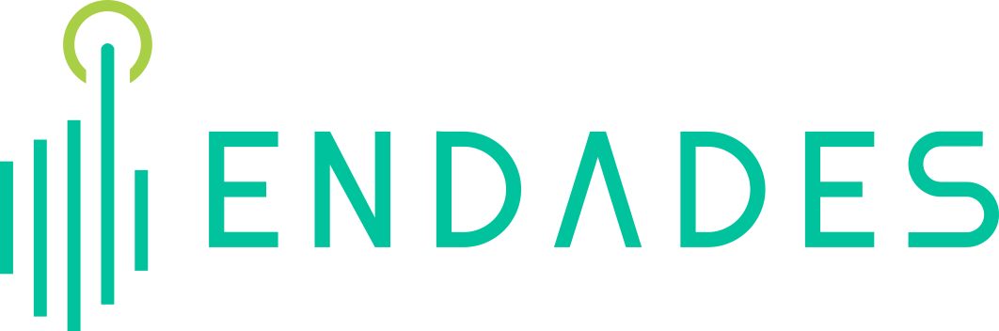

<!--  -->

  

  <a href="/">Español</a> | <a href="/en/">English</a>

# Home

Welcome to the documentation in **English**.

---

# What is the purpose of a Version Newsletter?

The Version Newsletter aims to **inform users and technicians** about the improvements, fixes, and new features included in each software update.

---

# Why is it important?

- **Keeps everyone informed:**  
  Users and technical teams are aware of the latest available updates.

- **Increases transparency:**  
  Changes implemented and the value they bring are communicated clearly.

- **Facilitates version management:**  
  IT managers can plan deployments and updates in an organized manner.

- **Improves the user experience:**  
  By knowing the new features, users can make better use of the newly added functionalities.

---

**For more information, feel free to contact us by email:**  
[soporte@endades.com](mailto:soporte@endades.com)
