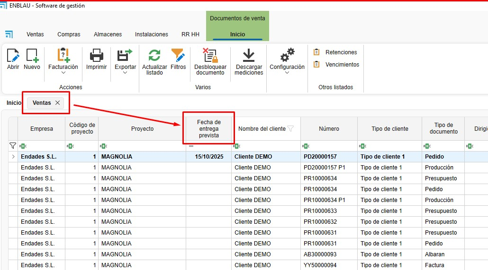

# Newsletter delle versioni ENBLAU

Benvenuto al bollettino degli aggiornamenti di **ENBLAU**.  
Qui troverai le ultime versioni, i miglioramenti e le correzioni di errori.

---

## Prossima versione
**Data di pubblicazione:** Non disponibile

Novità

Correzioni

- **ENBLAU - Installazioni - Elenco installazioni:** Risolto problema con la colonna 'Pianificato'. Puntava a tabelle obsolete.
- **ENBLAU - Installazioni - Pianificatore installazioni:** Risolto problema di duplicazione chiavi con più utenti.
- **ENBLAU - Vendite - Stock necessario:** Modificato nome colonna errato.

---

## Versione 25.10.0017
**Data di pubblicazione:** 20/10/2025

Novità

- **ENBLAU - Vendite - Report:** Nuovo report aggiunto. Riepilogo documenti.

	

	

	

 	
 
- **ENBLAU - Vendite - Data di consegna prevista:** Aggiunto nuovo campo di tipo data in preventivi e ordini cliente.

	

	

Correzioni

- **ENBLAU - Vendite - Spese generali:** Risolto problema in cui l'applicazione di una ripartizione per importo non otteneva una ripartizione corretta.
- **ENBLAU - Vendite - Produzione - Scomponi:** Risolto problema insieme alla nuova incorporazione dell'API in Logikal.
- **ENBLAU - Vendite - Rotture:** Risolto problema durante l'acquisto di materiali dalle rotture. Ora appare il nome del colore nella descrizione del materiale.
- **enCLAD - Traduzioni:** Risolto problema con le traduzioni in italiano.
- **enCLAD - Clienti - Sblocca:** Risolto problema durante lo sblocco dei clienti.

---

## Versione 25.10.0013
**Data di pubblicazione:** 14/10/2025

Novità

- **enSITE - I miei timbri:** Rimosso
- **enSITE - Timbri:** Rinominato a Tempi

Correzioni

- **ENBLAU - Esportazione a Cortizo Center:** Risolto problema nell'esportazione di certe referenze

---

## Versione 25.10.0003
**Data di pubblicazione:** 03/10/2025

Novità

- **ENBLAU - Utenti:** Nuovi campi aggiunti. Sesso, data di nascita e sicurezza sociale
- **ENBLAU - Magazzini - Inventari:** Nuova implementazione. Ora è possibile effettuare inventari di stock su un progetto
- **ENBLAU - Magazzini - Magazzino per stock:** Ora è possibile indicare qual è il nostro progetto per stock nella sezione di configurazione
- **ENBLAU - Acquisti - Importa sotto minimo e sotto abituale:** Ora si confronta con il progetto definito per stock
- **ENBLAU - Configurazione - Progetti:** Nuovo campo aggiunto nella configurazione generale per la definizione delle osservazioni predefinite dei progetti

Correzioni

- **ENBLAU - Acquisti:** Risolto conflitto durante l'eliminazione di una bolla d'acquisto e l'aggiornamento delle unità ricevute nell'ordine di acquisto
- **ENBLAU - Vendite - Scadenze:** Risolto problema di aggiornamento della descrizione della scadenza dall'elenco delle scadenze
- **ENBLAU - Vendite - Ritenute:** Risolto problema di aggiornamento della descrizione della ritenuta dall'elenco delle ritenute
- **ENBLAU - Acquisti - Esportazione Cortizo Center:** Risolto problema di esportazione negli accessori dove la finitura era diversa dal nero

---

## Versione 25.09.0022
**Data di pubblicazione:** 22/09/2025

Novità

- **ENBLAU - Configurazione:** Ora si controllano gli stati dei documenti di installazioni, vendite e acquisti ad ogni aggiornamento, senza interferire con gli stati propri inseriti
- **ENBLAU - Vendite - Report fattura:** Aggiunto campo fattura rettificativa nelle fatture rettificative
- **ENBLAU - Vendite - Report fattura:** Aggiunti checkbox per poter nascondere l'immagine e la descrizione e ridurre le dimensioni della fattura
- **ENBLAU - Acquisti - Esportazione Cortizo Center:** Modifica effettuata per la valutazione dei profili in PVC utilizzati da Logikal
- **ENBLAU - Acquisti - Reclami:** Nel report dei reclami, ora è possibile visualizzare solo le righe che contengono unità in attesa di ricezione. Si può anche mostrare senza valutazione

Correzioni

- **enCONTROL - Monitor persiane:** Risolto problema di duplicazione in materiali di tipo pezzo come cassonetti per persiane

---

## Versione 25.09.0010
**Data di pubblicazione:** 10/09/2025

Novità

- **ENBLAU - Vendite - Materiale necessario:** Ora si relazionano i cassonetti per persiane con la loro posizione pertinente
- **ENBLAU - Acquisti:** Ora si relazionano i cassonetti per persiane con la loro posizione pertinente
- **ENBLAU - Progetti - Esportazione costi:** Nuova colonna aggiunta per materiale scontato del progetto
- **ENBLAU - Progetti - Esportazione costi:** Tradotto in inglese, portoghese e italiano

Correzioni

- **enCONTROL - Monitor preparazione materiale:** Corretto problema di rilevamento vetro nel progetto
- **enCONTROL - Monitor steccatura:** Corretto sconto automatico dei vetri
- **enCONTROL - Monitor persiane:** Corretto sconto automatico dei cassonetti, definiti come tipo pezzo, provenienti da Logikal
- **enCONTROL - Monitor taglio:** Corretto problema di ottenimento dei tagli con multiple lavorazioni

---

## Versione 25.09.0002
**Data di pubblicazione:** 02/09/2025

Novità

- **ENBLAU - Traduzioni - Rifornimento stock:** Italiano disponibile
- **enCONTROL - Traduzioni - Rifornimento stock:** Italiano disponibile
- **enSITE - Traduzioni - Rifornimento stock:** Italiano disponibile
- **ENBLAU WEB - Traduzioni - Rifornimento stock:** Italiano disponibile
- **enUPDATE - Traduzioni - Rifornimento stock:** Italiano disponibile
- **enCONNECT - Traduzioni - Rifornimento stock:** Italiano disponibile
- **ENBLAU - Acquisti:** Nuova implementazione di ricerca all'interno del dettaglio del documento

Correzioni

- **ENBLAU - Vendite - Logikal:** Risolto problema di sincronizzazione con le posizioni di Logikal. Il valore della colonna Custom4 di Ventas_Detalle è stato incrementato al massimo
- **ENBLAU - Acquisti - Rifornimento stock:** Risolto problema del filtro in sotto minimo e sotto abituale
- **enCLAD - Esportazione PDF:** Risolto problema in esportazione. Leggeva l'immagine come risorsa e non fisica
- **enCLAD - Prospetti:** Risolto problema nella creazione di prospetti. Leggeva l'immagine come risorsa e non fisica

---

## Versione 25.08.0025
**Data di pubblicazione:** 25/08/2025

Novità

_Nessuna novità degna di nota._

Correzioni

_Nessuna correzione degna di nota._

---

## Versione 25.07.0014
**Data di pubblicazione:** 14/07/2025

Novità

- **ENBLAU - Magazzini - Localizza bolla d'acquisto:** Nuovo checkbox in configurazione (Acquisti e stock --> Localizza bolla). Quando selezionato, alla creazione di una nuova bolla d'acquisto si aprirà automaticamente la finestra di localizzazione bolla.
- **ENBLAU - Clienti:** Nuovo tipo di contatto 'Vendite' per selezione email automatica
- **ENBLAU - Acquisti - Esportazione a Cortizo Center:** Modificato il richiesto nei giunti al totale unità moltiplicato per il totale unità di imballaggio
- **ENBLAU - Contatti:** Nuovo tipo di contatto 'Vendite' per selezione email automatica
- **enCONTROL - Monitor controllo:** Aggiunto riepilogo stato 'Taglio e piegatura'
- **enCONTROL - Monitor controllo:** Aggiunto riepilogo stato 'Verniciatura'
- **enCONTROL - Monitor controllo:** Aggiunto riepilogo stato 'Picking'
- **enCONTROL - Monitor controllo:** Aggiunto riepilogo stato 'Trasformazione'
- **enCONTROL - Monitor controllo:** Aggiunto riepilogo stato 'Saldatura'
- **enCONTROL - Monitor controllo:** Aggiunto riepilogo stato 'Pulizia'

Correzioni

- **ENBLAU - Valute:** Risolto problema con nuova implementazione dello storico valute con duplicazione valuta selezionata

---

## Versione 25.07.0003
**Data di pubblicazione:** 03/07/2025

Novità

- **enCONTROL - Campi in DB:** Aggiunti campi ProfileClass, ArticleType e PieceListType a PR_Barras_Cortes
- **enCONTROL - Campi in DB:** Aggiunti campi ArticleType e PieceListType a Ventas_Detalle_EPI_Cuadros_Articulos
- **enCONTROL - Monitor taglio profili principali:** Nuova postazione di taglio profili principali
- **enCONTROL - Monitor taglio stecche:** Nuova postazione di taglio stecche

Correzioni

- **enCONTROL - Monitor taglio:** Risolto problema di referenza Logikal in PVC bicolori

---

## Versione 25.07.0001
**Data di pubblicazione:** 01/07/2025

Novità

- **ENBLAU - Vendite - Materiale necessario:** Ora è possibile aggiungere materiali importati da Logikal nei documenti di vendita
- **ENBLAU - Vendite - Materiale necessario:** Aggiunta funzionalità per poter scontare dallo stock dalla finestra del materiale necessario
- **ENBLAU - Risorse Umane - Calendario assenze:** Migliorata vista richieste

Correzioni

- **ENBLAU - Vendite - Valuta utilizzata:** Corretto problema di selezione data corrente la prima volta che si presenta un documento
- **ENBLAU - Risorse Umane - Calendario assenze:** Risolto problema di calcolo giorni pendenti da godere quando si aggiungono giorni manualmente

---

## Versione 25.06.0030
**Data di pubblicazione:** 30/06/2025

Novità

- **enCONTROL - Licenziamento:** Nuova modalità di licenziamento. Si potrà lavorare con qualsiasi postazione. Per quanto riguarda le licenze, si terrà conto solo del totale delle postazioni concorrenti, indipendentemente da quali siano
- **ENBLAU - Installazioni - Calendario:** Nuovo permesso sul calendario. Sarà necessario concedere questo permesso affinché gli utenti possano modificare gli appuntamenti del calendario
- **ENBLAU - Vendite - Valuta utilizzata:** Ora è possibile scegliere la valuta della data del documento

Correzioni

_Nessuna correzione degna di nota._

---

## Versione 25.06.0019
**Data di pubblicazione:** 19/06/2025

Novità

- **enCONTROL - Monitor saldatura:** Nuova postazione di saldatura
- **enCONTROL - Monitor pulizia:** Nuova postazione di pulizia
- **enCONTROL - Monitor trasformazione:** Nuova postazione di trasformazione
- **ENBLAU - Clienti:** Il campo indirizzo è stato incrementato da 50 a 200 caratteri
- **ENBLAU - Fornitori:** Il campo indirizzo è stato incrementato da 50 a 200 caratteri
- **ENBLAU - Utenti:** Il campo indirizzo è stato incrementato da 50 a 200 caratteri
- **ENBLAU - Installatori:** Il campo indirizzo è stato incrementato da 50 a 200 caratteri
- **ENBLAU - Contatti:** Il campo indirizzo è stato incrementato da 50 a 200 caratteri
- **ENBLAU - Configurazione generale:** Il campo indirizzo è stato incrementato da 50 a 200 caratteri
- **ENBLAU - Aziende:** Il campo indirizzo è stato incrementato da 50 a 200 caratteri
- **ENBLAU - Progetti:** Il campo indirizzo è stato incrementato da 50 a 200 caratteri
- **enCONTROL - Monitor taglio - Scarti:** Ora richiediamo la ubicazione dello scarto. Precedentemente si ubicava automaticamente nell'ubicazione da cui si otteneva la barra
- **ENBLAU - Vendite - Bolle:** Sono stati aggiunti i campi 'Firmato', 'DataFirma', 'NomeFirmatario' e 'DNIFirmatario' per le bolle nei documenti di vendita
- **ENBLAU - Vendite - Fatturazione:** È stata implementata una nuova funzionalità per marcare il checkbox di fatturato quando fatturiamo da una bolla di vendita
- **enCONTROL - Monitor taglio e trasformazione:** Nuova postazione di taglio, in cui si tagliano quantità di barre per immagazzinare in misure opportune per stock
- **ENBLAU - Vendite - Documento di vendita:** Cambiando il nome della posizione, se Logikal lo permette e ci troviamo connessi a Logikal, il nome verrà cambiato anche in Logikal.

Correzioni

- **enCONTROL - Monitor steccatura:** Risolto problema in profili montati a destinazione
- **enCONTROL - Monitor montaggio:** Risolto problema in profili montati a destinazione

---

## Versione 25.06.0011
**Data di pubblicazione:** 11/06/2025

Novità

- **ENBLAU - Materiali importati:** Nuovo campo aggiunto 'Montato a destinazione'
- **ENBLAU - Vendite - Classificazioni:** Aggiunta nuova postazione di picking
- **ENBLAU - Configurazione - Layout produzione:** Aggiunta nuova postazione di picking
- **enMATERIALS - Articoli:** Nuovo campo aggiunto 'Montato a destinazione'
- **enCONTROL - Lavagna:** Migliorata velocità nella postazione lavagna
- **enCONTROL - Picking:** Nuova postazione di picking
- **enCONTROL - Montaggio:** Nuovo checkbox montato a destinazione. Cliccandolo quel materiale apparirà nella postazione picking
- **enCONTROL - Steccatura:** Nuovo checkbox montato a destinazione. Cliccandolo quel materiale apparirà nella postazione picking
- **enCONTROL - Ferramenta:** Nuovo checkbox montato a destinazione. Cliccandolo quel materiale apparirà nella postazione picking
- **ENBLAU - Vendite - Fatturazione bolle:** Sono state aggiunte le colonne codice progetto, nome del progetto e tecnico di progetto
- **ENBLAU - Acquisti - Reclami:** Ora si memorizza il testo dell'email del reclamo, nella nuova modalità di invio email

Correzioni

- **ENBLAU - Magazzini - Assegnazione:** Risolto problema in cui si permetteva di assegnare unità in eccesso
- **ENBLAU - Vendite - Nuovo documento di vendita:** Corretto problema in cui si permetteva di aggiungere documento senza numerazione
- **ENBLAU - Installazioni - Nuovo documento di installazione:** Corretto problema in cui si permetteva di aggiungere documento senza numerazione
- **ENBLAU - Vendite - Nuova bolla:** Risolto problema in cui una bolla senza XML prezzi non poteva essere fatturata
- **ENBLAU - Vendite - Nuovo documento:** Risolto problema di selezione automatica del checkbox di fatturazione automatica quando si sceglie un progetto

---

## Versione 25.06.0003
**Data di pubblicazione:** 03/06/2025

Novità

- **ENBLAU - Installazioni - Pianificatore:** Nuova modalità di vista timeline. Ora è possibile interagire con l'ora di inizio e di fine
- **ENBLAU - Progetti - Pianificatore:** Ora si mantiene sempre visibile la prima ora di inizio, in modo che anche se si posticipano i compiti potremo visualizzare la data iniziale di assegnazione

Correzioni

- **ENBLAU - Installazioni - Pianificatore:** Risolto problema durante l'eliminazione di appuntamenti nella pianificazione

---

## Versione 29.05.0025
**Data di pubblicazione:** 29/05/2025

Novità

- **ENBLAU - Esportazione a contabilità:** Nuovi campi aggiunti

Correzioni

_Nessuna correzione degna di nota._

---

## Versione 25.05.0026
**Data di pubblicazione:** 26/05/2025

Novità

- **enCONTROL - Monitor taglio:** Aggiunta informazione riguardo al fatto che il taglio selezionato abbia o meno lavorazioni
- **ENBLAU - Vendite - Materiale necessario:** Aggiunta nuova colonna che indica se c'è stock nel progetto o no, per poter filtrare
- **ENBLAU - Acquisti - Ordine di rifornimento:** Aggiunte colonne colore interno e colore esterno
- **ENBLAU - Acquisti - Ordine di rifornimento:** Ora si visualizzano le referenze anche se hai stock nel magazzino
- **ENBLAU - Progetti - Albero materiali importati:** Aggiunto albero ai progetti
- **ENBLAU - Progetti - Materiale aggiuntivo:** Ora è possibile aggiungere materiale da Logikal
- **ENBLAU - Progetti - Rotture:** Ora è possibile aggiungere materiale da Logikal
- **ENBLAU - Vendite - Albero materiali importati:** Aggiunto albero alle vendite
- **ENBLAU - Vendite - Materiale aggiuntivo:** Ora è possibile aggiungere materiale da Logikal
- **ENBLAU - Vendite - Rotture:** Ora è possibile aggiungere materiale da Logikal

Correzioni

_Nessuna correzione degna di nota._

---

## Versione 25.05.0019
**Data di pubblicazione:** 19/05/2025

Novità

- **ENBLAU - Utenti - Permessi utente:** Ora è possibile modificare i permessi utente in blocco
- **ENBLAU - Utenti - Permessi:** Ora è possibile modificare i permessi utente in blocco

Correzioni

- **ENBLAU - Vendite - Logikal:** Risolto problema durante la copia di posizioni
- **ENBLAU - Vendite - Logikal:** Risolto problema di assegnazione nome

---

## Versione 25.05.0015
**Data di pubblicazione:** 15/05/2025

Novità

- **ENBLAU - Vendite - Ordine:** Nuovo report disponibile. Certificato di fornitura
- **ENBLAU:** Corrette stringhe in inglese quando si selezionano filtri
- **enCLAD:** Corrette stringhe in inglese quando si selezionano filtri
- **enCONTROL:** Corrette stringhe in inglese quando si selezionano filtri
- **ENBLAU - Magazzini - Movimenti magazzino:** Ora è possibile aprire il documento di acquisto correlato dai movimenti
- **ENBLAU - Magazzini - Movimenti magazzino:** Ora è possibile aprire il documento della produzione correlata dai movimenti
- **ENBLAU:** Cambio modalità di apertura nelle finestre di documenti. Ora dipendono dalla finestra principale di ENBLAU
- **ENBLAU - Vendite:** Ora si può togliere il soggetto passivo nelle fatture
- **enCONTROL - Monitor controllo finale:** Aggiunta etichetta prodotto finito

Correzioni

_Nessuna correzione degna di nota._

---

## Versione 25.05.0012
**Data di pubblicazione:** 12/05/2025

Novità

- **ENBLAU - Vendite - Documento materiale necessario:** Abilitato in misurazioni e produzioni
- **ENBLAU - Utenti - Stampa tessere:** È stata abilitata la modifica delle tessere direttamente dall'applicazione

Correzioni

- **ENBLAU - Acquisti - Ordini raggruppati:** Risolto problema nella creazione di documenti

---

## Versione 25.05.0007
**Data di pubblicazione:** 07/05/2025

Novità

_Nessuna novità degna di nota._

Correzioni

- **enCONTROL - Monitor controllo:** Risolto problema di postazione di controllo. A volte non liberava la postazione in uso

---

## Versione 25.05.0005
**Data di pubblicazione:** 05/05/2025

Novità

- **ENBLAU - Vendite - Posizioni:** Aggiunti tre nuovi campi nel database con informazioni di sistema, colore e tipo di prodotto per posizioni di Logikal
- **ENBLAU - Magazzini - Prodotto finito:** Nuova sezione di gestione prodotto finito
- **enCONTROL - Monitor controllo:** Nuovo pulsante di ubicazione prodotto

Correzioni

_Nessuna correzione degna di nota._

---

## Versione 25.04.0028
**Data di pubblicazione:** 29/04/2025

Novità

- **ENBLAU - Installazioni - Pianificatore:** Ora è possibile copiare e incollare appuntamenti nel pianificatore
- **ENBLAU - Installazioni - Installazioni pianificate:** Aggiunta colonna stato
- **ENBLAU - Installazioni - Installazioni pianificate:** Aggiunta colonna Classificazione
- **ENBLAU - Installazioni - Installazioni pianificate:** Modificate colonne data per mostrare l'ora
- **ENBLAU - Magazzini:** Nuovo elenco - Riepilogo con ubicazioni
- **enCONTROL - Monitor controllo - Passa a produzione:** Ora si rispettano i cambiamenti iniziali quando si trascina una nuova produzione a fabbricazione, e si cambiano certi valori
- **ENBLAU - Gestione finestre pop-up:** Ora si modificano in modo indipendente

Correzioni

- **ENBLAU - Campi testo - Testo arricchito:** Risolto problema durante la copia del testo in tutti i campi osservazioni
- **ENBLAU - Vendite:** Risolti problemi con sottostrutture ottenute da Logikal

---

## Versione 25.04.0016
**Data di pubblicazione:** 22/04/2025

Novità

- **ENBLAU - Progetti - Stock:** Al termine di un progetto ora possiamo riassegnare in blocco tutti i materiali di magazzino a un nuovo progetto
- **ENBLAU - Vendite - Stock:** Ora si possono riassegnare materiali di magazzino dal materiale necessario
- **enCONTROL - Stock:** Creato log di problemi di stock nel percorso di installazione di ENBLAU

Correzioni

- **ENBLAU - Acquisti:** Risolto problema in fatturazione di bolle
- **ENBLAU - Acquisti:** Risolto problema di duplicazione nella descrizione di materiali quando trascinati dall'albero materiali. Solo in superfici.
- **enCONTROL - Stock:** Risolti molteplici problemi durante lo sconto automatico dello stock

---

## Versione 25.04.0011
**Data di pubblicazione:** 11/04/2025

Novità

- **ENBLAU - Acquisti - Rifornimento stock:** Nuova applicazione per importare materiali a stock sotto minimo o sotto abituale
- **ENBLAU - Magazzini:** Ora è possibile configurare la modalità di sconto dallo stock per quando si effettuano movimenti di uscita da una produzione in ENBLAU

Correzioni

- **ENBLAU - Magazzini:** Corretta la modalità in cui si mostrano i colori nel materiale necessario per sapere se disponiamo di materiali in stock

---

## Versione 25.04.0007
**Data di pubblicazione:** 07/04/2025

Novità

- **ENBLAU - Acquisti - Scansione:** Modificato per poter scansionare fogli multipli di documenti in un unico PDF
- **enUPDATE - Download:** Ora ogni volta che si chiude e si rientra in enUPDATE, permetterà di scaricare nuovamente la versione se non si trova installata
- **ENBLAU - Magazzini:** Nuovo tipo di movimento. Movimento di assegnazione da magazzino dettagliato, attraverso il quale possiamo assegnare il progetto in cui vogliamo utilizzare il materiale
- **ENBLAU - Vendite - Stock necessario:** Ora si possono visualizzare le unità disponibili, riservate e pendenti del materiale per ogni magazzino da questa finestra
- **ENBLAU - Magazzini - Dettagliato:** Ora si può aprire il documento di entrata dall'elenco del magazzino
- **ENBLAU - Magazzini - Materiale pendente:** Ora si può aprire il documento di entrata dall'elenco del materiale pendente
- **ENBLAU - Magazzini - Riservato:** Ora si può aprire il materiale riservato del progetto e interagire

Correzioni

_Nessuna correzione degna di nota._

---

## Versione 25.04.0003
**Data di pubblicazione:** 03/04/2025

Novità

_Nessuna novità degna di nota._

Correzioni

- **enCONTROL - Touch:** Risolto problema con interfaccia touch su certi schermi.

---

## Versione 25.04.0001
**Data di pubblicazione:** 01/04/2025

Novità

- **ENBLAU - Magazzini - Movimenti:** Aggiunta colonna ora nei movimenti
- **ENBLAU - Magazzini - Movimenti:** Ora si può restituire un'uscita di materiale
- **ENBLAU - Magazzini - Movimenti:** Ora si può eliminare un movimento da un amministratore
- **ENBLAU - Magazzini - Movimenti - Report:** Nuovo report movimenti 'Movimenti'
- **ENBLAU - Magazzini - Movimenti - Report:** Nuovo report movimenti 'Movimenti I'
- **ENBLAU - Magazzini - Magazzini - Report:** Nuovo report inventario in data concreta
- **ENBLAU - Magazzini - Magazzini - Report:** Nuovo report inventario secondo filtro applicato
- **ENBLAU - Magazzini - Magazzini - Riepilogo:** Migliorata vista riepilogo magazzino
- **ENBLAU - Materiale necessario - Vetri:** Modificate le descrizioni estese dei vetri provenienti da Logikal

Correzioni

- **ENBLAU - Materiale Riservato:** Risolto problema di visualizzazione negli stock nei magazzini
- **enCHECK - Traduzioni:** Risolto problema con la traduzione

---

## Versione 25.03.0025
**Data di pubblicazione:** 25/03/2025

Novità

- **enCONTROL - Lavagna:** Interfaccia migliorata.
- **enCONTROL - Monitor:** Interfaccia migliorata.
- **ENBLAU - Vendite - Fatturazione:** Integrata l'esportazione per la fatturazione elettronica secondo il governo spagnolo

Correzioni

- **ENBLAU - Acquisti:** Risolto problema dei prezzi per le persiane nei materiali provenienti da Logikal
- **ENBLAU - Acquisti:** Risolto problema dei prezzi per i vetri nei materiali provenienti da Logikal
- **ENBLAU - Acquisti - Posizionamento dei ddt:** Risolto problema di duplicazione delle unità in stock

---

## Versione 25.03.0006
**Data di pubblicazione:** 06/03/2025

Novità

- **ENBLAU - Magazzini:** Aggiunto il totale delle unità in stock, in attesa di ricevimento e riservate.
- **ENBLAU - Progetti - Materiale riservato:** Aggiunto il totale delle unità in stock, in attesa di ricevimento e riservate.
- **ENBLAU - Vendite - Materiale necessario - Rotture:** Aggiunto il totale delle unità in stock, in attesa di ricevimento e riservate.
- **ENBLAU - Vendite - Rotture:** Aggiunto il totale delle unità in stock, in attesa di ricevimento e riservate.
- **ENBLAU - Vendite - Materiale aggiuntivo:** Aggiunto il totale delle unità in stock, in attesa di ricevimento e riservate.

Correzioni

*Nessuna correzione degna di nota.*

---

## Versione 25.02.0018
**Data di pubblicazione:** 18/02/2025

Novità

- **ENBLAU - Report - Ordini di acquisto non valutati:** Ora si tiene conto delle unità di vendita indicate nel fornitore
- **ENBLAU - Acquisti - Scansione:** Ora l'immagine scansionata viene sempre salvata in PDF. Inoltre incrementa il nome del documento da salvare
- **enCONTROL - Monitor di controllo:** Cliccando su una produzione in coda di produzione, vedremo la documentazione associata nello stesso nell'albero di produzione
- **ENBLAU:** Miglioramento delle prestazioni
- **ENBLAU:** Aggiornamento dell'ambiente
- **enCONTROL:** Aggiornamento dell'ambiente
- **enMATERIALS:** Aggiornamento dell'ambiente
- **enCHECK:** Aggiornamento dell'ambiente
- **enCAD:** Aggiornamento dell'ambiente
- **enCLAD:** Aggiornamento dell'ambiente
- **ENBLAU - Vendite - Configurazione stati:** Ora è possibile configurare stati esistenti o aggiungere nuovi stati
- **ENBLAU - Acquisti - Configurazione stati:** Ora è possibile configurare stati esistenti o aggiungere nuovi stati
- **ENBLAU - Installazioni - Configurazione stati:** Ora è possibile configurare stati esistenti o aggiungere nuovi stati
- **ENBLAU - Vendite - Filtri:** Prestazioni e usabilità migliorate
- **ENBLAU - Acquisti - Filtri:** Prestazioni e usabilità migliorate
- **ENBLAU - Installazioni - Filtri:** Prestazioni e usabilità migliorate
- **ENBLAU - Vendite - Materiali necessari - STOCK:** Migliorata la query di ottenimento delle unità in stock, considerando il materiale dei progetti finalizzati
- **ENBLAU - Magazzini:** Migliorata la query con il valore 'ÈRottame' raggruppato
- **ENBLAU - Contabilità:** Aggiunto nuovo tipo di esportazione contabile previsto per '.xlsx'
- **ENBLAU - Pianificatore installazioni:** Migliorata usabilità e visualizzazione del pianificatore installazioni

Correzioni

*Nessuna correzione degna di nota.*

---

## Versione 25.02.0004
**Data di pubblicazione:** 04/02/2025

Novità

*Nessuna novità degna di nota.*

Correzioni

- **enCONTROL:** Risolti problemi visivi relativi alle traduzioni

---

## Versione 25.02.0001
**Data di pubblicazione:** 31/01/2025

Novità

*Nessuna novità degna di nota.*

Correzioni

- **ENBLAU - Posizionamento ddt:** Risolto problema di visualizzazione piano
- **ENBLAU - Progetti:** Risolto problema di eliminazione automatica del magazzino, in modalità stock 2

---

## Versione 25.01.0022
**Data di pubblicazione:** 22/01/2025

Novità

- **enCONTROL - Monitor lavagna:** Aggiunto il testo dell'ultimo commento di produzione
- **ENBLAU - Pianificatore progetti:** Ora viene salvata l'ultima vista utilizzata nel pianificatore per utente
- **ENBLAU - Magazzini - Stock:** Nuova visualizzazione dello stock attraverso la quale possiamo vedere a quale progetto sono destinati quei materiali
- **ENBLAU - Vendite - Materiale necessario:** Ora si visualizza dalle vendite il progetto a cui è destinato lo stock
- **ENBLAU - Vendite - Materiale necessario:** La colonna articolo e la colonna unità da acquistare si visualizzano in colore rosso o verde a seconda se si trova materiale disponibile per realizzare il progetto o no. Consideriamo materiale disponibile la differenza tra le unità necessarie e quelle in stock destinate al progetto, o in progetti finalizzati, meno quelle riservate.
- **ENBLAU - Progetti:** Nuova spunta di predefinito accanto a responsabile acquisti e responsabile. Se marcata, assumiamo che il responsabile indicato sia quello che vogliamo venga assegnato automaticamente ad ogni nuovo documento di acquisti o documento di vendite che andiamo a creare, e che sia relazionato con il progetto in questione.
- **ENBLAU - Acquisti - Report:** Ora è possibile nascondere nei documenti di ordine al fornitore il documento di origine
- **ENBLAU - Lingua:** Disponibile in portoghese
- **enCONTROL - Lingua:** Disponibile in portoghese
- **enCLAD - Lingua:** Disponibile in portoghese
- **enSite - Lingua:** Disponibile in portoghese
- **ENBLAU - Lingua:** Disponibile in inglese
- **enCONTROL - Lingua:** Disponibile in inglese
- **enCLAD - Lingua:** Disponibile in inglese
- **enSite - Lingua:** Disponibile in inglese
- **enSite - Documentazione:** Aggiunta nuova sezione di documentazione
- **ENBLAU - Report - Editor:** Aggiunte le dll necessarie per l'editing di report personalizzati

Correzioni

- **ENBLAU - Email - Salvataggio in locale:** Risolto problema di archiviazione locale

---

## Versione 25.01.0002
**Data di pubblicazione:** 02/01/2025

Novità

- **enCONTROL - Monitor preparazione materiale:** Sono state aggiunte due nuove colonne. Stock in progetto e riservato in progetto
- **ENBLAU - Installazioni:** Modificata la modalità di lettura delle icone nella documentazione. Ora non si smetterà di visualizzare la documentazione dopo un'installazione anche se un altro utente avesse aperto l'applicazione durante il processo di installazione
- **ENBLAU - Elenco vendite - Report fatture:** Ora ammette il filtro applicato nell'elenco
- **ENBLAU - Elenco acquisti - Report fatture:** Ora ammette il filtro applicato nell'elenco
- **ENBLAU - Stock:** Aggiunta la colonna È rottame ai magazzini e ai magazzini nelle vendite
- **ENBLAU - Stock - Materiale riservato:** Aggiunta la visualizzazione del materiale nei magazzini nella finestra di riservato
- **ENBLAU - Acquisti - Logikal - Materiali importati:** Nuovo albero dei materiali degli articoli di Logikal con cui abbiamo lavorato precedentemente. Ora è possibile aggiungere materiali di Logikal a un ordine di acquisto senza necessità di essere connessi
- **ENBLAU - Logikal - Materiali importati:** Ora si possono definire i materiali di Logikal in modo che si controlli lo stock quando si elenca il materiale o si marchi come da acquistare secondo le necessità
- **ENBLAU - Acquisti - Report:** Nuovo report di M2 per fornitore
- **ENBLAU - Acquisti - Stock:** Nuova funzione dagli ordini di acquisto per richiedere al fornitore tutti i materiali sotto minimo o sotto abituale in magazzino

Correzioni

- **ENBLAU - Utenti:** Corretto problema di duplicità dei permessi
- **ENBLAU - Notifiche di processo:** Corretto problema nelle notifiche di certi utenti

---

## Versione 24.12.0020
**Data di pubblicazione:** 20/12/2024

Novità

- **ENBLAU - Misure di persiana:** Ora si importa l'altezza della cassonatura della persiana
- **ENBLAU - Acquisti - Documento di acquisti:** Aggiunta colonna di tracciabilità delle superfici
- **ENBLAU - Acquisti - Nuovo ddt:** Aggiunta colonna di tracciabilità delle superfici
- **ENBLAU - Acquisti - Nuova fattura:** Aggiunta colonna di tracciabilità delle superfici

Correzioni

- **ENBLAU - Stock:** Risolto problema di movimento e sconto delle guarnizioni quando la lunghezza coincideva con la lunghezza da scontare
- **enSITE - Stock:** Risolto problema di movimento e sconto delle guarnizioni quando la lunghezza coincideva con la lunghezza da scontare

---

## Versione 24.12.0012
**Data di pubblicazione:** 12/12/2024

Novità

- **enCONTROL - Postazione di controllo finale:** Aggiunto campo riferimento di produzione

Correzioni

*Nessuna correzione degna di nota.*

---

## Versione 24.12.0010
**Data di pubblicazione:** 10/12/2024

Novità

- **ENBLAU - Acquisti - Scanner:** Ora è possibile chiamare lo scanner da un documento di acquisti
- **ENBLAU - Stock - Materiale riservato:** Ora se una prenotazione è cancellata, non somma le quantità nuove aggiunte su di essa

Correzioni

- **ENBLAU - Acquisti - Importo in superfici:** Risolto problema di valutazione nei materiali di tipo superficie

---

## Versione 24.12.0009
**Data di pubblicazione:** 09/12/2024

Novità

- **ENBLAU - Acquisti - Posizionamento in stock:** Ora si può posizionare un ddt di acquisti in magazzino da ENBLAU
- **ENBLAU - Acquisti - Fatturazione:** Aggiornamento della spunta di pagato nelle fatture di acquisto automaticamente
- **ENBLAU - Acquisti:** Ora si permette di modificare il riferimento fornitore dei materiali di Logikal e ENBLAU da un documento di acquisti
- **enCONTROL - Postazione di taglio:** Aggiunta la lunghezza del rottame nelle informazioni della barra
- **enCONTROL - Postazione di taglio:** Modificato l'ordine dei tagli in modo che vengano mostrati come nel report di ottimizzazione di taglio di Logikal

Correzioni

*Nessuna correzione degna di nota.*

---

## Versione 24.11.0027
**Data di pubblicazione:** 27/11/2024

Novità

- **enCONTROL:** Aggiunto enUPDATE all'installazione indipendente di enCONTROL
- **enCONTROL:** Aggiunta nuova postazione di verniciatura
- **enCONTROL:** Aggiunta nuova postazione di taglio e piegatura lamiere
- **ENBLAU - Stock:** Aggiunta l'esportazione Excel della barra in stock secondo il protocollo di importazione dei rottami di Logikal
- **ENBLAU - Fatturazione elettronica:** Aggiunta la fatturazione elettronica secondo Facturae
- **ENBLAU - Fatturazione elettronica:** Modificato il modello di fattura con QR della fattura elettronica
- **ENBLAU - Vendite - Scadenze:** Aggiornamento automatico dello stato nelle fatture quando si indica che le scadenze si trovano incassate

Correzioni

*Nessuna correzione degna di nota.*

---

## Versione 24.11.0015
**Data di pubblicazione:** 15/11/2024

Novità

- **enCONTROL:** Aggiunta nuova etichetta. Etichetta 06.

Correzioni

- **ENBLAU - Produzione:** Corretto problema di duplicità di ID nello stock necessario
- **enCONTROL:** Risolto problema di interpretazione delle date in alcuni ambienti di rete

---

## Versione 24.10.0031
**Data di pubblicazione:** 11/11/2024

Novità

- **enCONTROL - Configurazione:** Incluso nuovo percorso di documentazione generica
- **enCONTROL - Configurazione:** Nuovo sistema di controllo stock. Scontare dal progetto, in sua mancanza da qualsiasi luogo
- **ENBLAU - Produzione:** Ora è possibile controllare lo stock necessario massivamente da ENBLAU

Correzioni

*Nessuna correzione degna di nota.*

---

## Versione 24.10.0028
**Data di pubblicazione:** 28/10/2024

Novità

- **ENBLAU - Acquisti - Report:** Inclusa l'immagine del materiale nell'ordine di acquisto non valutato
- **ENBLAU - Acquisti - Report:** Inclusa l'immagine del materiale nel materiale da ricevere
- **ENBLAU - Acquisti - Report:** Inclusa l'immagine del materiale nei reclami
- **enCLAD - Selezione profili:** Ora si mostra la lunghezza del profilo
- **enCLAD - Lunghezza profili:** Ora si generano della lunghezza esatta invece di 10 mm di differenza

Correzioni

- **enCLAD - Pannelli dispiegati:** Risolto problema in muri con inclinazione

---

## Versione 24.10.0015
**Data di pubblicazione:** 15/10/2024

Novità

- **ENBLAU - Acquisti - Scadenze:** Aggiunta nuova spunta alla configurazione, dove poter indicare se vogliamo che le scadenze nelle fatture di acquisto si creino di default come pagate
- **ENBLAU - Acquisti - Elenco scadenze:** Ora si calcola la data della scadenza dalla data del documento
- **ENBLAU - Acquisti - Elenco scadenze:** Sono state aggiunte le colonne riferimento e riferimento fornitore
- **ENBLAU - Acquisti - Report - Ordine non valutato:** Ora si visualizzano le osservazioni per il fornitore
- **ENBLAU - Vendite:** Ora è possibile visualizzare lo stock dal materiale necessario nel nuovo metodo di controllo stock
- **ENBLAU - Notifiche:** Ora è possibile indicare un utente concreto da notificare

Correzioni

- **ENBLAU - Vendite:** Risolto problema aggiungendo materiale a rotture
- **ENBLAU - Acquisti - Elenco scadenze:** Risolto problema con il filtro di pagato

---

## Versione 24.10.0004
**Data di pubblicazione:** 04/10/2024

Novità

- **ENBLAU:** Miglioramenti delle prestazioni interne
- **ENBLAU - Vendite:** Incluse le misure di persiana nei materiali di tipo pezzo provenienti da Logikal

Correzioni

*Nessuna correzione degna di nota.*

---

## Versione 24.09.0011
**Data di pubblicazione:** 11/09/2024

Novità

- **ENBLAU - Elenco materiale:** Modificato l'arrotondamento nei vetri per controllare che corrisponda ai millimetri
- **ENBLAU - Finestra di riservato:** Aggiunto mostrare i colori nei materiali da trascinare
- **ENBLAU - Materiali necessari:** Ora si mostra la misura della persiana nella descrizione dell'articolo
- **ENBLAU - Acquisti - Report:** Aggiunto nuovo modello di ordine di acquisto non valutato
- **ENBLAU - Vendite - Scadenze:** Aggiunta colonna del commerciale
- **ENBLAU - Scadenze:** Aggiunto campo della data di incasso
- **ENBLAU - Report:** Aggiunta colonna della data di incasso nel report delle scadenze

Correzioni

- **enSITE - Allegati nelle ricezioni:** Risolto problema allegando immagini in un ddt di acquisto
- **ENBLAU - Finestra di riservato:** Risolto problema di visualizzazione delle unità nei riferimenti degli ordini
- **ENBLAU - Stock:** Risolto problema con l'ottenimento del codice unico in riferimenti simili con colore diverso

---

## Versione 24.09.0003
**Data di pubblicazione:** 03/09/2024

Novità

- **ENBLAU - Report:** Ddt valutato - Ora è possibile nascondere la colonna sconto
- **ENBLAU - Acquisti:** Non è permessa la modifica del riferimento nei materiali di Logikal

Correzioni

- **enCONTROL - Monitor persiana:** Risolto problema di visualizzazione della documentazione
- **enSITE - Opzioni:** Risolto problema di visualizzazione del testo nei valori delle opzioni di tipo selezione
- **ENBLAU - Acquisti - Esportazione Cortizo Center:** Risolto problema di esportazione nel modello di Cortizo center

---

## Versione 24.07.0024
**Data di pubblicazione:** 29/07/2024

Novità

- **ENBLAU - Elenco vendite:** Aggiunta colonna tipo cliente
- **ENBLAU - Controllo stock:** Nuova funzionalità di prenotazioni di materiale per progetto
- **ENBLAU - Risorse umane - Richieste:** Elenco giorni disponibili per dipendente per anno di convenzione
- **ENBLAU - Risorse umane - Appuntamenti:** Elenco giorni disponibili per dipendente per anno di convenzione
- **ENBLAU - Notifiche:** Aggiunto pulsante per poter aprire il documento a cui si fa riferimento
- **ENBLAU - Documentazione:** Aggiunta automazione di creazione di directory nelle cartelle di documentazione
- **enCONTROL - Etichette:** Nuova etichetta aggiunta

Correzioni

*Nessuna correzione degna di nota.*

---

## Versione 24.07.0008
**Data di pubblicazione:** 08/07/2024

Novità

- **ENBLAU - Clienti:** Aggiunto pulsante conti contabili in clienti
- **ENBLAU - Acquisti - Scadenze:** Ora è possibile marcare come pagate multiple scadenze di acquisto
- **ENBLAU - Vendite:** Aggiunto nuovo campo in configurazione, per personalizzare l'ottenimento della descrizione delle superfici di Logikal

Correzioni

- **ENBLAU - Acquisti:** Corretto problema di traduzioni applicando sconti massivamente in acquisti
- **ENBLAU - Progetti:** Corretto problema nel filtro nome selezionando il cliente

---

## Versione 24.06.0020
**Data di pubblicazione:** 20/06/2024

Novità

- **ENBLAU - Materiale necessario:** Sarà possibile raggruppare vetri provenienti da Logikal da configurazione generale
- **ENBLAU - Rottami:** Nuovo campo di rottame minimo in Logikal, in configurazione generale di ENBLAU
- **ENBLAU - Acquisti:** Ora è possibile applicare IVA diversa alle diverse linee dell'ordine, del ddt o della fattura
- **ENBLAU - Acquisti:** Sono stati modificati i modelli di ordine, ddt e fattura per visualizzare l'IVA della linea

Correzioni

*Nessuna correzione degna di nota.*

---

## Versione 24.06.0017
**Data di pubblicazione:** 17/06/2024

Novità

- **ENBLAU - Report:** Aggiunto totalizzatore nel report di credito
- **ENBLAU - Report:** Nuovo report di ddt valutato in vendite
- **ENBLAU - Report:** Nuovo report dall'elenco di vendite. Posizioni realizzate in un periodo di tempo
- **ENBLAU - Controllo stock:** Aggiunta nuova modalità di controllo stock, attraverso definizione di piano di pianta
- **enSITE - Controllo stock:** Ora è possibile posizionare ddt ricevuti, realizzare trasferimenti o uscite
- **enCONTROL - Controllo stock:** Nuova configurazione per controllo stock. Ora si sconteranno automaticamente i materiali utilizzati in ogni postazione

Correzioni

*Nessuna correzione degna di nota.*

---

## Versione 24.05.0021
**Data di pubblicazione:** 21/05/2024

Novità

- **ENBLAU - Email:** Ora esistono due modalità di invio email, disponibili per selezionare da configurazione generale --> Email. Modalità 1 e Modalità 2. La nuova modalità di invio email archivia una copia dell'email inviata nella cartella inviati dell'utente che la invia
- **enMATERIALS - Articoli:** Aggiunta spunta per creazione di utensili

Correzioni

*Nessuna correzione degna di nota.*

---

## Versione 24.05.0017
**Data di pubblicazione:** 17/05/2024

Novità

- **ENBLAU - Numerazioni:** Nuovo sviluppo. Per qualsiasi tipo di documento che appartenga a un progetto, di default prenderà le numerazioni pertinenti all'azienda a cui è diretto
- **ENBLAU - Scadenze - Report:** Aggiunto il totalizzatore totale dell'importo al documento delle scadenze
- **ENBLAU - Progetti - Esportazione costi:** Aggiunte colonne di ore reali di enCONTROL, costo di fabbricazione, ore reali di enSITE e costo di posa in opera
- **ENBLAU - Progetti - Esportazione costi:** Implementati miglioramenti di visualizzazione

Correzioni

- **ENBLAU - Acquisti - Nuovo ddt:** Corretto problema di visualizzazione della base imponibile totale
- **enSITE - Acquisti - Nuovo ddt:** Corretto problema di visualizzazione della base imponibile totale
- **ENBLAU - Acquisti - Nuova fattura:** Corretto problema di visualizzazione della base imponibile totale

---

## Versione 24.05.0008
**Data di pubblicazione:** 08/05/2024

Novità

- **ENBLAU - Fase di produzione:** Ora è possibile selezionare la data prevista di entrata in produzione, e un motivo
- **ENBLAU - Nuova fase di produzione:** Ora è possibile selezionare la data prevista di entrata in produzione, e un motivo per poter inviare a produzione immediatamente
- **enCONTROL - Monitor di controllo:** Si visualizza nelle produzioni in coda il motivo indicato dal tecnico
- **enSITE - Ricezioni:** Migliorato il processo in cui si salvano gli allegati in base dati. Controllando il server HTTP a volte non arrivava a salvarsi per mancanza di tempo
- **enSITE - Misurazioni:** Ora è possibile scaricare e pubblicare misurazioni in modalità 'SENZA CONNESSIONE'
- **enSITE - Rilevazioni dati:** Ora è possibile scaricare e pubblicare rilevazioni dati in modalità 'SENZA CONNESSIONE'

Correzioni

*Nessuna correzione degna di nota.*

---

## Versione 24.04.0030
**Data di pubblicazione:** 30/04/2024

Novità

- **ENBLAU - Installazioni - Modello ordine:** Cambio in visualizzazione delle osservazioni
- **ENBLAU - Acquisti:** Aggiunto pulsante per poter aprire il progetto dal documento di acquisti
- **ENBLAU - Installazioni:** Aggiunto pulsante per poter aprire il progetto dal documento di installazione
- **ENBLAU - Vendite - Logikal:** Da mostrare percorso, ora è visibile maggiore informazione sul progetto relazionato
- **ENBLAU - Vendite - Logikal:** Aggiunta spunta in report per produzione per differenziare il report di esportazione di produzione dal report di esportazione di gestione
- **ENBLAU - Magazzini:** Nuova implementazione. Realizzazione di movimenti massivi dal magazzino stesso. Entrata, uscita e trasferimento
- **ENBLAU - Progetti:** Aggiunto pulsante per aprire documentazione dei documenti appartenenti all'opera, senza necessità di aprire il documento in questione

Correzioni

*Nessuna correzione degna di nota.*

---

## Versione 24.04.0018
**Data di pubblicazione:** 19/04/2024

Novità

- **enMATERIALS - Esportare articoli:** Modificato il processo di esportare articoli e dati di acquisto per fornitore
- **enMATERIALS - Importare articoli:** Ora si possono importare certi campi degli articoli attraverso un excel
- **enMATERIALS - Importare dati di acquisto:** Si possono importare i dati di acquisto degli articoli modificati
- **ENBLAU - Logikal:** Creata tabella di archiviazione di materiali importati.
- **enCONTROL - Postazione persiana:** Nuova postazione per controllo di montaggio persiana
- **ENBLAU - Vendite - Lista magazzini:** Si permette di filtrare
- **ENBLAU - Acquisti - Lista magazzini:** Si permette di filtrare
- **ENBLAU - Vendite - Materiale necessario:** Si visualizza un'immagine del materiale selezionato
- **ENBLAU - Vendite - Materiale aggiuntivo:** Si visualizza un'immagine del materiale selezionato
- **ENBLAU - Acquisti:** Si visualizza un'immagine del materiale selezionato

Correzioni

- **ENBLAU - Licenze:** Risolto problema con accenti nelle licenze

---

## Versione 24.04.0005
**Data di pubblicazione:** 05/04/2024

Novità

- **enCLAD - Inizio:** Archiviazione della lingua scelta dall'utente nel registro
- **ENBLAU - Inizio:** Archiviazione della lingua scelta dall'utente nel registro
- **enCONTROL - Inizio:** Archiviazione della lingua scelta dall'utente nel registro
- **enMATERIALS - Inizio:** Archiviazione della lingua scelta dall'utente nel registro
- **ENBLAU - Rottami:** Modifica di aggiunta di rottami di materiali di Logikal
- **ENBLAU - Acquisti:** Copiando e incollando una linea in un ordine di acquisti, ora mantiene la relazione con materiale necessario o rotture, in modo che possiamo controllare lo stock adeguatamente in materiali di Logikal
- **enCLAD - Sistema rivettatura:** Modifica di calcolo di rivetti in spigoli orizzontali e contorni
- **enCLAD - Calcolo pannelli:** Implementato miglioramento per controllo di pannelli in telai appartenenti a vani

Correzioni

*Nessuna correzione degna di nota.*

---

## Versione 24.03.0027
**Data di pubblicazione:** 27/03/2024

Novità

- **enCONTROL - Data proposta:** La data della produzione in ENBLAU sarà quella proposta al responsabile di produzione al passare la produzione da coda a fabbricazione.
- **enCONTROL - Osservazioni:** Saranno visibili le osservazioni del tecnico trascinando la produzione da coda a fabbricazione
- **ENBLAU - Traduzioni:** Migliorata traduzione in report, produzione, configurazione e stringhe interne
- **ENBLAU - Inizio:** Migliorata la velocità di inizio in caricamento di materiali, colori e distinte
- **enMATERIALS - Inizio:** Migliorata la velocità di inizio in caricamento di materiali e colori
- **enCAD - Inizio:** Migliorata la velocità di inizio in caricamento di materiali e colori
- **enCLAD - Inizio:** Migliorata la velocità di inizio in caricamento di materiali e colori

Correzioni

- **ENBLAU - Notifiche:** Risolto problema di controllo di valori nulli
- **enCONTROL - Invio a produzione:** Risolto problema di controllo di campi e file necessari

---

## Versione 24.03.0020
**Data di pubblicazione:** 15/03/2024

Novità

- **enSITE - Posizionamento misurazioni:** Si aggiunge pulsante per visualizzare l'immagine con tratti e poter fare zoom.
- **enSITE - Posizionamento rilevazione dati:** Si aggiunge pulsante per visualizzare l'immagine con tratti e poter fare zoom.
- **ENBLAU - Vendite - Inviare a produzione:** Ora non è necessario stabilire i dati del calendario di fabbricazione inviando una produzione a fabbricazione.
- **ENBLAU - Risorse Umane - Calendario:** Si cambia design di finestre di nuovi appuntamenti e si aggiungono funzionalità aggiuntive.
- **enCONTROL - Monitor di controllo:** Aggiorneremo il calendario di produzione trascinando la produzione da coda di produzione a fabbricazione.
- **ENBLAU - Vendite:** Ora si trasmettono le osservazioni interne aggiungendo versione o accettando il preventivo.
- **ENBLAU - Vendite - Fatturazione:** Modificato campo affinché in totale ordine di fatture si tenga conto dello sconto di pronto pagamento.
- **ENBLAU - Vendite - Report - Comparativa tra versioni:** Ora si tiene conto dello sconto di pronto pagamento.
- **enCONTROL - Pianificazione (Nuovo):** Aggiunto diagramma di Gantt per previsione di produzione in base al carico di tempi.

Correzioni

- **enCONTROL - Monitor di controllo:** Corretto problema di visualizzazione di spostamento di produzioni aggiornando l'elenco di produzioni o trascinando produzioni tra elenchi di produzioni in coda, produzioni archiviate o produzioni in fabbricazione.

---

## Versione 24.02.0022
**Data di pubblicazione:** 22/02/2024

Novità

- **ENBLAU - Scadenze:** Aggiunta colonna azienda.
- **ENBLAU - Ritenzioni:** Aggiunta colonna azienda.
- **ENBLAU - Progetti:** Si è divisa l'informazione di compiti e documenti relazionati in diverse schede.
- **ENBLAU - Traduzioni:** Aggiunte nuove traduzioni su domande e avvisi di ENBLAU.
- **ENBLAU - Traduzioni:** Migliorato filtraggio e gestione di traduzioni.

Correzioni

- **ENBLAU - Progetti:** Risolto problema di visualizzazione di documenti relazionati in progetti particolari.

---

## Versione 24.02.0016
**Data di pubblicazione:** 16/02/2024

Novità

- **enSITE - Rilevazione dati:** Rimossa intestazione di informazione pagine.
- **enSITE - Produzione:** Ora dopo aver realizzato un'azione in un progetto si può annullare premendo nuovamente sul pulsante di montare/posizionare.
- **ENBLAU - Logikal:** Cambio di modalità di lavoro di ENBLAU attraverso Logikal. Ora non si creano nuovi progetti, in ogni momento si lavora sullo stesso progetto di Logikal creando versioni, accettando preventivo, creando misurazioni o creando produzioni. Per differenziare le posizioni si sposteranno attraverso fasi di Logikal.

Correzioni

*Nessuna correzione degna di nota.*

---

## Versione 24.02.0008
**Data di pubblicazione:** 08/02/2024

Novità

- **ENBLAU-enSITE - Rilevazione dati-Misurazioni:** Revisionato e migliorato funzionamento per il trasferimento di informazione tra i due reparti.
- **ENBLAU - Rilevazione dati-Misurazioni:** Ora si aggiungono i valori di luci della rilevazione dati alla misurazione.
- **enSITE - Elenco produzioni:** Correzione affinché si mostri la numerazione della produzione selezionata nella parte inferiore dell'elenco.
- **enSITE - Elenco produzioni:** Correzione affinché quando l'app è in funzione aggiorni le produzioni appena aggiunte.
- **enSITE - Posizionamento misurazioni:** Ora i tratti si salvano automaticamente, si elimina il pulsante salva.
- **enSITE - Posizionamento rilevazione dati:** Ora i tratti si salvano automaticamente, si elimina il pulsante salva.
- **enSITE - Opzioni misurazioni:** Ora in tablet si spostano congiuntamente i reparti di proposta attuale e proposta precedente.
- **ENBLAU - Vendite - Materiale necessario:** Mostra controllo stock per colori in materiale necessario.
- **ENBLAU - Vendite - Rotture:** Ora è possibile visualizzare il materiale di Logikal nel magazzino attraverso rotture.
- **ENBLAU - Logikal:** Migliorato il lavoro con informazione di Logikal.
- **enCONTROL - Preparazione materiale:** È visibile se c'è materiale in stock nel magazzino del progetto.

Correzioni

*Nessuna correzione degna di nota.*

---

## Versione 24.02.0006
**Data di pubblicazione:** 06/02/2024

Novità

- **ENBLAU-enSITE - Revisione misurazioni:** Correzione affinché si mostrino le immagini scattate in posizionamento anche se non hanno tratti disegnati.
- **ENBLAU-enSITE - Revisione rilevazione dati:** Correzione affinché si mostrino le immagini scattate in posizionamento anche se non hanno tratti disegnati.
- **ENBLAU - Notifiche per processi:** Aggiunto nuovo metodo di notifiche per processi, configurabile dal cliente.
- **ENBLAU - Notifiche:** Modificato il sistema di notifiche affinché non si inviino notifiche giornaliere finché non sono lette.
- **ENBLAU - Vendite - Approvazione processi:** Ora è possibile definire una configurazione affinché una persona responsabile possa decidere quando si può comprare materiale per un ordine di cliente, quando si può passare a produzione o quando si può andare a installare.

Correzioni

*Nessuna correzione degna di nota.*

---

## Versione 24.02.0002
**Data di pubblicazione:** 02/02/2024

Novità

- **ENBLAU - Inizio:** Unificato calendario di compiti e notifiche.

Correzioni

*Nessuna correzione degna di nota.*

---

## Versione 24.02.0001
**Data di pubblicazione:** 01/02/2024

Novità

- **enSITE - I miei compiti:** Correzione in intervallo di date che mostrano gli elenchi
- **enSITE - I miei timbri:** Correzione in intervallo di date che mostrano gli elenchi
- **enSITE - Elenco rilevazione dati:** Correzioni in date di ultimi movimenti di rilevazione dati
- **enSITE - Elenco misurazioni:** Correzioni in date di ultimi movimenti di misurazione
- **enSITE - Caricare documenti (Documentazione):** Si aggiunge possibilità di aggiungere PDF in versione IOS
- **enSITE - Allegati (Rilevazione dati):** Si aggiunge possibilità di aggiungere PDF in versione IOS
- **enSITE - Allegati (Misurazioni):** Si aggiunge possibilità di aggiungere PDF in versione IOS
- **ENBLAU - Vendite - Report comparativa:** Invertito l'ordine di calcolo della percentuale.
- **ENBLAU - Vendite:** Nuova scorciatoia per aprire un progetto da un documento di vendite. Pulsante nella barra superiore.
- **ENBLAU - Installazioni:** Nuovo calendario di installazioni.
- **ENBLAU - Vendite - Elenco scadenze:** Si aggiunge un totalizzatore del totale delle scadenze filtrate.
- **ENBLAU - Vendite - Elenco ritenzioni:** Si aggiunge un totalizzatore del totale delle scadenze filtrate.
- **ENBLAU - Acquisti - Elenco scadenze:** Si aggiunge un totalizzatore del totale delle scadenze filtrate.
- **ENBLAU - Vendite - Produzioni:** Miglioramento realizzato per aggiungere i rottami al magazzino da una produzione inviata a produzione, e poterli scontare dal magazzino dall'elenco di materiale necessario.
- **ENBLAU - Vendite - Materiale necessario - Stock:** la colonna di riferimento si mostrerà in azzurro quando è un rottame. Le colonne di riservato e scontato si mostreranno in verde quando disponiamo di stock e in rosso quando non disponiamo di stock

Correzioni

*Nessuna correzione degna di nota.*

---

## Versione 24.01.0026
**Data di pubblicazione:** 26/01/2024

Novità

- **ENBLAU - Progetti (Pianificazione):** Aggiunto pulsante di modifica di progetti dal compito stesso.
- **ENBLAU - Progetti (Pianificazione):** Aggiunto pulsante di modifica di documento dal compito stesso.
- **ENBLAU - Progetti (Pianificazione):** Si invia un avviso alla persona a cui si aggiunge il compito quando il compito si crea nuovo, cambia o si elimina.
- **ENBLAU - Numerazioni:** Le numerazioni di vendite, acquisti e montaggi possono essere associate a un'azienda. Creando un nuovo documento con un progetto associato che appartenga a un'azienda, ci mostrerà unicamente le numerazioni relazionate con l'azienda in questione
- **ENBLAU - Progetti:** Aggiunto campo commerciale e responsabile a progetti.
- **ENBLAU - Progetti:** Aggiunto campo commerciale di progetto e responsabile di progetto a elenco di progetti.
- **ENBLAU - Progetti:** Migliorati accessi a modificare, aggiungere e eliminare contatti.
- **ENBLAU - Clienti:** Migliorati accessi a modificare, aggiungere e eliminare contatti.
- **ENBLAU - Installatori:** Migliorati accessi a modificare, aggiungere e eliminare contatti.
- **ENBLAU - Fornitori:** Migliorati accessi a modificare, aggiungere e eliminare contatti.
- **ENBLAU - Acquisti:** Inviando un ordine di acquisti per email, ora lo stato cambia automaticamente a inviato.

Correzioni

- **ENBLAU - Vendite:** Corretto problema con la generazione di vetri da Logikal, in materiali necessari di un documento di vendite.
- **ENBLAU - Acquisti:** Stato parzialmente ricevuto - Risolto problema aggiungendo nuova linea. Cambiava lo stato a parzialmente ricevuto senza esserlo.

---

## Versione 24.01.0016
**Data di pubblicazione:** 16/01/2024

Novità

- **ENBLAU - Notifiche:** Nuovo avviso aggiunto per nuove fatture pendenti di incasso.
- **ENBLAU - Notifiche:** Nuovo avviso aggiunto per nuove scadenze incassate.
- **ENBLAU - Traduzioni:** Miglioramento in filtraggio di traduzioni per poter filtrare comparando tra campi di lingua.
- **ENBLAU - Report:** Nuovo report di elenco di preventivi organizzato per responsabile.
- **ENBLAU - Report:** Nuovo report di elenco di preventivi accettati organizzato per responsabile e mostrando l'accumulato annuale per azienda.

Correzioni

*Nessuna correzione degna di nota.*

---

## Versione 24.01.0011
**Data di pubblicazione:** 11/01/2024

Novità

- **ENBLAU - Acquisti:** Aggiunta esportazione di fatturazione per collegamento con programmi contabili.
- **ENBLAU - Progetti (Pianificazione):** Aggiunto calendario di navigazione.
- **ENBLAU - Configurazione:** Aggiunto campo di numerazione per conti contabili di clienti (CC e CC di ritenzione) e fornitori (CC). Creando un cliente o un fornitore nuovo prenderà automaticamente per l'informazione di conti il campo di questa numerazione, sempre quando il campo sia diverso da 0.
- **ENBLAU - enCHECK:** Nuova applicazione creata per timbratura di utenti attraverso una tessera con un codice a barre.

Correzioni

*Nessuna correzione degna di nota.*

---

## Versione 24.01.0008
**Data di pubblicazione:** 08/01/2024

Novità

- **ENBLAU - Utenti:** È stato aggiunto un nuovo ruolo di tipo commerciale. Affinché un utente appaia nel menu a tendina di commerciali, sarà necessario che abbia selezionato questo ruolo
- **ENBLAU - Utenti:** Aggiunto nuovo campo in utenti affinché sia disponibile come risorsa nel pianificatore di progetti.
- **ENBLAU - Pianificatore progetti:** Aggiornando il calendario, ora si aggiornano risorse, stati e classificazioni, oltre a compiti. Non è più necessario uscire e rientrare in ENBLAU
- **ENBLAU - Vendite:** Aggiunto nuovo pulsante a menu tendina per azioni su preventivo, dentro il reparto di fasi
- **ENBLAU - Configurazione generale:** Nuovo campo aggiunto per vendite. Ora possiamo configurare per esigere che il cliente disponga di P.IVA accettando un preventivo
- **ENBLAU - Fatturazione:** È necessario che l'ordine da fatturare disponga di cliente e il cliente disponga di P.IVA

Correzioni

*Nessuna correzione degna di nota.*

---

## Versione 24.01.0002
**Data di pubblicazione:** 02/01/2024

Novità

- **ENBLAU - Report:** Sono stati modificati tutti i report di clienti, fornitori e installatori per includere i dati dell'azienda a cui appartiene il progetto invece dei dati precedenti.
- **enSITE - Compiti:** Si aggiunge POPUP per poter modificare i compiti assegnati.
- **enSITE - Compiti:** Si aggiunge nuovo reparto in inizio per visualizzare i compiti pendenti aggiunti a ogni utente.
- **enSITE - Documenti:** Miglioramenti di uso e visivi nel reparto di documentazione di utente.
- **enSITE - Calendario lavorativo:** Cambi di design nelle schede 'festivi' e 'ferie e assenze'.

Correzioni

*Nessuna correzione degna di nota.*

---

## Versione 23.12.0022
**Data di pubblicazione:** 22/12/2023

Novità

- **ENBLAU - Progetti:** Modificata interfaccia di progetti per aggiungere un controllo di compiti.
- **ENBLAU - Progetti:** Disponibile pianificazione per progetti.
- **ENBLAU - I miei compiti:** Ora si mostrano i miei compiti assegnati all'iniziare ENBLAU.
- **ENBLAU - Elenco progetti:** Si trova disponibile il calendario di compiti amministrativi nell'elenco di progetti.
- **ENBLAU - Elenco progetti:** Aggiunta configurazione di opzioni di misurazione da elenco di progetti.
- **ENBLAU - Elenco progetti:** Aggiunta configurazione di stati di progetti da elenco di progetti.
- **ENBLAU - Elenco progetti:** Aggiunta configurazione di stati di compiti da elenco di progetti.
- **ENBLAU - Elenco progetti:** Aggiunta configurazione di classificazione di compiti da elenco di progetti.
- **ENBLAU - Progetti:** Ora è possibile configurare gli stati dei progetti.
- **ENBLAU - Report:** Modificato report di comparazione tra versioni. Ora appare il logo
- **enSITE - Misurazioni:** Selezionando un'opzione di tipo numerico si seleziona automaticamente tutto il testo.
- **enSITE - Rilevazione dati:** Nuovo reparto aggiunto di rilevazione dati in progetti.
- **ENBLAU - Rilevazione dati:** Aggiunta modifica, pubblicazione e download di rilevazione dati.
- **ENBLAU - Configurazione:** Aggiunto controllo di credito in clienti.
- **ENBLAU - Clienti:** Ora si può definire il credito in clienti.
- **ENBLAU - Fornitori:** Nuovo ruolo di assicuratore aggiunto.
- **ENBLAU - Utenti:** Nuovo ruolo di responsabile di credito aggiunto.
- **ENBLAU - Elenco clienti:** Nuovo report aggiunto - Credito e cauzione.

Correzioni

*Nessuna correzione degna di nota.*

---

## Versione 23.12.0015
**Data di pubblicazione:** 15/12/2023

Novità

- **ENBLAU - Misurazioni:** Si visualizzano o nascondono opzioni ricorsivamente a qualsiasi livello di opzioni.
- **ENBLAU - Opzioni di misurazione:** Migliorata gestione di configurazione di opzioni.
- **ENBLAU - Vendite:** Controllato problema di Logikal assegnando un numero di preventivo a un progetto di Logikal.
- **ENBLAU - Vendite:** Controllato problema di Logikal assegnando un numero di progetto a un progetto di Logikal.
- **enSITE - Misurazioni:** Le opzioni di misurazione ora si mostrano secondo l'ordine configurato.
- **ENBLAU - Misurazioni:** Le opzioni di misurazione ora si mostrano secondo l'ordine configurato.
- **enSITE - Misurazioni:** Si visualizzano o nascondono opzioni ricorsivamente a qualsiasi livello di opzioni.
- **enSITE - Misurazioni:** In opzioni di misurazione, ora si mantiene sempre visibile l'intestazione della posizione.
- **enSITE - Misurazioni:** In opzioni di misurazione, le opzioni di selezione si adattano alla configurazione dello schermo.

Correzioni

*Nessuna correzione degna di nota.*

---

## Versione 23.12.0014
**Data di pubblicazione:** 14/12/2023

Novità

- **ENBLAU - Misurazioni:** Modificato 'Opzioni di gruppo', ora si visualizza il campo ordine.
- **ENBLAU - Vendite:** Aggiunto nuovo tipo di posizione. Elenco di pannelli.
- **ENBLAU - Vendite:** Ora è possibile realizzare il nesting di pannelli da ENBLAU, senza necessità di accedere a enCLAD.
- **enCLAD - Nesting:** Migliorato calcolo in funzione di punti 3D ottenuti da vertici di dati.
- **ENBLAU - Vendite:** Modificata la dimensione delle immagini ottenute da Logikal. Passa da 250x250 a 350x350.

Correzioni

- **enMATERIALS - Sistemi:** Risolto problema di visualizzazione in campo ubicazione del ferramenta.

---

## Versione 23.12.0007
**Data di pubblicazione:** 07/12/2023

Novità

- **enCLAD - Calcolo di montanti estremi:** Ora si applica dal muro di opera.
- **enCLAD - Ottenimento di separatori:** Modificato per tenere in conto la separazione del profilo scelto e del sistema.
- **enCLAD - Telai a non rivestire:** Ora tutti i telai si collocano a rivestire di default.
- **ENBLAU - Report:** Nuovo report aggiunto di comparazione tra versioni.
- **ENBLAU - Report:** Aggiunta descrizione di report.
- **ENBLAU - Vendite:** Ottimizzato rendimento ottenendo forme di pagamento e responsabili.
- **ENBLAU - Vendite:** Modificati i responsabili selezionabili. Ora unicamente sono utenti di ENBLAU.
- **ENBLAU - Vendite:** Modificati i commerciali selezionabili. Ora unicamente sono utenti di ENBLAU.
- **enSITE - Misurazioni:** Ora è possibile visualizzare o nascondere multiple opzioni.
- **ENBLAU - Misurazioni:** Ora è possibile visualizzare o nascondere multiple opzioni.

Correzioni

- **ENBLAU - Misurazioni:** Risolto problema di visualizzazione in immagini scattate con dispositivi iOS revisionando documenti allegati di misurazione da ENBLAU.
- **enSITE - Misurazioni:** Risolto problema di fotocamera e selezione di allegati in dispositivi iOS.

---

## Versione 23.11.0030
**Data di pubblicazione:** 30/11/2023

Novità

- **ENBLAU - Risorse Umane:** Le finestre del reparto di risorse umane ora si aprono come schede della finestra principale. 
- **ENBLAU - Logikal:** Cambiata la modalità di copia di progetti.
- **ENBLAU - Preventivi:** Miglioramenti di rendimento implementati.
- **enCLAD - Galleria pannelli:** Nuova galleria predefinita di pannelli.

Correzioni

- **ENBLAU - Preventivi:** Corretto problema con lo sconto di pronto pagamento in modello di preventivi.
- **enMATERIALS - Sistemi:** Risolto problema di visualizzazione dell'albero di ferramenta.

---

## Versione 23.11.0017
**Data di pubblicazione:** 17/11/2023

Novità

- **ENBLAU - Misurazioni:** Ora è possibile scegliere il tecnico a cui si pubblicherà la misurazione. 
- **enSITE - Misurazioni:** Si aggiunge pulsante per poter tornare indietro da reparti di misurazione alla finestra misurazione in dispositivi IOS. 
- **enSITE - Misurazioni:** In reparto luci di una misurazione premendo su un valore per modificare, si seleziona tutto il testo per facilitare l'introduzione di valori. 
- **enSITE - Comune:** Si aggiunge barra inferiore rossa quando siamo in modalità disconnesso. 

Correzioni

- **ENBLAU - Misurazioni:** Corretto problema copiando e incollando linee in un documento. Non si stavano copiando dati della misurazione.
- **ENBLAU - Misurazioni:** Corretto pubblicando misurazioni.

---

## Versione 23.11.0010
**Data di pubblicazione:** 10/11/2023

Novità

- **ENBLAU - Documenti di vendita:** Ora è possibile eliminare multiple posizioni selezionate.
- **ENBLAU - Nuova misurazione:** Modificato affinché si trascini il riferimento dall'ordine alla misurazione.
- **ENBLAU - Report:** Modificati margini di report di produzione e di elenco 'Parte di tempi (Annotazione tempi)'. 
- **ENBLAU - Report:** Ora è possibile assegnare il riferimento di una produzione durante la creazione della stessa, dall'assistente. 
- **ENBLAU - Principale:** Si mostra avviso di nuova versione nella barra inferiore della pagina principale. 
- **Logikal - Descrizione di posizione:** Mostriamo tutte le descrizioni del design. Se le descrizioni sono state divise, si accumuleranno tutte le descrizioni. 
- **ENBLAU - Documento di vendita:** Si mostra il riferimento nel titolo della finestra. 

Correzioni

*Nessuna correzione degna di nota.*

---

## Versione 23.11.0007
**Data di pubblicazione:** 07/11/2023

Novità

- **enCLAD - Sistema rivettatura:** Distinzione tra L, Omega e T per lavorare. Ora in pannelli rivettati, si generano le lavorazioni corrispondenti secondo tipo di montante.
- **enCLAD - Creazione pannelli:** Migliorata la modalità in cui si controllava la lunghezza delle ariste viste del pannello, per la sua creazione o no secondo il minimo di pannello del progetto.
- **Logikal - Descrizione di posizioni:** Ora si ottengono tutte le descrizioni quando le descrizioni di una posizione si trovano divise.
- **ENBLAU - Progetti:** Miglioramento per permettere l'azione di assegnare compiti da un progetto.
- **ENBLAU - Progetti:** Modificata l'interfaccia. Il riassunto del documento si sposta all'esterno dell'elenco di documenti di un progetto.
- **ENBLAU - Progetti:** Si aggiunge modifica di campi del pianificatore di compiti in elenco di tracciabilità di un progetto.
- **ENBLAU - Progetti:** Si aggiunge colonna responsabile del pianificatore di compiti in elenco di tracciabilità di un progetto.
- **ENBLAU - Vendite:** Si aggiunge colonna responsabile del pianificatore di compiti in elenco di vendite.
- **ENBLAU - Documenti di vendita:** Ora è possibile eliminare multiple posizioni selezionate.

Correzioni

- **enCONTROL - Registro licenza:** Corretto problema registro iniziale di 'Tutte le postazioni in uso'.
- **Logikal - Modifica posizione:** Risolto problema con l'ottenimento dell'importo e la descrizione modificando una posizione.

---

## Versione 23.11.0002
**Data di pubblicazione:** 02/11/2023

Novità

- **ENBLAU - Assegnazione compiti:** Disponibile l'assegnazione di compiti per utente dal progetto, o dal documento di vendite stesso. Ora gli utenti potranno filtrare l'elenco di vendite per i loro compiti assegnati, e sarà visibile lo stato degli stessi dal progetto stesso.
- **Logikal - Calcolo lista pezzi:** Ora è possibile calcolare la lista di pezzi da ENBLAU.
- **Logikal - Velocità:** Migliorata la velocità accettando un preventivo, creando una misurazione o creando una produzione.
- **enCLAD - Parametro distanza interna vani:** Ora si può introdurre la distanza che la superficie di rivestimento deve introdursi dentro i vani del design, dall'assistente di design e calcolo.
- **ENBLAU - Modello preventivo involucro:** Modificato per ottenere il totale della superficie di rivestimento, non unicamente quella del primo muro.
- **enCLAD - Aggiornamento vista rivetto di conformato:** Ora, cambiando il colore dall'albero di proprietà del rivetto di conformato si aggiorna la vista all'istante
- **ENBLAU - Multi-azienda:** Ora possiamo lavorare con multiple aziende
- **ENBLAU - Progetti:** Si aggiungono colonne del pianificatore di compiti in elenco di tracciabilità di un progetto.
- **ENBLAU - Vendite:** Si aggiungono colonne del pianificatore di compiti in elenco di vendite.
- **ENBLAU - Risorse Umane:** Si aggiunge pulsante per accedere a finestra elenco di tempi realizzati in ENBLAU.
- **ENBLAU - Risorse Umane:** Si aggiunge pulsante per accedere a finestra elenco di azioni realizzate in ENBLAU.

Correzioni

- **Logikal - ottenimento progetti:** Risolto problema con l'ottenimento di progetti collegati che si trovano in sotto-directory.

---
