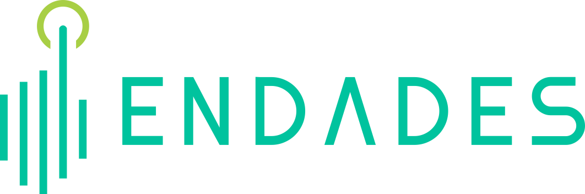

<!--  -->

  

---

# A cosa serve una Newsletter delle versioni?

La Newsletter delle versioni ha lo scopo di **informare utenti e tecnici** sui miglioramenti, correzioni e novità introdotte in ogni aggiornamento del software.

---

# Perché è importante?

- **Mantiene tutti informati:**  
  Gli utenti e i team tecnici sono a conoscenza degli ultimi aggiornamenti disponibili.

- **Aumenta la trasparenza:**  
  Comunica chiaramente le modifiche implementate e il valore che apportano.

- **Facilita la gestione delle versioni:**  
  I responsabili IT possono pianificare i rilasci e gli aggiornamenti in modo organizzato.

- **Migliora l’esperienza dell’utente:**  
  Conoscendo le novità, gli utenti possono sfruttare meglio le nuove funzionalità introdotte.

---

**Per ulteriori informazioni, non esiti a contattarci via e-mail:**  
[soporte@endades.com](mailto:soporte@endades.com)
