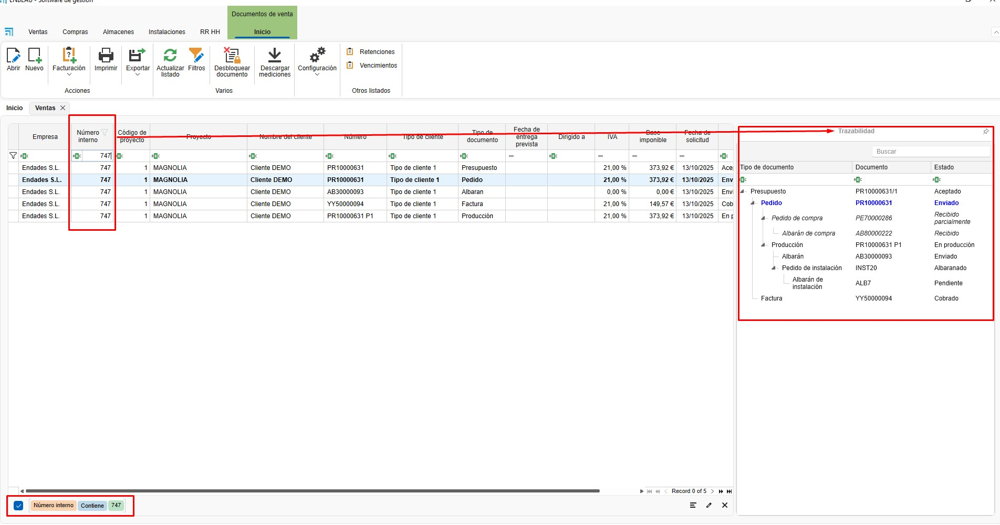

# Newsletter de Versões ENBLAU

Bem-vindo ao boletim de atualizações do **ENBLAU**.
Aqui encontrarás as últimas versões, melhorias e correções de erros.

---

## Próxima versão
**Data de lançamento:** Não disponível

Novidades

Correções

- **ENBLAU - Vendas - Relatório de orçamentos aceitos: Modificado o acumulado para exibir o total anual até a data final indicada ao apresentar o relatório.

	
	

---

## Versão 25.11.0014
**Data de lançamento:** Não disponível

Novidades

- **ENBLAU - Montagens - Comentários: Agora é possível adicionar comentários de montagem visíveis no ENBLAU WEB para montadores.

	
	
	

- **ENBLAU - Montagens - Comentários: Agora é possível adicionar comentários de montagem visíveis no ENBLAU para montadores.

	

- **ENBLAU - Montagens - Listagem: Incluída visualização e edição de comentários de montagem.

	

- **ENBLAU - Montagens - Listagem: Incluída visualização e edição de instalações planejadas.

	

- **ENBLAU - Montagens - Comentários: Agora é possível adicionar comentários de montagem visíveis a partir do planejador de instalações.

	

- **ENBLAU - Logikal - Modos de trabalho: Agora é possível trabalhar em 3 modos diferentes durante o processo de edição de projetos e posições do Logikal.

	

Correções

---

## Versão 25.10.0017
**Data de publicação:** 20/10/2025

Novidades

- **ENBLAU - Vendas - Relatórios:** Novo relatório adicionado. Resumo de documentos.

	

	

	

 	
 
- **ENBLAU - Vendas - Data de entrega prevista:** Adicionado novo campo do tipo data em orçamentos e pedidos de cliente.

	

	

Correções

- **ENBLAU - Vendas - Despesas gerais:** Resolvido problema em que, ao aplicar uma repartição por valor, não estava a obter uma repartição correta.
- **ENBLAU - Vendas - Produção - Desagregar:** Resolvido problema juntamente com nova incorporação de API na Logikal.
- **ENBLAU - Vendas - Ruturas:** Resolvido problema ao comprar materiais a partir de ruturas. Agora aparece o nome da cor na descrição do material.
- **enCLAD - Traduções:** Resolvido problema com traduções em italiano.
- **enCLAD - Clientes - Desbloquear:** Resolvido problema ao desbloquear clientes.

---

## Versão 25.10.0013
**Data de publicação:** 14/10/2025

Novidades

- **enSITE - Os meus registos de ponto:** Desaparece
- **enSITE - Registos de ponto:** Passa a chamar-se tempos

Correções

- **ENBLAU - Exportação para Cortizo Center:** Resolvido problema na exportação de certas referências

---

## Versão 25.10.0003
**Data de publicação:** 03/10/2025

Novidades

- **ENBLAU - Utilizadores:** Novos campos adicionados. Sexo, data de nascimento e segurança social
- **ENBLAU - Armazéns - Inventários:** Nova implementação. Agora é possível realizar inventários de stock sobre um projeto
- **ENBLAU - Armazéns - Armazém para stock:** Agora é possível indicar qual é o nosso projeto para stock no apartado de configuração
- **ENBLAU - Compras - Importar abaixo do mínimo e abaixo do habitual:** Agora contrasta contra o projeto definido para stock
- **ENBLAU - Configuração - Projetos:** Novo campo adicionado na configuração geral para definição de observações por defeito de projetos

Correções

- **ENBLAU - Compras:** Resolvido conflito ao eliminar um guia de compras e atualizar unidades recebidas no pedido de compras
- **ENBLAU - Vendas - Vencimentos:** Resolvido problema de atualização de descrição de vencimento a partir da listagem de vencimentos
- **ENBLAU - Vendas - Retenções:** Resolvido problema de atualização de descrição de retenção a partir da listagem de retenções
- **ENBLAU - Compras - Exportação Cortizo Center:** Resolvido problema de exportação em acessórios onde o acabamento era distinto do preto

---

## Versão 25.09.0022
**Data de publicação:** 22/09/2025

Novidades

- **ENBLAU - Configuração:** Agora verificam-se os estados dos documentos de instalações, vendas e compras em cada atualização, sem interferir nos estados próprios introduzidos
- **ENBLAU - Vendas - Relatório de fatura:** Adicionado campo de fatura retificativa em faturas retificativas
- **ENBLAU - Vendas - Relatório de fatura:** Adicionadas opções para poder ocultar a imagem e a descrição e reduzir o tamanho da fatura
- **ENBLAU - Compras - Exportação Cortizo Center:** Modificação realizada para valoração de perfis de PVC utilizados da Logikal
- **ENBLAU - Compras - Reclamações:** No relatório de reclamações, agora é possível visualizar apenas as linhas que contenham unidades pendentes de receber. Também se pode mostrar sem valoração

Correções

- **enCONTROL - Monitor de persiana:** Resolvido problema de duplicidade em materiais do tipo peça como caixas de persiana

---

## Versão 25.09.0010
**Data de publicação:** 10/09/2025

Novidades

- **ENBLAU - Vendas - Material necessário:** Agora relacionam-se as caixas de persiana com a sua posição pertinente
- **ENBLAU - Compras:** Agora relacionam-se as caixas de persiana com a sua posição pertinente
- **ENBLAU - Projetos - Exportação de custos:** Nova coluna adicionada de material descontado de projeto
- **ENBLAU - Projetos - Exportação de custos:** Traduzido para inglês, português e italiano

Correções

- **enCONTROL - Monitor de preparação de material:** Corrigido problema de deteção de vidro no projeto
- **enCONTROL - Monitor de junquilhamento:** Corrigido desconto automático de vidros
- **enCONTROL - Monitor de persiana:** Corrigido desconto automático de caixas, definidas como tipo peça, provenientes da Logikal
- **enCONTROL - Monitor de corte:** Corrigido problema de obtenção de cortes com múltiplos mecanizados

---

## Versão 25.09.0002
**Data de publicação:** 02/09/2025

Novidades

- **ENBLAU - Traduções - Reposição de stock:** Italiano disponível
- **enCONTROL - Traduções - Reposição de stock:** Italiano disponível
- **enSITE - Traduções - Reposição de stock:** Italiano disponível
- **ENBLAU WEB - Traduções - Reposição de stock:** Italiano disponível
- **enUPDATE - Traduções - Reposição de stock:** Italiano disponível
- **enCONNECT - Traduções - Reposição de stock:** Italiano disponível
- **ENBLAU - Compras:** Nova implementação de realização de pesquisas entre o detalhe do documento

Correções

- **ENBLAU - Vendas - Logikal:** Resolvido problema de sincronização com posições da Logikal. O valor da coluna Custom4 de Ventas_Detalle foi incrementado ao máximo
- **ENBLAU - Compras - Reposição de stock:** Resolvido problema de filtro em abaixo do mínimo e abaixo do habitual
- **enCLAD - Exportação para PDF:** Resolvido problema em exportação. Lía imagem como recurso e não física
- **enCLAD - Alçados:** Resolvido problema em criação de alçados. Lía imagem como recurso e não física

---

## Versão 25.08.0025
**Data de publicação:** 25/08/2025

Novidades

_Sem novidades destacadas._

Correções

_Sem correções destacadas._

---

## Versão 25.07.0014
**Data de publicação:** 14/07/2025

Novidades

- **ENBLAU - Armazéns - Ubicar guia de compras:** Nova opção em configuração (Compras e stock --> Ubicar guia). Ao marcar esta caixa, ao criar um novo guia de compras abrir-se-á automaticamente a janela de ubicar guia.
- **ENBLAU - Clientes:** Novo tipo de contacto 'Vendas' para seleção de email automaticamente
- **ENBLAU - Compras - Exportação para Cortizo Center:** Alterado o requerido em juntas ao total de unidades multiplicado pelo total de unidades de empacotamento
- **ENBLAU - Contactos:** Novo tipo de contacto 'Vendas' para seleção de email automaticamente
- **enCONTROL - Monitor de controlo:** Adicionado resumo estado 'Corte e dobragem'
- **enCONTROL - Monitor de controlo:** Adicionado resumo estado 'Pintura'
- **enCONTROL - Monitor de controlo:** Adicionado resumo estado 'Picking'
- **enCONTROL - Monitor de controlo:** Adicionado resumo estado 'Transformação'
- **enCONTROL - Monitor de controlo:** Adicionado resumo estado 'Soldadura'
- **enCONTROL - Monitor de controlo:** Adicionado resumo estado 'Limpeza'

Correções

- **ENBLAU - Divisas:** Resolvido problema com nova implementação de histórico de divisas com duplicidade de divisa selecionada

---

## Versão 25.07.0003
**Data de publicação:** 03/07/2025

Novidades

- **enCONTROL - Campos na BD:** Adicionados campos ProfileClass, ArticleType e PieceListType a PR_Barras_Cortes
- **enCONTROL - Campos na BD:** Adicionados campos ArticleType e PieceListType a Ventas_Detalle_EPI_Cuadros_Articulos
- **enCONTROL - Monitor de corte de perfis principais:** Novo posto de corte de perfis principais
- **enCONTROL - Monitor de corte de junquilhos:** Novo posto de corte de junquilhos

Correções

- **enCONTROL - Monitor de corte:** Resolvido problema de referência da Logikal em PVC em bicolores

---

## Versão 25.07.0001
**Data de publicação:** 01/07/2025

Novidades

- **ENBLAU - Vendas - Material necessário:** Agora é possível adicionar materiais importados da Logikal em documentos de venda
- **ENBLAU - Vendas - Material necessário:** Adicionada funcionalidade para poder descontar de stock a partir da janela de material necessário
- **ENBLAU - RRHH - Calendário de ausências:** Melhorada vista de solicitações

Correções

- **ENBLAU - Vendas - Divisa utilizada:** Corrigido problema de seleção de data atual a primeira vez que se apresenta um documento
- **ENBLAU - RRHH - Calendário de ausências:** Resolvido problema de cálculo de dias pendentes de disfrutar ao adicionar dias manualmente

---

## Versão 25.06.0030
**Data de publicação:** 30/06/2025

Novidades

- **enCONTROL - Licenciamento:** Novo modo de licenciamento. Poder-se-á trabalhar com qualquer posto. Quanto a licenças, apenas se terá em conta o total de postos concorrentes, independentemente de quais sejam
- **ENBLAU - Instalações - Calendário:** Nova permissão sobre calendário. Será necessário conceder esta permissão para que os utilizadores possam modificar as marcações do calendário
- **ENBLAU - Vendas - Divisa utilizada:** Agora é possível escolher a divisa da data do documento

Correções

_Sem correções destacadas._

---

## Versão 25.06.0019
**Data de publicação:** 19/06/2025

Novidades

- **enCONTROL - Monitor de Soldadura:** Novo posto de soldadura
- **enCONTROL - Monitor de Limpeza:** Novo posto de limpeza
- **enCONTROL - Monitor de Transformação:** Novo posto de transformação
- **ENBLAU - Clientes:** Foi incrementado o campo direção de 50 a 200 caracteres
- **ENBLAU - Fornecedores:** Foi incrementado o campo direção de 50 a 200 caracteres
- **ENBLAU - Utilizadores:** Foi incrementado o campo direção de 50 a 200 caracteres
- **ENBLAU - Instaladores:** Foi incrementado o campo direção de 50 a 200 caracteres
- **ENBLAU - Contactos:** Foi incrementado o campo direção de 50 a 200 caracteres
- **ENBLAU - Configuração geral:** Foi incrementado o campo direção de 50 a 200 caracteres
- **ENBLAU - Empresas:** Foi incrementado o campo direção de 50 a 200 caracteres
- **ENBLAU - Projetos:** Foi incrementado o campo direção de 50 a 200 caracteres
- **enCONTROL - Monitor de corte - Retalhos:** Agora solicitamos a ubicación do retalho. Anteriormente ubicava-se automaticamente na ubicación de onde se obtinha a barra
- **ENBLAU - Vendas - Guias:** Foram adicionados os campos 'Assinado', 'DataAssinado', 'NomeAssinante' e 'DNIAssinante' para guias em documentos de vendas
- **ENBLAU - Vendas - Faturação:** Foi implementada uma nova funcionalidade para que marque a opção de faturado quando faturamos a partir de um guia de vendas
- **enCONTROL - Monitor de corte e transformação:** Novo posto de corte, no qual se cortam quantidades de barras para armazenar em medidas oportunas para stock
- **ENBLAU - Vendas - Documento de venda:** Ao cambiar o nome da posição, se a Logikal o permite e nos encontramos conectados à Logikal, o nome também se cambiará na Logikal.

Correções

- **enCONTROL - Monitor de Junquilhamento:** Resolvido problema em perfis de montado no destino
- **enCONTROL - Monitor de Montagem:** Resolvido problema em perfis de montado no destino

---

## Versão 25.06.0011
**Data de publicação:** 11/06/2025

Novidades

- **ENBLAU - Materiais importados:** Novo campo adicionado 'Montado no destino'
- **ENBLAU - Vendas - Classificações:** Adicionado novo posto de picking
- **ENBLAU - Configuração - Layout de produção:** Adicionado novo posto de picking
- **enMATERIALS - Artigos:** Novo campo adicionado 'Montado no destino'
- **enCONTROL - Quadro:** Melhorada velocidade no posto de quadro
- **enCONTROL - Picking:** Novo posto de picking
- **enCONTROL - Montagem:** Nova opção de montado no destino. Ao clicar, esse material aparecerá no posto de picking
- **enCONTROL - Junquilhamento:** Nova opção de montado no destino. Ao clicar, esse material aparecerá no posto de picking
- **enCONTROL - Ferragem:** Nova opção de montado no destino. Ao clicar, esse material aparecerá no posto de picking
- **ENBLAU - Vendas - Faturação de guias:** Foram adicionadas as colunas código de projeto, nome do projeto e técnico de projeto
- **ENBLAU - Compras - Reclamações:** Agora armazena-se o texto do email da reclamação, no modo novo de envio de emails

Correções

- **ENBLAU - Armazéns - Atribuição:** Resolvido problema em que se permitia atribuir unidades a mais
- **ENBLAU - Vendas - Novo documento de vendas:** Corrigido problema em que se permitia adicionar documento sem numeração
- **ENBLAU - Instalações - Novo documento de instalação:** Corrigido problema em que se permitia adicionar documento sem numeração
- **ENBLAU - Vendas - Novo guia:** Resolvido problema em que um guia sem XML de preços não podia ser faturado
- **ENBLAU - Vendas - Novo documento:** Resolvido problema de seleção automática de opção de faturação automática ao escolher um projeto

---

## Versão 25.06.0003
**Data de publicação:** 03/06/2025

Novidades

- **ENBLAU - Instalações - Planeador:** Novo modo de vista de linha de tempo. Agora é possível interagir com a hora de início e de fim
- **ENBLAU - Projetos - Planeador:** Agora mantém-se sempre a primeira hora de início visível, de tal modo que ainda que se vão adiando as tarefas poderemos visualizar a data inicial de atribuição

Correções

- **ENBLAU - Instalações - Planeador:** Resolvido problema ao eliminar marcações no planeamento

---

## Versão 29.05.0025
**Data de publicação:** 29/05/2025

Novidades

- **ENBLAU - Exportação para contabilidade:** Novos campos adicionados

Correções

_Sem correções destacadas._

---

## Versão 25.05.0026
**Data de publicação:** 26/05/2025

Novidades

- **enCONTROL - Monitor de corte:** Adicionada informação acerca de se tem ou não mecanizados o corte selecionado
- **ENBLAU - Vendas - Material necessário:** Adicionada nova coluna que indica se há stock no projeto ou não, para poder filtrar
- **ENBLAU - Compras - Pedido de reposição:** Adicionadas colunas de cor interior e cor exterior
- **ENBLAU - Compras - Pedido de reposição:** Agora visualizam-se as referências ainda que tenhas stock no armazém
- **ENBLAU - Projetos - Árvore de materiais importados:** Adicionada árvore a projetos
- **ENBLAU - Projetos - Material adicional:** Agora é possível adicionar material da Logikal
- **ENBLAU - Projetos - Ruturas:** Agora é possível adicionar material da Logikal
- **ENBLAU - Vendas - Árvore de materiais importados:** Adicionada árvore a vendas
- **ENBLAU - Vendas - Material adicional:** Agora é possível adicionar material da Logikal
- **ENBLAU - Vendas - Ruturas:** Agora é possível adicionar material da Logikal

Correções

_Sem correções destacadas._

---

## Versão 25.05.0019
**Data de publicação:** 19/05/2025

Novidades

- **ENBLAU - Utilizadores - Permissões de utilizador:** Agora é possível modificar permissões de utilizador massivamente
- **ENBLAU - Utilizadores - Permissões:** Agora é possível modificar permissões de utilizador massivamente

Correções

- **ENBLAU - Vendas - Logikal:** Resolvido problema ao copiar posições
- **ENBLAU - Vendas - Logikal:** Resolvido problema de atribuição de nome

---

## Versão 25.05.0015
**Data de publicação:** 15/05/2025

Novidades

- **ENBLAU - Vendas - Pedido:** Novo relatório disponível. Certificado de fornecimento
- **ENBLAU:** Corrigidas cadeias em inglês ao selecionar filtros
- **enCLAD:** Corrigidas cadeias em inglês ao selecionar filtros
- **enCONTROL:** Corrigidas cadeias em inglês ao selecionar filtros
- **ENBLAU - Armazéns - Movimentos de armazém:** Agora é possível abrir o documento de compras relacionado a partir de movimentos
- **ENBLAU - Armazéns - Movimentos de armazém:** Agora é possível abrir o documento da produção relacionada a partir de movimentos
- **ENBLAU:** Mudança de modo de abertura em janelas de documentos. agora dependem da janela principal do ENBLAU
- **ENBLAU - Vendas:** Agora pode-se retirar o sujeito passivo em faturas
- **enCONTROL - Monitor de verificação final:** Adicionada etiqueta de produto terminado

Correções

_Sem correções destacadas._

---

## Versão 25.05.0012
**Data de publicação:** 12/05/2025

Novidades

- **ENBLAU - Vendas - Documento de material necessário:** Habilitado em medições e em produções
- **ENBLAU - Utilizadores - Impressão de cartões:** Foi habilitada a edição dos cartões diretamente desde a aplicação

Correções

- **ENBLAU - Compras - Pedidos agrupados:** Resolvido problema em criação de documentos

---

## Versão 25.05.0007
**Data de publicação:** 07/05/2025

Novidades

_Sem novidades destacadas._

Correções

- **enCONTROL - Monitor de controlo:** Resolvido problema de posto de controlo. Em ocasiões não liberava o posto em uso

---

## Versão 25.05.0005
**Data de publicação:** 05/05/2025

Novidades

- **ENBLAU - Vendas - Posições:** Adicionados três campos novos na base de dados com informação de sistema, cor e tipo de produto para posições da Logikal
- **ENBLAU - Armazéns - Produto terminado:** Novo apartado de gestão de produto terminado
- **enCONTROL - Monitor de verificação:** Novo botão de ubicación de produto

Correções

_Sem correções destacadas._

---

## Versão 25.04.0028
**Data de publicação:** 29/04/2025

Novidades

- **ENBLAU - Instalações - Planeador:** Agora é possível copiar e colar marcações no planeador
- **ENBLAU - Instalações - Instalações planeadas:** Adicionada coluna estado
- **ENBLAU - Instalações - Instalações planeadas:** Adicionada coluna Classificação
- **ENBLAU - Instalações - Instalações planeadas:** Modificadas colunas de data para que mostre a hora
- **ENBLAU - Armazéns:** Nova listagem - Resumo com ubicaciones
- **enCONTROL - Monitor de controlo - Passar a produção:** Agora respeitam-se as mudanças iniciais ao arrastar uma nova produção para fabricação, e cambiar certos valores
- **ENBLAU - Gestão de janelas emergentes:** Agora modificam-se de maneira independente

Correções

- **ENBLAU - Campos de texto - Texto enriquecido:** Resolvido problema ao copiar texto em todos os campos de observações
- **ENBLAU - Vendas:** Resolvidos problemas com subestruturas obtidas desde a Logikal

---

## Versão 25.04.0016
**Data de publicação:** 22/04/2025

Novidades

- **ENBLAU - Projetos - Stock:** Ao finalizar um projeto agora podemos reatribuir massivamente todos os materiais de armazém a um novo projeto
- **ENBLAU - Vendas - Stock:** Agora podem-se reatribuir materiais de armazém desde material necessário
- **enCONTROL - Stock:** Criado log de problemas de stock em rota de instalação do ENBLAU

Correções

- **ENBLAU - Compras:** Resolvido problema em faturação de guias
- **ENBLAU - Compras:** Resolvido problema de duplicidade na descrição de materiais ao arrastarem-se desde a árvore de materiais. Apenas em superfícies.
- **enCONTROL - Stock:** Resolvidos múltiplos problemas ao descontar stock automaticamente

---

## Versão 25.04.0011
**Data de publicação:** 11/04/2025

Novidades

- **ENBLAU - Compras - Reposição de stock:** Nova aplicação para importar materiais para stock abaixo do mínimo ou abaixo do habitual
- **ENBLAU - Armazéns:** Agora é possível configurar o modo de descontar de stock para quando se realizam movimentos de saída desde uma produção no ENBLAU

Correções

- **ENBLAU - Armazéns:** Corrigido o modo em que se mostram as cores em material necessário para saber se dispomos de materiais em stock

---

## Versão 25.04.0007
**Data de publicação:** 07/04/2025

Novidades

- **ENBLAU - Compras - Digitalizar:** Modificado para poder digitalizar múltiplas folhas de documentos num único PDF
- **enUPDATE - Descargas:** Agora cada vez que se feche e se volte a entrar no enUPDATE, permitirá voltar a descarregar a versão se não se encontrar instalada
- **ENBLAU - Armazéns:** Novo tipo de movimento. Movimento de atribuição desde armazém detalhado, através do qual podemos atribuir o projeto no queremos utilizar o material
- **ENBLAU - Vendas - Stock necessário:** Agora pode-se visualizar as unidades disponíveis, reservadas e pendentes do material para cada armazém desde esta janela
- **ENBLAU - Armazéns - Detalhado:** Agora pode-se abrir o documento de entrada desde a listagem de armazém
- **ENBLAU - Armazéns - Material pendente:** Agora pode-se abrir o documento de entrada desde a listagem de material pendente
- **ENBLAU - Armazéns - Reservado:** Agora pode-se abrir o material reservado do projeto e interagir

Correções

_Sem correções destacadas._

---

## Versão 25.04.0003
**Data de publicação:** 03/04/2025

Novidades

_Sem novidades destacadas._

Correções

- **enCONTROL - Toque:** Resolvido problema com interface tátil em certos ecrãs.

---

## Versão 25.04.0001
**Data de publicação:** 01/04/2025

Novidades

- **ENBLAU - Armazéns - Movimentos:** Adicionada coluna de hora em movimentos
- **ENBLAU - Armazéns - Movimentos:** Agora é possível devolver uma saída de material
- **ENBLAU - Armazéns - Movimentos:** Agora é possível eliminar um movimento por um administrador
- **ENBLAU - Armazéns - Movimentos - Relatórios:** Novo relatório de movimentos 'Movimentos'
- **ENBLAU - Armazéns - Movimentos - Relatórios:** Novo relatório de movimentos 'Movimentos I'
- **ENBLAU - Armazéns - Armazéns - Relatórios:** Novo relatório de inventário em data concreta
- **ENBLAU - Armazéns - Armazéns - Relatórios:** Novo relatório de inventário segundo filtro aplicado
- **ENBLAU - Armazéns - Armazéns - Resumo:** Melhorada vista de resumo de armazém
- **ENBLAU - Material necessário - Vidros:** Modificadas as descrições estendidas dos vidros provenientes da Logikal

Correções

- **ENBLAU - Material Reservado:** Resolvido problema de visualização em stock em armazéns
- **enCHECK - Traduções:** Resolvido problema com tradução

---

## Versão 25.03.0025
**Data de publicação:** 25/03/2025

Novidades

- **enCONTROL - Quadro:** Melhorada interface.
- **enCONTROL - Monitores:** Melhorada interface.
- **ENBLAU - Vendas - Faturação:** Integrada exportação para faturação eletrónica segundo governo de Espanha

Correções

- **ENBLAU - Compras:** Resolvido problema de preços em persianas em materiais provenientes da Logikal
- **ENBLAU - Compras:** Resolvido problema de preços em vidros em materiais provenientes da Logikal
- **ENBLAU - Compras - Ubicação de guias:** Resolvido problema de duplicação de unidades em stock

---

## Versão 25.03.0006
**Data de publicação:** 06/03/2025

Novidades

- **ENBLAU - Armazéns:** Adicionado somatório de unidades totais em stock, pendentes de receber e reservadas.
- **ENBLAU - Projetos - Material reservado:** Adicionado somatório de unidades totais em stock, pendentes de receber e reservadas.
- **ENBLAU - Vendas - Material necessário - Ruturas:** Adicionado somatório de unidades totais em stock, pendentes de receber e reservadas.
- **ENBLAU - Vendas - Ruturas:** Adicionado somatório de unidades totais em stock, pendentes de receber e reservadas.
- **ENBLAU - Vendas - Material adicional:** Adicionado somatório de unidades totais em stock, pendentes de receber e reservadas.

Correções

_Sem correções destacadas._

---

## Versão 25.02.0018
**Data de publicação:** 18/02/2025

Novidades

- **ENBLAU - Relatórios - Pedido de compras sem valorar:** Agora tem-se em conta as unidades de venda indicadas no fornecedor
- **ENBLAU - Compras - Digitalizar:** Agora armazena-se sempre em PDF a imagem digitalizada. Também incrementa o nome do documento a armazenar
- **enCONTROL - Monitor de controlo:** Ao clicar sobre uma produção em fila de produção, veremos a documentação associada à mesma na árvore de produção
- **ENBLAU:** Melhoria de rendimento
- **ENBLAU:** Atualização de ambiente
- **enCONTROL:** Atualização de ambiente
- **enMATERIALS:** Atualização de ambiente
- **enCHECK:** Atualização de ambiente
- **enCAD:** Atualização de ambiente
- **enCLAD:** Atualização de ambiente
- **ENBLAU - Vendas - Configuração estados:** Agora é possível configurar estados existentes ou adicionar estados novos
- **ENBLAU - Compras - Configuração estados:** Agora é possível configurar estados existentes ou adicionar estados novos
- **ENBLAU - Instalações - Configuração estados:** Agora é possível configurar estados existentes ou adicionar estados novos
- **ENBLAU - Vendas - Filtros:** Melhorado rendimento e usabilidade
- **ENBLAU - Compras - Filtros:** Melhorado rendimento e usabilidade
- **ENBLAU - Instalações - Filtros:** Melhorado rendimento e usabilidade
- **ENBLAU - Vendas - Materiais necessários - STOCK:** Melhorada consulta de obtenção de unidades em stock, contando com o material de projetos finalizados
- **ENBLAU - Armazéns:** Melhorada consulta com o valor 'ÉRetal' agrupado
- **ENBLAU - Contabilidade:** Adicionado novo tipo de exportação contável previsto para '.xlsx'
- **ENBLAU - Planeador de instalações:** Melhorando usabilidade e visualização do planeador de instalações

Correções

_Sem correções destacadas._

---

## Versão 25.02.0004
**Data de publicação:** 04/02/2025

Novidades

_Sem novidades destacadas._

Correções

- **enCONTROL:** Resolvidos problemas visuais relacionados com traduções

---

## Versão 25.02.0001
**Data de publicação:** 31/01/2025

Novidades

_Sem novidades destacadas._

Correções

- **ENBLAU - Ubicação guias:** Resolvido problema visualização planta
- **ENBLAU - Projetos:** Resolvido problema eliminação armazém automaticamente, em modo de stock 2

---

## Versão 25.01.0022
**Data de publicação:** 22/01/2025

Novidades

- **enCONTROL - Monitor de quadro:** Adicionado o texto do último comentário de produção
- **ENBLAU - Planeador de projetos:** Agora armazena-se a última vista utilizada no planeador por utilizador
- **ENBLAU - Armazéns - Stock:** Nova visualização de stock através da qual podemos ver a que projeto vão destinados esses materiais
- **ENBLAU - Vendas - Material necessário:** Agora visualiza-se desde vendas o projeto ao que vai destinado o stock
- **ENBLAU - Vendas - Material necessário:** A coluna artigo e a coluna unidades a comprar visualizam-se em cor vermelha ou verde segundo se encontre material disponível para realizar o projeto ou não. Consideramos material disponível a diferença entre as unidades necessárias e as que há em stock destinadas ao projeto, ou em projetos finalizados, menos as reservadas.
- **ENBLAU - Projetos:** Nova opção de predefinido junto a responsável de compras e responsável. Ao marcá-lo, assumimos que o responsável indicado é o que queremos que arraste a cada documento de compras ou documento de vendas respetivamente que vamos criar de novo, e que se encontre relacionado com o projeto em questão.
- **ENBLAU - Compras - Relatórios:** Agora pode-se ocultar nos documentos de pedido a fornecedor o documento de origem
- **ENBLAU - Idioma:** Disponível em português
- **enCONTROL - Idioma:** Disponível em português
- **enCLAD - Idioma:** Disponível em português
- **enSite - Idioma:** Disponível em português
- **ENBLAU - Idioma:** Disponível em Inglês
- **enCONTROL - Idioma:** Disponível em Inglês
- **enCLAD - Idioma:** Disponível em Inglês
- **enSite - Idioma:** Disponível em Inglês
- **enSite - Documentação:** Adicionado novo apartado de documentação
- **ENBLAU - Relatórios - Editor:** Adicionadas dlls necessárias para edição de relatórios personalizados

Correções

- **ENBLAU - Emails - Guardado em local:** Resolvido problema de armazenamento local

---

## Versão 25.01.0002
**Data de publicação:** 02/01/2025

Novidades

- **enCONTROL - Monitor de preparação de material:** Foram adicionadas duas colunas novas. Stock em projeto e reservado em projeto
- **ENBLAU - Instalações:** Modificado o modo de leitura de ícones em documentação. Agora não se deixará de visualizar a documentação depois de uma instalação ainda que outro utilizador tivesse aberta a aplicação durante o processo de instalação
- **ENBLAU - Listagem de vendas - Relatório de faturas:** Agora admite o filtro aplicado na listagem
- **ENBLAU - Listagem de compras - Relatório de faturas:** Agora admite o filtro aplicado na listagem
- **ENBLAU - Stock:** Adicionada coluna É retal a armazéns e armazéns em vendas
- **ENBLAU - Stock - Material reservado:** Adicionada a visualização de material em armazéns na janela de reservado
- **ENBLAU - Compras - Logikal - Materiais importados:** Nova árvore de materiais de artigos da Logikal com os que temos trabalhado previamente. Agora é possível adicionar materiais da Logikal a um pedido de compras sem necessidade de estar conectado
- **ENBLAU - Logikal - Materiais importados:** Agora podem-se definir os materiais da Logikal para que se controle o stock ao listar material ou se marque como para comprar segundo necessidades
- **ENBLAU - Compras - Relatórios:** Novo relatório de M2 por fornecedor
- **ENBLAU - Compras - Stock:** Nova função desde pedidos de compra para pedir a fornecedor todos os materiais abaixo do mínimo ou abaixo do habitual em armazém

Correções

- **ENBLAU - Utilizadores:** Corrigido problema de duplicidade de permissões
- **ENBLAU - Notificações de processos:** Corrigido problema em notificações de certos utilizadores

---

## Versão 24.12.0020
**Data de publicação:** 20/12/2024

Novidades

- **ENBLAU - Medidas de persiana:** Agora importa-se a altura da caixa de persiana
- **ENBLAU - Compras - Documento de compras:** Adicionada coluna de rastreabilidade de superfícies
- **ENBLAU - Compras - Novo guia:** Adicionada coluna de rastreabilidade de superfícies
- **ENBLAU - Compras - Nova fatura:** Adicionada coluna de rastreabilidade de superfícies

Correções

- **ENBLAU - Stock:** Resolvido problema de movimento e desconto de juntas quando o comprimento coincidia com o comprimento a descontar
- **enSITE - Stock:** Resolvido problema de movimento e desconto de juntas quando o comprimento coincidia com o comprimento a descontar

---

## Versão 24.12.0012
**Data de publicação:** 12/12/2024

Novidades

- **enCONTROL - Posto de verificação final:** Adicionado campo referência de produção

Correções

_Sem correções destacadas._

---

## Versão 24.12.0010
**Data de publicação:** 10/12/2024

Novidades

- **ENBLAU - Compras - Scanner:** Agora é possível chamar o scanner desde um documento de compras
- **ENBLAU - Stock - Material reservado:** Agora se uma reserva está cancelada, não soma quantidades novas adicionadas sobre ela

Correções

- **ENBLAU - Compras - Valor em superfícies:** Resolvido problema de valoração em materiais de tipo superfície

---

## Versão 24.12.0009
**Data de publicação:** 09/12/2024

Novidades

- **ENBLAU - Compras - Ubicação em stock:** Agora pode-se ubicar um guia de compras em armazém desde o ENBLAU
- **ENBLAU - Compras - Faturação:** Atualização de opção de pago em faturas de compra automaticamente
- **ENBLAU - Compras:** Agora permite-se modificar a referência de fornecedor de materiais da Logikal e ENBLAU desde um documento de compras
- **enCONTROL - Posto de corte:** Adicionado comprimento de retalho na informação da barra
- **enCONTROL - Posto de corte:** Modificado o ordenamento dos cortes para que se mostre como no relatório de otimização de corte da Logikal

Correções

_Sem correções destacadas._

---

## Versão 24.11.0027
**Data de publicação:** 27/11/2024

Novidades

- **enCONTROL:** Adicionado enUPDATE à instalação independente de enCONTROL
- **enCONTROL:** Adicionado novo posto de pintura
- **enCONTROL:** Adicionado novo posto de corte e dobragem de chapas
- **ENBLAU - Stock:** Adicionada exportação Excel de barra em stock segundo protocolo de importação de retalhos da Logikal
- **ENBLAU - Faturação eletrónica:** Adicionada faturação eletrónica segundo Facturae
- **ENBLAU - Faturação eletrónica:** Modificada plantilla de fatura com QR de fatura eletrónica
- **ENBLAU - Vendas - Vencimentos:** Atualização de estado automático em faturas ao indicar que os vencimentos se encontram cobrados

Correções

_Sem correções destacadas._

---

## Versão 24.11.0015
**Data de publicação:** 15/11/2024

Novidades

- **enCONTROL:** Nova etiqueta adicionada. Etiqueta 06.

Correções

- **ENBLAU - Produção:** Corrigido problema de duplicidade de IDs em stock necessário
- **enCONTROL:** Resolvido problema de interpretação de datas em alguns ambientes de rede

---

## Versão 24.10.0031
**Data de publicação:** 11/11/2024

Novidades

- **enCONTROL - Configuração:** Incluída nova rota de documentação genérica
- **enCONTROL - Configuração:** Novo sistema de controlo de stock. Descontar do projeto, em sua falta de qualquer lugar
- **ENBLAU - Produção:** Agora é possível controlar o stock necessário massivamente desde o ENBLAU

Correções

_Sem correções destacadas._

---

## Versão 24.10.0028
**Data de publicação:** 28/10/2024

Novidades

- **ENBLAU - Compras - Relatórios:** Incluída imagem de material em pedido de compras sem valorar
- **ENBLAU - Compras - Relatórios:** Incluída imagem de material em material a receber
- **ENBLAU - Compras - Relatórios:** Incluída imagem de material em reclamações
- **enCLAD - Seleção perfis:** Agora mostra-se o comprimento do perfil
- **enCLAD - Comprimento perfis:** Agora geram-se do comprimento exato em lugar de 10 mm de diferença

Correções

- **enCLAD - Painéis desdobrados:** Resolvido problema em muros com inclinação

---

## Versão 24.10.0015
**Data de publicação:** 15/10/2024

Novidades

- **ENBLAU - Compras - Vencimentos:** Adicionada nova opção a configuração, onde poder indicar se queremos que os vencimentos em faturas de compra se criem por defeito como pagados
- **ENBLAU - Compras - Listagem de vencimentos:** Agora calcula-se a data do vencimento desde a data do documento
- **ENBLAU - Compras - Listagem de vencimentos:** Foram adicionadas as colunas referência e referência de fornecedor
- **ENBLAU - Compras - Relatórios - Pedido sem valorar:** Agora visualizam-se as observações para o fornecedor
- **ENBLAU - Vendas:** Agora é possível visualizar o stock desde material necessário no novo método de controlo de stock
- **ENBLAU - Notificações:** Agora é possível indicar um utilizador concreto a notificar

Correções

- **ENBLAU - Vendas:** Resolvido problema ao adicionar material a ruturas
- **ENBLAU - Compras - Listagem de vencimentos:** Resolvido problema com filtro de pago

---

## Versão 24.10.0004
**Data de publicação:** 04/10/2024

Novidades

- **ENBLAU:** Melhorias de rendimento interno
- **ENBLAU - Vendas:** Incluídas medidas de persiana em materiais de tipo peça provenientes da Logikal

Correções

_Sem correções destacadas._

---

## Versão 24.09.0011
**Data de publicação:** 11/09/2024

Novidades

- **ENBLAU - Listagem de material:** Modificado o arredondamento em vidros para controlar que se corresponda com milímetros
- **ENBLAU - Janela de reservado:** Adicionado mostrar cores em materiais para arrastar
- **ENBLAU - Materiais necessários:** Agora mostra-se a medida da persiana na descrição do artigo
- **ENBLAU - Compras - Relatórios:** Adicionada nova plantilla de pedido de compras sem valorar
- **ENBLAU - Vendas - Vencimentos:** Adicionada coluna de comercial
- **ENBLAU - Vencimentos:** Adicionado campo de data de cobrado
- **ENBLAU - Relatórios:** Adicionada coluna de data de cobrado no relatório de vencimentos

Correções

- **enSITE - Anexos em receções:** Resolvido problema ao anexar imagens num guia de compra
- **ENBLAU - Janela de reservado:** Resolvido problema de visualização de unidades em referências de pedidos
- **ENBLAU - Stock:** Resolvido problema com obtenção de código único em referências similares com diferente cor

---

## Versão 24.09.0003
**Data de publicação:** 03/09/2024

Novidades

- **ENBLAU - Relatórios:** Guia valorado - Agora é possível ocultar a coluna de desconto
- **ENBLAU - Compras:** Não se permite a modificação da referência em materiais da Logikal

Correções

- **enCONTROL - Monitor de persiana:** Resolvido problema de visualização de documentação
- **enSITE - Opções:** Resolvido problema de visualização do texto nos valores das opções de tipo seleção
- **ENBLAU - Compras - Exportação Cortizo Center:** Resolvido problema de exportação a plantilla de Cortizo center

---

## Versão 24.07.0024
**Data de publicação:** 29/07/2024

Novidades

- **ENBLAU - Listagem de vendas:** Adicionada coluna de tipo de cliente
- **ENBLAU - Controlo de stock:** Nova funcionalidade de reservas de material para projeto
- **ENBLAU - Recursos humanos - Solicitações:** Listagem de dias disponíveis por empregado por ano de convenção
- **ENBLAU - Recursos humanos - Marcações:** Listagem de dias disponíveis por empregado por ano de convenção
- **ENBLAU - Notificações:** Adicionado botão para poder abrir o documento ao que se faz referência
- **ENBLAU - Documentação:** Adicionada automatização de criação de diretórios nas pastas de documentação
- **enCONTROL - Etiquetas:** Nova etiqueta adicionada

Correções

_Sem correções destacadas._

---

## Versão 24.07.0008
**Data de publicação:** 08/07/2024

Novidades

- **ENBLAU - Clientes:** Adicionado botão de contas contáveis em clientes
- **ENBLAU - Compras - Vencimentos:** Agora é possível marcar como pagados múltiplos vencimentos de compra
- **ENBLAU - Vendas:** Adicionado novo campo em configuração, para personalizar a obtenção de descrição de superfícies da Logikal

Correções

- **ENBLAU - Compras:** Corrigido problema de traduções ao aplicar descontos massivamente em compras
- **ENBLAU - Projetos:** Corrigido problema em filtro nome ao selecionar o cliente

---

## Versão 24.06.0020
**Data de publicação:** 20/06/2024

Novidades

- **ENBLAU - Material necessário:** Será possível agrupar vidros provenientes da Logikal desde configuração geral
- **ENBLAU - Retalhos:** Novo campo de retalho mínimo na Logikal, em configuração geral do ENBLAU
- **ENBLAU - Compras:** Agora é possível aplicar diferente IVA às distintas linhas do pedido, do guia ou da fatura
- **ENBLAU - Compras:** Foram modificadas as plantillas de pedido, guia e fatura para visualizar o IVA da linha

Correções

_Sem correções destacadas._

---

## Versão 24.06.0017
**Data de publicação:** 17/06/2024

Novidades

- **ENBLAU - Relatórios:** Adicionado somatório em relatório de crédito
- **ENBLAU - Relatórios:** Novo relatório de guia valorado em vendas
- **ENBLAU - Relatórios:** Novo relatório desde a listagem de vendas. Posições realizadas num período de tempo
- **ENBLAU - Controlo de stock:** Adicionado novo modo de controlo de stock, através de definição de planta de planta
- **enSITE - Controlo de stock:** Agora é possível ubicar guias recebidos, realizar transferências ou saídas
- **enCONTROL - Controlo de stock:** Nova configuração para controlo de stock. Agora descontar-se-ão automaticamente os materiais utilizados em cada posto

Correções

_Sem correções destacadas._

---

## Versão 24.05.0021
**Data de publicação:** 21/05/2024

Novidades

- **ENBLAU - Emails:** Agora existem dois modos de envio de emails, disponíveis para selecionar desde configuração geral --> Emails. Modo 1 e Modo 2. O novo modo de envio de emails armazenará uma cópia do email enviado na bandeja de enviados do utilizador que o envia
- **enMATERIALS - Artigos:** Adicionada opção para criação de ferramentas

Correções

_Sem correções destacadas._

---

## Versão 24.05.0017
**Data de publicação:** 17/05/2024

Novidades

- **ENBLAU - Numerações:** Novo desenvolvimento. Para qualquer tipo de documento que pertença a um projeto, por defeito tomará as numerações pertinentes à empresa à que vai dirigido
- **ENBLAU - Vencimentos - Relatórios:** Adicionado o somatório total do importe ao documento de vencimentos
- **ENBLAU - Projetos - Exportação de custos:** Adicionadas colunas de horas reais de enCONTROL, custo de fabricação, horas reais de enSITE e custo de colocação
- **ENBLAU - Projetos - Exportação de custos:** Implementadas melhorias de visualização

Correções

- **ENBLAU - Compras - Novo guia:** Corrigido problema de visualização de base imponível total
- **enSITE - Compras - Novo guia:** Corrigido problema de visualização de base imponível total
- **ENBLAU - Compras - Nova fatura:** Corrigido problema de visualização de base imponível total

---

## Versão 24.05.0008
**Data de publicação:** 08/05/2024

Novidades

- **ENBLAU - Fase de produção:** Agora é possível selecionar a data prevista de entrada em produção, e um motivo
- **ENBLAU - Nova fase de produção:** Agora é possível selecionar a data prevista de entrada em produção, e um motivo para poder enviar a produção imediatamente
- **enCONTROL - Monitor de controlo:** Visualiza-se nas produções em fila o motivo indicado pelo técnico
- **enSITE - Receções:** Melhorado o processo no que se guardam os anexos em base de dados. Ao comprovar o servidor HTTP em ocasiões não chegava a guardar-se por falta de tempo
- **enSITE - Medições:** Agora é possível descarregar e publicar medições em modo 'SEM CONEXÃO'
- **enSITE - Tomas de dados:** Agora é possível descarregar e publicar tomas de dados em modo 'SEM CONEXÃO'

Correções

_Sem correções destacadas._

---

## Versão 24.04.0030
**Data de publicação:** 30/04/2024

Novidades

- **ENBLAU - Instalações - Plantilla de pedido:** Mudança em visualização de observações
- **ENBLAU - Compras:** Adicionado botão para poder abrir o projeto desde o documento de compras
- **ENBLAU - Instalações:** Adicionado botão para poder abrir o projeto desde o documento de instalação
- **ENBLAU - Vendas - Logikal:** Desde mostrar rota, agora é visível maior informação sobre o projeto relacionado
- **ENBLAU - Vendas - Logikal:** Adicionada opção em relatórios para produção para diferenciar o relatório de exportação de produção do relatório de exportação de gestão
- **ENBLAU - Armazéns:** Nova implementação. Realização de movimentos massivos desde o próprio armazém. Entrada, saída e transferência
- **ENBLAU - Projetos:** Adicionado botão para abrir documentação dos documentos pertencentes à obra, sem necessidade de abrir o documento em questão

Correções

_Sem correções destacadas._

---

## Versão 24.04.0018
**Data de publicação:** 19/04/2024

Novidades

- **enMATERIALS - Exportar artigos:** Modificado o processo de exportar artigos e dados de compra por fornecedor
- **enMATERIALS - Importar artigos:** Agora podem-se importar certos campos dos artigos através de um excel
- **enMATERIALS - Importar dados de compra:** Podem-se importar os dados de compra dos artigos modificados
- **ENBLAU - Logikal:** Criada tabela de armazenamento de materiais importados.
- **enCONTROL - Posto de persiana:** Novo posto para controlo de montagem de persiana
- **ENBLAU - Vendas - Lista de armazéns:** Permite-se filtrar
- **ENBLAU - Compras - Lista de armazéns:** Permite-se filtrar
- **ENBLAU - Vendas - Material necessário:** Visualiza-se uma imagem do material selecionado
- **ENBLAU - Vendas - Material adicional:** Visualiza-se uma imagem do material selecionado
- **ENBLAU - Compras:** Visualiza-se uma imagem do material selecionado

Correções

- **ENBLAU - Licenças:** Arranjado problema com acentos em licenças

---

## Versão 24.04.0005
**Data de publicação:** 05/04/2024

Novidades

- **enCLAD - Início:** Armazenamento de idioma escolhido pelo utilizador no registo
- **ENBLAU - Início:** Armazenamento de idioma escolhido pelo utilizador no registo
- **enCONTROL - Início:** Armazenamento de idioma escolhido pelo utilizador no registo
- **enMATERIALS - Início:** Armazenamento de idioma escolhido pelo utilizador no registo
- **ENBLAU - Retalhos:** Modificação de adição de retalhos de materiais da Logikal
- **ENBLAU - Compras:** Ao copiar e colar uma linha num pedido de compras, agora mantém a relação com material necessário ou ruturas, de tal modo que podemos controlar o stock adequadamente em materiais da Logikal
- **enCLAD - Sistema rebitado:** Modificação de cálculo de rebites em arestas horizontais e contornos
- **enCLAD - Cálculo de painéis:** Implementada melhoria para controlo de painéis em quadros pertencentes a vãos

Correções

_Sem correções destacadas._

---

## Versão 24.03.0027
**Data de publicação:** 27/03/2024

Novidades

- **enCONTROL - Data proposta:** A data da produção no ENBLAU será a proposta ao responsável de produção ao passar a produção de fila para fabricação.
- **enCONTROL - Observações:** Serão visíveis as observações do técnico ao arrastar a produção de fila para fabricação
- **ENBLAU - Traduções:** Melhorada tradução em relatórios, produção, configuração e cadeias internas
- **ENBLAU - Início:** Melhorada a velocidade de início em carga de materiais, cores e análises de custos
- **enMATERIALS - Início:** Melhorada a velocidade de início em carga de materiais e cores
- **enCAD - Início:** Melhorada a velocidade de início em carga de materiais e cores
- **enCLAD - Início:** Melhorada a velocidade de início em carga de materiais e cores

Correções

- **ENBLAU - Notificações:** Resolvido problema de verificação de valores nulos
- **enCONTROL - Envio a produção:** Resolvido problema de verificação de campos e ficheiros necessários

---

## Versão 24.03.0020
**Data de publicação:** 15/03/2024

Novidades

- **enSITE - Ubicação medições:** Adiciona-se botão para visualizar a imagem com traços e poder fazer zoom.
- **enSITE - Ubicação toma de dados:** Adiciona-se botão para visualizar a imagem com traços e poder fazer zoom.
- **ENBLAU - Vendas - Enviar a produção:** Agora não é necessário estabelecer os dados do calendário de fabricação ao enviar uma produção a fabricação.
- **ENBLAU - RRHH - Calendário:** Muda-se desenho de janelas de novas marcações e adicionam-se funcionalidades adicionais.
- **enCONTROL - Monitor de controlo:** Atualizar-se-á o calendário de produção ao arrastar a produção de fila de produção a fabricação.
- **ENBLAU - Vendas:** Agora transmitem-se as observações internas ao adicionar versão ou ao aceitar o orçamento.
- **ENBLAU - Vendas - Faturação:** Modificado campo para que em total pedido de faturas se tenha em conta o desconto de pronto pagamento.
- **ENBLAU - Vendas - Relatórios - Comparativa entre versões:** Agora tem-se em conta o desconto de pronto pagamento.
- **enCONTROL - Planeamento (Novo):** Adicionado diagrama de Gantt para previsão de produção em base à carga de tempos.

Correções

- **enCONTROL - Monitor de controlo:** Corrigido problema de visualização de deslocamento de produções ao atualizar listagem de produções ou arrastar produções entre listagens de produções em fila, produções arquivadas ou produções em fabricação.

---

## Versão 24.02.0022
**Data de publicação:** 22/02/2024

Novidades

- **ENBLAU - Vencimentos:** Adicionada coluna empresa.
- **ENBLAU - Retenções:** Adicionada coluna empresa.
- **ENBLAU - Projetos:** Dividiu-se a informação de tarefas e documentos relacionados em distintas separadores.
- **ENBLAU - Traduções:** Adicionadas novas traduções sobre perguntas e avisos do ENBLAU.
- **ENBLAU - Traduções:** Melhorado filtrado e manejo de traduções.

Correções

- **ENBLAU - Projetos:** Resolvido problema de visualização de documentos relacionados em projetos pontuais.

---

## Versão 24.02.0016
**Data de publicação:** 16/02/2024

Novidades

- **enSITE - Toma de dados:** Elimina-se cabeçalho de informação de páginas.
- **enSITE - Produção:** Agora depois de realizar uma ação num projeto pode-se desfazer voltando a pressionar sobre o botão de montar/colocar.
- **ENBLAU - Logikal:** Mudança de modo de trabalho do ENBLAU através da Logikal. Agora não se criam novos projetos, em todo o momento trabalha-se sobre o mesmo projeto da Logikal ao criar versões, aceitar orçamento, criar medições ou criar produções. Para diferenciar as posições irão movendo-se através de fases da Logikal.

Correções

_Sem correções destacadas._

---

## Versão 24.02.0008
**Data de publicação:** 08/02/2024

Novidades

- **ENBLAU-enSITE - Toma dados-Medições:** Revê-se e melhora funcionamento para a transferência de informação entre os dois apartados.
- **ENBLAU - Toma dados-Medições:** Agora adicionam-se os valores de luzes da toma de dados à medição.
- **enSITE - Listagem de produções:** Correção para que se mostre numeração da produção selecionada na parte inferior da listagem.
- **enSITE - Listagem de produções:** Correção para que ao estar a app em funcionamento atualize as produções recentemente adicionadas.
- **enSITE - Ubicação medições:** Agora os traços guardam-se automaticamente, elimina-se o botão de guardar.
- **enSITE - Ubicação toma de dados:** Agora os traços guardam-se automaticamente, elimina-se o botão de guardar.
- **enSITE - Opções medições:** Agora em tablet deslocam-se conjuntamente os apartados de proposta atual e proposta anterior.
- **ENBLAU - Vendas - Material necessário:** Mostra de controlo de stock por cores em material necessário.
- **ENBLAU - Vendas - Ruturas:** Agora é possível visualizar o material da Logikal no armazém através de ruturas.
- **ENBLAU - Logikal:** Melhorado o trabalho com informação da Logikal.
- **enCONTROL - Preparação de material:** É visível se há material em stock no armazém do projeto.

Correções

_Sem correções destacadas._

---

## Versão 24.02.0006
**Data de publicação:** 06/02/2024

Novidades

- **ENBLAU-enSITE - Revisão medições:** Correção para que se mostrem as imagens tomadas em ubicação ainda que não tenham traços desenhados.
- **ENBLAU-enSITE - Revisão toma de dados:** Correção para que se mostrem as imagens tomadas em ubicação ainda que não tenham traços desenhados.
- **ENBLAU - Notificações por processos:** Adicionado novo método de notificações por processos, configurável pelo cliente.
- **ENBLAU - Notificações:** Modificado o sistema de notificações para que não se enviem notificações diárias até lidas.
- **ENBLAU - Vendas - Aprovação de processos:** Agora é possível definir uma configuração para que uma pessoa responsável possa decidir quando se pode comprar material para um pedido de cliente, quando se pode passar a produção ou quando se pode ir a instalar.

Correções

_Sem correções destacadas._

---

## Versão 24.02.0002
**Data de publicação:** 02/02/2024

Novidades

- **ENBLAU - Início:** Unificado calendário de tarefas e notificações.

Correções

_Sem correções destacadas._

---

## Versão 24.02.0001
**Data de publicação:** 01/02/2024

Novidades

- **enSITE - As minhas tarefas:** Correção em intervalo de datas que mostram as listagens
- **enSITE - Os meus registos de ponto:** Correção em intervalo de datas que mostram as listagens
- **enSITE - Listagem de toma de dados:** Correções em datas de últimos movimentos de toma de dados
- **enSITE - Listagem de medições:** Correções em datas de últimos movimentos de medição
- **enSITE - Subir documentos (Documentação):** Adiciona-se possibilidade de adicionar PDF's em versão IOS
- **enSITE - Anexos (Toma de dados):** Adiciona-se possibilidade de adicionar PDF's em versão IOS
- **enSITE - Anexos (Medições):** Adiciona-se possibilidade de adicionar PDF's em versão IOS
- **ENBLAU - Vendas - Relatório comparativa:** Invertida a ordem de cálculo de percentagem.
- **ENBLAU - Vendas:** Novo atalho para abrir um projeto desde um documento de vendas. Botão em fita de botões superior.
- **ENBLAU - Instalações:** Novo calendário de instalações.
- **ENBLAU - Vendas - Listagem de vencimentos:** Adiciona-se um somatório do total dos vencimentos filtrados.
- **ENBLAU - Vendas - Listagem de retenções:** Adiciona-se um somatório do total dos vencimentos filtrados.
- **ENBLAU - Compras - Listagem de vencimentos:** Adiciona-se um somatório do total dos vencimentos filtrados.
- **ENBLAU - Vendas - Produções:** Melhoria realizada para adicionar os retalhos ao armazém desde uma produção enviada a produção, e poder descontá-los do armazém desde a listagem de material necessário.
- **ENBLAU - Vendas - Material necessário - Stock:** a coluna de referência mostrar-se-á em azul quando for um retalho. As colunas de reservado e descontado mostrar-se-ão em verde quando disponhamos de stock e em vermelho quando não disponhamos de stock

Correções

_Sem correções destacadas._

---

## Versão 24.01.0026
**Data de publicação:** 26/01/2024

Novidades

- **ENBLAU - Projetos (Planeamento):** Adicionado botão de edição de projetos desde a própria tarefa.
- **ENBLAU - Projetos (Planeamento):** Adicionado botão de edição de documento desde a própria tarefa.
- **ENBLAU - Projetos (Planeamento):** Envia-se um aviso à pessoa à que se adiciona a tarefa quando a tarefa se cria nova, muda ou se elimina.
- **ENBLAU - Numerações:** As numerações de vendas, compras e montagens podem ser associadas a uma empresa. Ao criar um novo documento com um projeto associado o qual pertença a uma empresa, unicamente nos mostrará as numerações relacionadas com a empresa em questão
- **ENBLAU - Projetos:** Adicionado campo comercial e responsável a projetos.
- **ENBLAU - Projetos:** Adicionado campo comercial de projeto e responsável de projeto a listagem de projetos.
- **ENBLAU - Projetos:** Melhor acessos a editar, adicionar e eliminar contactos.
- **ENBLAU - Clientes:** Melhor acessos a editar, adicionar e eliminar contactos.
- **ENBLAU - Montadores:** Melhor acessos a editar, adicionar e eliminar contactos.
- **ENBLAU - Fornecedores:** Melhor acessos a editar, adicionar e eliminar contactos.
- **ENBLAU - Compras:** Ao enviar um pedido de compras por email, agora o estado muda automaticamente a enviado.

Correções

- **ENBLAU - Vendas:** Corrigido problema com a geração de vidros desde a Logikal, em materiais necessários de um documento de vendas.
- **ENBLAU - Compras:** Estado parcialmente recebido - Resolvido problema ao adicionar nova linha. Mudava o estado a parcialmente recebido sem o estar.

---

## Versão 24.01.0016
**Data de publicação:** 16/01/2024

Novidades

- **ENBLAU - Notificações:** Novo aviso adicionado para novas faturas pendentes de cobrança.
- **ENBLAU - Notificações:** Novo aviso adicionado para novos vencimentos cobrados.
- **ENBLAU - Traduções:** Melhoria em filtrado de traduções para poder filtrar comparando entre campos de idioma.
- **ENBLAU - Relatórios:** Novo relatório de listagem de orçamentos organizado por responsável.
- **ENBLAU - Relatórios:** Novo relatório de listagem de orçamentos aceites organizado por responsável e mostrando o acumulado anual por empresa.

Correções

_Sem correções destacadas._

---

## Versão 24.01.0011
**Data de publicação:** 11/01/2024

Novidades

- **ENBLAU - Compras:** Adicionada exportação de faturação para vinculação com programas contáveis.
- **ENBLAU - Projetos (Planeamento):** Adicionado calendário de navegação.
- **ENBLAU - Configuração:** Adicionado campo de numeração para contas contáveis de clientes (CC e CC de retenção) e fornecedores (CC). Ao criar um cliente ou um fornecedor novo tomará automaticamente para a informação de contas o campo desta numeração, sempre e quando o campo seja distinto de 0.
- **ENBLAU - enCHECK:** Nova aplicação criada para registo de ponto de utilizadores através de um cartão com um código de barras.

Correções

_Sem correções destacadas._

---

## Versão 24.01.0008
**Data de publicação:** 08/01/2024

Novidades

- **ENBLAU - Utilizadores:** Adicionou-se um novo rol de tipo comercial. Para que um utilizador apareça no desdobrável de comerciais, será necessário que tenha marcado este rol
- **ENBLAU - Utilizadores:** Adicionado novo campo em utilizadores para que esteja disponível como recurso no planeador de projetos.
- **ENBLAU - Planeador de projetos:** Ao atualizar o calendário, agora atualizam-se recursos, estados e classificações, além de tarefas. Já não é necessário sair e voltar a entrar no ENBLAU
- **ENBLAU - Vendas:** Adicionado novo botão desdobrável para ações sobre orçamento, dentro do apartado de etapas
- **ENBLAU - Configuração geral:** Novo campo adicionado para vendas. Agora podemos configurar para exigir que o cliente disponha de NIF ao aceitar um orçamento
- **ENBLAU - Faturação:** É necessário que o pedido a faturar disponha de cliente e o cliente disponha de NIF

Correções

_Sem correções destacadas._

---

## Versão 24.01.0002
**Data de publicação:** 02/01/2024

Novidades

- **ENBLAU - Relatórios:** Modificaram-se todos os relatórios de clientes, fornecedores e instaladores para incluir os dados da empresa à que pertence o projeto em lugar dos dados anteriores.
- **enSITE - Tarefas:** Adiciona-se POPUP para poder modificar as tarefas atribuídas.
- **enSITE - Tarefas:** Adiciona-se novo apartado em início para visualizar as tarefas pendentes adicionadas a cada utilizador.
- **enSITE - Documentos:** Melhorias de uso e visuais no apartado de documentação de utilizador.
- **enSITE - Calendário laboral:** Mudanças de desenho nas separadores 'festivos' e 'férias e ausências'.

Correções

_Sem correções destacadas._

---

## Versão 23.12.0022
**Data de publicação:** 22/12/2023

Novidades

- **ENBLAU - Projetos:** Modificada interface de projetos para adicionar um controlo de tarefas.
- **ENBLAU - Projetos:** Disponível planeamento por projetos.
- **ENBLAU - As minhas tarefas:** Agora mostram-se as minhas tarefas atribuídas ao iniciar o ENBLAU.
- **ENBLAU - Listagem de projetos:** Encontra-se disponível o calendário de tarefas administrativas na listagem de projetos.
- **ENBLAU - Listagem de projetos:** Adicionada configuração de opções de medição desde listagem de projetos.
- **ENBLAU - Listagem de projetos:** Adicionada configuração de estados de projetos desde listagem de projetos.
- **ENBLAU - Listagem de projetos:** Adicionada configuração de estados de tarefas desde listagem de projetos.
- **ENBLAU - Listagem de projetos:** Adicionada configuração de classificação de tarefas desde listagem de projetos.
- **ENBLAU - Projetos:** Agora é possível configurar os estados dos projetos.
- **ENBLAU - Relatórios:** Modificado relatório de comparação entre versões. Agora aparece o logótipo
- **enSITE - Mediçõe**s:** Ao selecionar uma opção de tipo numérico seleciona-se automaticamente todo o texto.
- **enSITE - Toma de dados:** Novo apartado adicionado de toma de dados em projetos.
- **ENBLAU - Toma de dados:** Adicionado edição, publicação e descarga de toma de dados.
- **ENBLAU - Configuração:** Adicionado controlo de crédito em clientes.
- **ENBLAU - Clientes:** Agora pode-se definir o crédito em clientes.
- **ENBLAU - Fornecedores:** Novo rol de segurador adicionado.
- **ENBLAU - Utilizadores:** Novo rol de responsável de crédito adicionado.
- **ENBLAU - Listagem de clientes:** Novo relatório adicionado - Crédito e caução.

Correções

_Sem correções destacadas._

---

## Versão 23.12.0015
**Data de publicação:** 15/12/2023

Novidades

- **ENBLAU - Mediçõe**s:** Visualizam-se u ocultam opções recursivamente a qualquer nível de opções.
- **ENBLAU - Opções de medição:** Melhorado manejo de configuração de opções.
- **ENBLAU - Vendas:** Controlado problema de Logikal ao atribuir um número de orçamento a um projeto da Logikal.
- **ENBLAU - Vendas:** Controlado problema de Logikal ao atribuir um número de projeto a um projeto da Logikal.
- **enSITE - Mediçõe**s:** As opções de medição agora mostram-se segundo o ordenamento configurado.
- **ENBLAU - Mediçõe**s:** As opções de medição agora mostram-se segundo o ordenamento configurado.
- **enSITE - Mediçõe**s:** Visualizam-se u ocultam opções recursivamente a qualquer nível de opções.
- **enSITE - Mediçõe**s:** Em opções de medição, agora mantém-se sempre visível a cabeçalho da posição.
- **enSITE - Mediçõe**s:** Em opções de medição, as opções de seleção adaptam-se à configuração do ecrã.

Correções

_Sem correções destacadas._

---

## Versão 23.12.0014
**Data de publicação:** 14/12/2023

Novidades

- **ENBLAU - Mediçõe**s:** Modificado 'Opções de grupo', agora visualiza-se o campo ordenamento.
- **ENBLAU - Vendas:** Adicionado novo tipo de posição. Listagem de painéis.
- **ENBLAU - Vendas:** Agora é possível realizar o nesting de painéis desde o ENBLAU, sem necessidade de aceder a enCLAD.
- **enCLAD - Nesting:** Melhorado cálculo em função de pontos 3D obtidos de vértices de dados.
- **ENBLAU - Vendas:** Modificado o tamanho das imagens obtidas da Logikal. Passa de 250x250 a 350x350.

Correções

- **enMATERIALS - Sistemas:** Arranjado problema de visualização em campo ubicación da ferragem.

---

## Versão 23.12.0007
**Data de publicação:** 07/12/2023

Novidades

- **enCLAD - Cálculo de montantes extremos:** Agora aplica-se desde o muro de obra.
- **enCLAD - Obtenção de separadores:** Modificado para ter em conta a separação do perfil escolhido e do sistema.
- **enCLAD - Quadros a não revestir:** Agora todos os quadros colocam-se a revestir por defeito.
- **ENBLAU - Relatórios:** Novo relatório adicionado de comparação entre versões.
- **ENBLAU - Relatórios:** Adicionada descrição de relatórios.
- **ENBLAU - Vendas:** Otimizado rendimento ao obter formas de pagamento e responsáveis.
- **ENBLAU - Vendas:** Modificados os responsáveis selecionáveis. Agora unicamente são utilizadores do ENBLAU.
- **ENBLAU - Vendas:** Modificados os comerciais selecionáveis. Agora unicamente são utilizadores do ENBLAU.
- **enSITE - Mediçõe**s:** Agora é possível visualizar u ocultar múltiplas opções.
- **ENBLAU - Mediçõe**s:** Agora é possível visualizar u ocultar múltiplas opções.

Correções

- **ENBLAU - Mediçõe**s:** Resolvido problema de visualização em imagens tomadas com dispositivos iOS ao revisar documentos anexos de medição desde o ENBLAU.
- **enSITE - Mediçõe**s:** Resolvido problema de câmara e seleção de anexos em dispositivos iOS.

---

## Versão 23.11.0030
**Data de publicação:** 30/11/2023

Novidades

- **ENBLAU - RRHH:** As janelas do apartado de recursos humanos agora abrem-se como separadores da janela principal. 
- **ENBLAU - Logikal:** Mudado o modo de cópia de projetos.
- **ENBLAU - Orçamentos:** Melhorias de rendimento implementadas.
- **enCLAD - Galeria de painéis:** Nova galeria predefinida de painéis.

Correções

- **ENBLAU - Orçamentos:** Corrigido problema com o desconto de pronto pagamento em plantilla de orçamentos.
- **enMATERIALS - Sistemas:** Resolvido problema de visualização da árvore de ferragem.

---

## Versão 23.11.0017
**Data de publicação:** 17/11/2023

Novidades

- **ENBLAU - Mediçõe**s:** Agora é possível escolher o técnico ao que se vai publicar a medição. 
- **enSITE - Mediçõe**s:** Adiciona-se botão para poder voltar atrás de apartados de medição à janela medição em dispositivos IOS. 
- **enSITE - Mediçõe**s:** Em apartado luzes de uma medição ao pressionar sobre um valor para modificar, seleciona-se todo o texto para facilitar a introdução de valores. 
- **enSITE - Comum:** Adiciona-se barra inferior vermelha quando estamos em modo desconectado. 

Correções

- **ENBLAU - Mediçõe**s:** Corrigido problema ao copiar e colar linhas num documento. Não se estavam a copiar dados da medição.
- **ENBLAU - Mediçõe**s:** Corrigido ao publicar medições.

---

## Versão 23.11.0010
**Data de publicação:** 10/11/2023

Novidades

- **ENBLAU - Documentos de venda:** Agora é possível eliminar múltiplas posições selecionadas.
- **ENBLAU - Nova medição:** Modificado para que se arraste a referência desde o pedido à medição.
- **ENBLAU - Relatórios:** Modificadas margens de relatório de produção e de listagem 'Parte de tempos (Anotação tempos)'. 
- **ENBLAU - Relatórios:** Agora é possível atribuir a referência de uma produção durante a criação da mesma, desde o assistente. 
- **ENBLAU - Principal:** Mostra-se aviso de nova versão na barra inferior da página principal. 
- **Logikal - Descrição de posição:** Mostramos todas as descrições do desenho. Se as descrições foram divididas, acumular-se-ão todas as descrições. 
- **ENBLAU - Documento de venda:** Mostra-se a referência no título da janela. 

Correções

_Sem correções destacadas._

---

## Versão 23.11.0007
**Data de publicação:** 07/11/2023

Novidades

- **enCLAD - Sistema rebitado:** Distinção entre L, Omega e T para mecanizar. Agora em painéis rebitados, geram-se os mecanizados correspondentes segundo tipo de montante.
- **enCLAD - Criação de painéis:** Melhorado o modo em que se comprovava o comprimento das arestas vistas do painel, para sua criação ou não segundo o mínimo de painel do projeto.
- **Logikal - Descrição de posições:** Agora obtêm-se todas as descrições quando as descrições de uma posição se encontram divididas.
- **ENBLAU - Projetos:** Melhoria para possibilitar a ação de atribuir tarefas desde um projeto.
- **ENBLAU - Projetos:** Modificada a interface. O resumo do documento move-se ao exterior da listagem de documentos de um projeto.
- **ENBLAU - Projetos:** Adiciona-se edição de campos do planeador de tarefas em listagem de rastreabilidade de um projeto.
- **ENBLAU - Projetos:** Adiciona-se coluna responsável do planeador de tarefas em listagem de rastreabilidade de um projeto.
- **ENBLAU - Vendas:** Adiciona-se coluna responsável do planeador de tarefas em listagem de vendas.
- **ENBLAU - Documentos de venda:** Agora é possível eliminar múltiplas posições selecionadas.

Correções

- **enCONTROL - Registo de licença:** Corrigido problema registo inicial de 'Todos os postos em uso'.
- **Logikal - Editar posição:** Resolvido problema com a obtenção do importe e a descrição ao editar uma posição.

---

## Versão 23.11.0002
**Data de publicação:** 02/11/2023

Novidades

- **ENBLAU - Atribuição de tarefas:** Disponível a atribuição de tarefas por utilizador desde o projeto, ou desde o próprio documento de vendas. Agora os utilizadores poderão filtrar a listagem de vendas pelas suas tarefas atribuídas, e será visível o estado das mesmas desde o próprio projeto.
- **Logikal - Cálculo de lista de peças:** Agora é possível calcular a lista de peças desde o ENBLAU.
- **Logikal - Velocidade:** Melhorada a velocidade ao aceitar um orçamento, criar uma medição ou criar uma produção.
- **enCLAD - Parâmetro distância interior vãos:** Agora pode-se introduzir a distância que a superfície de revestimento deve introduzir-se dentro dos vãos do desenho, desde o assistente de desenho e cálculo.
- **ENBLAU - Plantilla orçamento envolvente:** Modificado para obter o total da superfície de revestimento, não unicamente a do primeiro muro.
- **enCLAD - Atualização vista rebite de conformado:** Agora, ao mudar a cor desde a árvore de propriedades do rebite de conformado atualiza-se a vista ao instante
- **ENBLAU - Multiempresa:** Agora podemos trabalhar com múltiplas empresas
- **ENBLAU - Projetos:** Adicionam-se colunas do planeador de tarefas em listagem de rastreabilidade de um projeto.
- **ENBLAU - Vendas:** Adicionam-se colunas do planeador de tarefas em listagem de vendas.
- **ENBLAU - RRHH:** Adiciona-se botão para aceder a janela listagem de tempos realizados no ENBLAU.
- **ENBLAU - RRHH:** Adiciona-se botão para aceder a janela listagem de ações realizadas no ENBLAU.

Correções

- **Logikal - obtenção de projetos:** Resolvido problema com a obtenção de projetos vinculados que se encontram em sub-directório.

---
